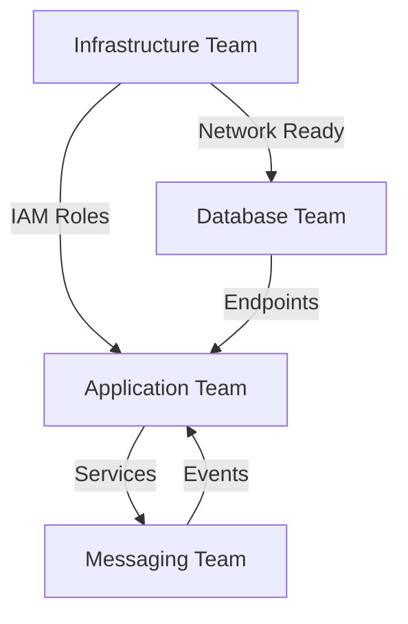

# AWS Migration Agent Assignment Matrix

**Generated**: 2025-01-11  
**Coordinator**: MS-3 Resource Coordinator  
**Status**: Active Deployment Phase

## Executive Summary

This document defines the agent assignment matrix for AWS migration execution, including RACI responsibilities, skill mappings, workload distribution, and communication protocols for coordinated deployment.

## Agent Specialization Groups

### 1. Infrastructure Agents

| Agent Role | Primary Skills | AWS Services | Availability |
|------------|---------------|--------------|--------------|
| VPC Specialist | Network Architecture, CIDR Planning | VPC, Subnets, Route Tables | 24/7 |
| Security Engineer | Security Groups, NACLs, WAF | Security Groups, AWS Shield | Business Hours + On-Call |
| IAM Administrator | Roles, Policies, Permission Boundaries | IAM, SSO, Organizations | Business Hours |

### 2. Database Agents

| Agent Role | Primary Skills | AWS Services | Availability |
|------------|---------------|--------------|--------------|
| Aurora Expert | Cluster Setup, Parameter Groups | RDS Aurora, Performance Insights | 24/7 |
| Migration Specialist | DMS, Schema Conversion | DMS, SCT, Database Activity Streams | Migration Windows |
| Data Validator | Data Integrity, Consistency Checks | CloudWatch, Lambda | Post-Migration |

### 3. Application Agents

| Agent Role | Primary Skills | AWS Services | Availability |
|------------|---------------|--------------|--------------|
| ECS Specialist | Task Definitions, Service Configuration | ECS, ECR, CloudMap | Business Hours |
| Container Expert | Docker, Image Optimization | Fargate, App Mesh | Development Hours |
| Service Deployer | Blue/Green, Rolling Updates | CodeDeploy, ALB | Deployment Windows |

### 4. Messaging Agents

| Agent Role | Primary Skills | AWS Services | Availability |
|------------|---------------|--------------|--------------|
| EventBridge Architect | Event Patterns, Rules | EventBridge, CloudWatch Events | Business Hours |
| Queue Designer | SQS Configuration, DLQ Setup | SQS, SNS | Business Hours |
| State Manager | Workflow Design, Error Handling | Step Functions, Lambda | Development Hours |

## RACI Matrix

### Phase 1: Infrastructure Setup

| Task | VPC Spec | Sec Eng | IAM Admin | Aurora Exp | ECS Spec | Lead |
|------|----------|---------|-----------|------------|----------|------|
| VPC Creation | **R** | C | I | I | C | VPC Spec |
| Security Groups | C | **R** | A | I | C | Sec Eng |
| IAM Roles | I | C | **R** | C | C | IAM Admin |
| Network Peering | **R** | A | I | I | I | VPC Spec |
| Bastion Setup | A | **R** | C | I | I | Sec Eng |

### Phase 2: Database Migration

| Task | Aurora Exp | Mig Spec | Data Val | VPC Spec | IAM Admin | Lead |
|------|------------|----------|----------|----------|-----------|------|
| Aurora Cluster | **R** | C | I | C | A | Aurora Exp |
| DMS Setup | C | **R** | I | A | C | Mig Spec |
| Schema Migration | A | **R** | C | I | I | Mig Spec |
| Data Transfer | I | **R** | A | I | I | Mig Spec |
| Validation | I | C | **R** | I | I | Data Val |

### Phase 3: Application Deployment

| Task | ECS Spec | Container | Deployer | IAM Admin | Sec Eng | Lead |
|------|----------|-----------|----------|-----------|---------|------|
| ECS Cluster | **R** | C | I | A | C | ECS Spec |
| Task Definitions | A | **R** | C | C | I | Container |
| Service Creation | **R** | A | C | I | C | ECS Spec |
| Load Balancer | C | I | **R** | I | A | Deployer |
| Auto Scaling | **R** | I | A | I | I | ECS Spec |

### Phase 4: Messaging Setup

| Task | EventBridge | Queue Des | State Mgr | ECS Spec | Lead |
|------|-------------|-----------|-----------|----------|------|
| Event Bus | **R** | C | I | I | EventBridge |
| SQS Queues | C | **R** | I | A | Queue Des |
| Step Functions | I | C | **R** | C | State Mgr |
| Integration | A | A | A | **R** | ECS Spec |

**Legend**: R = Responsible, A = Accountable, C = Consulted, I = Informed

## Workload Distribution

### Parallel Execution Groups

**Group A: Infrastructure Foundation**
- VPC Specialist + Security Engineer
- Parallel Tasks: VPC/Subnet creation, Security Group setup
- Duration: 2-3 hours

**Group B: Identity & Access**
- IAM Administrator
- Sequential Tasks: Role creation, Policy attachments
- Duration: 1-2 hours

**Group C: Database Team**
- Aurora Expert + Migration Specialist + Data Validator
- Parallel Tasks: Cluster setup, DMS configuration
- Duration: 4-6 hours

**Group D: Application Team**
- ECS Specialist + Container Expert + Service Deployer
- Parallel Tasks: Cluster creation, Image preparation
- Duration: 3-4 hours

**Group E: Messaging Team**
- EventBridge Architect + Queue Designer + State Manager
- Parallel Tasks: Event bus, Queue setup
- Duration: 2-3 hours

## Communication Protocols

### 1. Status Reporting

```yaml
frequency:
  critical: real-time
  normal: every 30 minutes
  routine: hourly

channels:
  slack:
    - #aws-migration-status
    - #aws-migration-alerts
  email:
    - migration-team@company.com
  dashboard:
    - https://migration.company.com/status
```

### 2. Escalation Matrix

| Severity | Initial Contact | Escalation L1 | Escalation L2 | Response Time |
|----------|----------------|---------------|---------------|---------------|
| Critical | Lead Agent | Tech Lead | Migration Manager | < 5 minutes |
| High | Lead Agent | Tech Lead | - | < 15 minutes |
| Medium | Team Channel | Lead Agent | - | < 1 hour |
| Low | Team Channel | - | - | < 4 hours |

### 3. Handoff Procedures

```markdown
## Handoff Checklist
- [ ] Current task status documented
- [ ] All credentials stored in secrets manager
- [ ] Configuration committed to git
- [ ] Test results recorded
- [ ] Next steps clearly defined
- [ ] Receiving agent acknowledged
```

## Performance Metrics

### Individual Agent Metrics

| Metric | Target | Measurement | Frequency |
|--------|--------|-------------|-----------|
| Task Completion Rate | > 95% | Completed/Assigned | Daily |
| Error Frequency | < 5% | Errors/Tasks | Real-time |
| Rework Percentage | < 10% | Rework/Completed | Weekly |
| Response Time | < SLA | Actual vs Target | Real-time |

### Team Performance Indicators

```yaml
kpis:
  migration_velocity:
    target: 100 resources/day
    current: tracking
  
  downtime_minutes:
    target: 0
    acceptable: < 5
    
  rollback_rate:
    target: 0%
    threshold: < 2%
    
  validation_success:
    target: 100%
    minimum: 99.9%
```

## Resource Allocation

### Agent Availability Windows

```markdown
## Standard Coverage
- Business Hours: 3 agents per group
- Extended Hours: 2 agents per group
- On-Call: 1 lead per group

## Migration Windows
- Database: 02:00 - 06:00 UTC
- Application: 00:00 - 04:00 UTC
- Validation: Continuous
```

### Skill Level Requirements

| Task Complexity | Required Level | Backup Required |
|----------------|----------------|-----------------|
| Critical Path | Senior (L3+) | Yes - Same Level |
| High Priority | Mid (L2+) | Yes - Any Level |
| Standard | Any Level | Optional |
| Monitoring | Junior (L1+) | No |

## Coordination Patterns

### 1. Lead Agent Responsibilities
- Task distribution within group
- Status aggregation and reporting
- Cross-team coordination
- Escalation decisions
- Resource reallocation

### 2. Peer Communication
```yaml
sync_meetings:
  daily_standup: 09:00 UTC
  midday_check: 14:00 UTC
  handoff_review: 18:00 UTC

async_updates:
  slack_threads: continuous
  status_board: every 30 min
  metrics_dashboard: real-time
```

### 3. Cross-Team Dependencies



## Error Handling Expertise

### Specialist Assignments

| Error Category | Primary Expert | Backup Expert | Runbook Location |
|---------------|----------------|---------------|------------------|
| Network Connectivity | VPC Specialist | Security Engineer | /runbooks/network |
| Permission Denied | IAM Administrator | Security Engineer | /runbooks/iam |
| Database Connection | Aurora Expert | Migration Specialist | /runbooks/database |
| Container Failures | Container Expert | ECS Specialist | /runbooks/containers |
| Message Processing | Queue Designer | State Manager | /runbooks/messaging |

## Automation Integration

### Agent-Triggered Automations

```yaml
automations:
  infrastructure:
    - vpc_validation_suite
    - security_compliance_check
    - network_connectivity_test
    
  database:
    - schema_comparison_tool
    - data_integrity_validator
    - performance_baseline_test
    
  application:
    - container_health_check
    - load_test_suite
    - smoke_test_runner
    
  messaging:
    - message_flow_test
    - dlq_monitor
    - latency_checker
```

## Success Criteria

### Phase Completion Gates

| Phase | Success Criteria | Validation Method | Sign-off Required |
|-------|-----------------|-------------------|-------------------|
| Infrastructure | All resources created, Security validated | Automated tests | Security + Tech Lead |
| Database | Data migrated, <1ms latency increase | Performance tests | DBA + Product Owner |
| Application | All services healthy, Zero errors | Health checks | DevOps + QA Lead |
| Messaging | All flows active, <100ms latency | Integration tests | Architect + Tech Lead |

## Continuous Improvement

### Lessons Learned Capture

```markdown
## Post-Task Review
- What worked well?
- What challenges emerged?
- How can we improve?
- What should we automate?

## Knowledge Base Updates
- New runbooks created
- Existing procedures refined
- Common errors documented
- Best practices identified
```

### Training Requirements

| Skill Gap | Training Resource | Target Agents | Timeline |
|-----------|------------------|---------------|----------|
| AWS Aurora Advanced | AWS Training | Database Team | Week 1 |
| ECS Best Practices | Internal Workshop | App Team | Week 1 |
| EventBridge Patterns | Documentation | Messaging Team | Week 2 |
| Terraform Updates | Online Course | All Leads | Ongoing |

---

## Next Steps

1. **Agent Onboarding**: Brief all agents on their assignments
2. **Runbook Review**: Ensure all runbooks are current
3. **Tool Access**: Verify all agents have necessary permissions
4. **Dry Run**: Execute practice scenarios
5. **Communication Test**: Verify all channels functional

**Last Updated**: 2025-01-11  
**Next Review**: Pre-migration final check