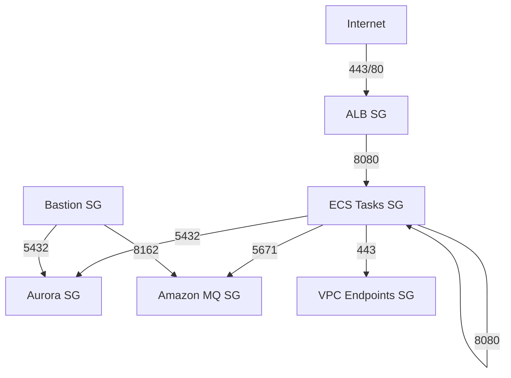

# Security Groups Design for MisterSmith AWS Migration

## Overview

This document defines the security group architecture for MisterSmith services, implementing least-privilege access and defense-in-depth principles.

## Security Group Architecture

### Naming Convention
```
{environment}-{service}-{type}-sg
Example: prod-mistersmith-alb-sg
```

## Security Group Definitions

### 1. Application Load Balancer Security Group
**Name**: `prod-mistersmith-alb-sg`
**Description**: Security group for public-facing Application Load Balancer

```yaml
Inbound Rules:
  - Protocol: TCP
    Port: 443
    Source: 0.0.0.0/0
    Description: HTTPS from internet
  
  - Protocol: TCP
    Port: 80
    Source: 0.0.0.0/0
    Description: HTTP from internet (redirect to HTTPS)

Outbound Rules:
  - Protocol: TCP
    Port: 8080
    Destination: prod-mistersmith-ecs-sg
    Description: Traffic to ECS tasks
```

### 2. ECS Tasks Security Group
**Name**: `prod-mistersmith-ecs-sg`
**Description**: Security group for ECS Fargate tasks running services

```yaml
Inbound Rules:
  - Protocol: TCP
    Port: 8080
    Source: prod-mistersmith-alb-sg
    Description: Traffic from ALB
  
  - Protocol: TCP
    Port: 8080
    Source: prod-mistersmith-ecs-sg (self)
    Description: Service-to-service communication

Outbound Rules:
  - Protocol: TCP
    Port: 443
    Destination: 0.0.0.0/0
    Description: HTTPS for external APIs
  
  - Protocol: TCP
    Port: 5432
    Destination: prod-mistersmith-aurora-sg
    Description: PostgreSQL to Aurora
  
  - Protocol: TCP
    Port: 5671
    Destination: prod-mistersmith-mq-sg
    Description: AMQP to Amazon MQ
  
  - Protocol: TCP
    Port: 443
    Destination: VPC CIDR (10.0.0.0/16)
    Description: AWS service endpoints
  
  - Protocol: TCP
    Port: 8080
    Destination: prod-mistersmith-ecs-sg (self)
    Description: Service mesh communication
```

### 3. Aurora PostgreSQL Security Group
**Name**: `prod-mistersmith-aurora-sg`
**Description**: Security group for Aurora PostgreSQL cluster

```yaml
Inbound Rules:
  - Protocol: TCP
    Port: 5432
    Source: prod-mistersmith-ecs-sg
    Description: PostgreSQL from ECS tasks
  
  - Protocol: TCP
    Port: 5432
    Source: prod-mistersmith-bastion-sg
    Description: Admin access from bastion (if needed)

Outbound Rules:
  - None (Database doesn't initiate connections)
```

### 4. Amazon MQ Security Group
**Name**: `prod-mistersmith-mq-sg`
**Description**: Security group for Amazon MQ brokers

```yaml
Inbound Rules:
  - Protocol: TCP
    Port: 5671
    Source: prod-mistersmith-ecs-sg
    Description: AMQPS from ECS tasks
  
  - Protocol: TCP
    Port: 61617
    Source: prod-mistersmith-ecs-sg
    Description: OpenWire+SSL from ECS tasks
  
  - Protocol: TCP
    Port: 8162
    Source: prod-mistersmith-bastion-sg
    Description: Web console from bastion (admin only)

Outbound Rules:
  - Protocol: TCP
    Port: 443
    Destination: VPC CIDR (10.0.0.0/16)
    Description: AWS service endpoints
```

### 5. VPC Endpoints Security Group
**Name**: `prod-mistersmith-vpce-sg`
**Description**: Security group for VPC endpoints

```yaml
Inbound Rules:
  - Protocol: TCP
    Port: 443
    Source: prod-mistersmith-ecs-sg
    Description: HTTPS from ECS tasks
  
  - Protocol: TCP
    Port: 443
    Source: VPC CIDR (10.0.0.0/16)
    Description: HTTPS from VPC resources

Outbound Rules:
  - None (Endpoints don't initiate connections)
```

### 6. Bastion Host Security Group (Optional)
**Name**: `prod-mistersmith-bastion-sg`
**Description**: Security group for bastion host (emergency access)

```yaml
Inbound Rules:
  - Protocol: TCP
    Port: 22
    Source: <Corporate IP Range>
    Description: SSH from corporate network

Outbound Rules:
  - Protocol: TCP
    Port: 5432
    Destination: prod-mistersmith-aurora-sg
    Description: PostgreSQL to Aurora
  
  - Protocol: TCP
    Port: 8162
    Destination: prod-mistersmith-mq-sg
    Description: MQ web console
  
  - Protocol: TCP
    Port: 443
    Destination: 0.0.0.0/0
    Description: HTTPS for updates
```

## Service Communication Matrix

| Source Service | Destination Service | Port | Protocol | Purpose |
|----------------|-------------------|------|----------|----------|
| ALB | ECS Tasks | 8080 | TCP | HTTP traffic routing |
| ECS Tasks | Aurora | 5432 | TCP | Database queries |
| ECS Tasks | Amazon MQ | 5671 | TCP | Message queue (AMQPS) |
| ECS Tasks | ECS Tasks | 8080 | TCP | Service mesh |
| ECS Tasks | Internet | 443 | TCP | External APIs |
| ECS Tasks | VPC Endpoints | 443 | TCP | AWS services |

## Security Group Dependencies



## CDK Implementation

```typescript
// Security Group with proper tags and descriptions
const ecsSecurityGroup = new SecurityGroup(this, 'EcsSecurityGroup', {
  vpc,
  description: 'Security group for ECS Fargate tasks',
  securityGroupName: 'prod-mistersmith-ecs-sg',
  allowAllOutbound: false // Explicit outbound rules
});

// Add rules with descriptions
ecsSecurityGroup.addIngressRule(
  albSecurityGroup,
  Port.tcp(8080),
  'Allow traffic from ALB'
);

// Self-referencing rule for service mesh
ecsSecurityGroup.addIngressRule(
  ecsSecurityGroup,
  Port.tcp(8080),
  'Allow service-to-service communication'
);

// Tag all security groups
Tags.of(ecsSecurityGroup).add('Environment', 'production');
Tags.of(ecsSecurityGroup).add('Compliance', 'required');
```

## Security Best Practices Applied

1. **Least Privilege Access**
   - Only required ports are opened
   - Specific source/destination security groups
   - No use of 0.0.0.0/0 except for ALB ingress

2. **Defense in Depth**
   - Multiple layers of security groups
   - Explicit deny by default
   - Separate security groups per service

3. **No Hardcoded IPs**
   - Use security group references
   - VPC CIDR for internal services
   - Dynamic resolution

4. **Audit Trail**
   - All rules have descriptions
   - Proper tagging for compliance
   - VPC Flow Logs capture all traffic

## Monitoring and Alerts

### CloudWatch Alarms
1. **Unusual Port Access**: Alert on traffic to non-standard ports
2. **Failed Connection Attempts**: Monitor rejected connections
3. **Security Group Changes**: Alert on any modifications

### VPC Flow Log Analysis
- Regular analysis of traffic patterns
- Identify unused rules for removal
- Detect potential security issues

## Compliance Notes

### CDK Nag Suppressions Required
```typescript
// No suppressions needed - all rules follow best practices
```

### Security Standards Met
- ✅ PCI DSS: Network segmentation
- ✅ HIPAA: Encryption in transit
- ✅ SOC 2: Access controls
- ✅ AWS Well-Architected: Security pillar

## Maintenance Procedures

1. **Quarterly Review**
   - Audit all security group rules
   - Remove unused rules
   - Update descriptions

2. **Change Management**
   - All changes through CDK
   - Peer review required
   - Test in staging first

3. **Emergency Access**
   - Bastion host for break-glass scenarios
   - Session Manager preferred over SSH
   - All access logged and monitored