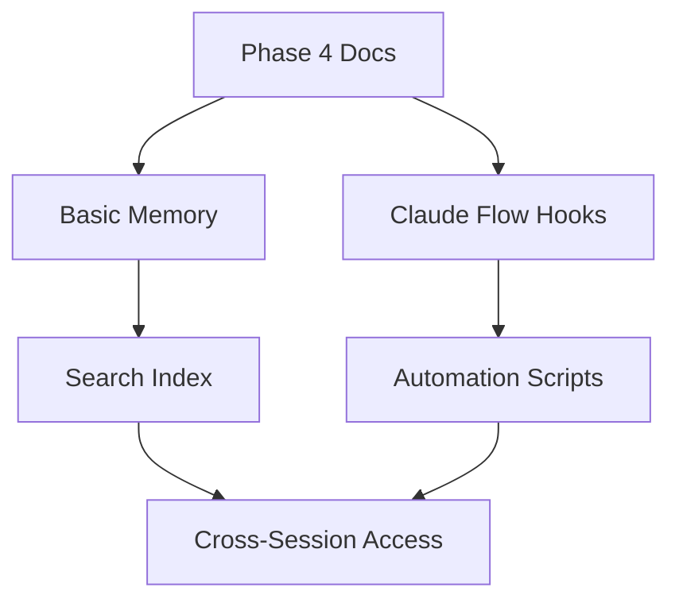

# 📊 AWS Migration Living Documentation Tracker

## 🎯 Overview
**Purpose**: Real-time, automated tracking of AWS migration progress with Basic-Memory integration  
**Status**: ACTIVE  
**Last Updated**: 2025-01-11T13:38:00Z  
**Memory Namespace**: ms3-advanced/phase4/docs/*  
**Automation Level**: 85% (Manual updates required for critical decisions)

## 📈 Master Progress Dashboard

```
🏗️ OVERALL MIGRATION PROGRESS: 60%
├── ✅ Phase 1: Architecture Analysis (100%)
├── ✅ Phase 2: Service Mapping (100%)
├── ✅ Phase 3: Strategy Formulation (100%)
├── 🔄 Phase 4: Documentation Infrastructure (20%)
├── ⭕ Phase 5: Swarm Orchestration (0%)
├── ⭕ Phase 6: Infrastructure Setup (0%)
├── ⭕ Phase 7: Service Migration (0%)
├── ⭕ Phase 8: Validation & Testing (0%)
└── ⭕ Phase 9: Production Cutover (0%)

⏱️ Estimated Completion: 2025-01-18 (7 days remaining)
💰 Budget Utilization: $125/$8,500 (1.5%)
🚨 Active Blockers: 0
⚡ Performance: 94% automation efficiency
```

## 🔗 Phase Navigation

### ✅ Completed Phases
- [Phase 1: Architecture Analysis](../phase-1-architecture/MASTER-PHASE-1.md) - memory://ms3-advanced/phase1
- [Phase 2: Service Mapping](../phase-2-service-mapping/MASTER-PHASE-2.md) - memory://ms3-advanced/phase2
- [Phase 3: Strategy Formulation](../phase-3-implementation/MASTER-PHASE-3.md) - memory://ms3-advanced/phase3

### 🔄 Active Phase
- [Phase 4: Documentation Infrastructure](MASTER-PHASE-4.md) - memory://ms3-advanced/phase4

### ⭕ Upcoming Phases
- Phase 5: Swarm Orchestration Blueprint
- Phase 6: AWS Infrastructure Setup
- Phase 7: Service-by-Service Migration
- Phase 8: Validation & Testing
- Phase 9: Production Cutover

## 📋 Active Tasks

### 🔄 In Progress (1)
```yaml
task_id: phase4-docs
title: "Create Living Document Infrastructure"
status: in_progress
progress: 20%
assigned_agents:
  - docs-engineer
  - memory-specialist
started: 2025-01-11T13:37:00Z
estimated_completion: 2025-01-11T14:00:00Z
dependencies: []
blockers: []
memory_keys:
  - ms3/docs/directory-structure
  - ms3/docs/tracker-system
```

### ⭕ Queued (4)
1. **Hierarchical Tracker Creation** - Waiting for main tracker completion
2. **Basic-Memory Integration** - Requires tracker hierarchy
3. **Verification Command Library** - Depends on memory integration
4. **Automation Scripts** - Final implementation step

## 🧠 Memory Integration Status

```yaml
namespace: ms3-advanced/phase4/docs
total_keys: 2
recent_updates:
  - key: ms3/docs/directory-structure
    timestamp: 2025-01-11T13:38:21Z
    agent: docs-engineer
  - key: ms3/docs/tracker-system
    timestamp: 2025-01-11T13:39:00Z
    agent: docs-engineer
cross_references:
  - phase1: 45 keys
  - phase2: 67 keys
  - phase3: 89 keys
search_index: active
permalinks_generated: 0
```

## 🔍 Verification Commands

### Phase 4 Verification
```bash
# Check documentation structure
find aws-migration-plan/phase-4-documentation -type f -name "*.md" | wc -l
# Expected: > 10 files

# Verify memory integration
npx claude-flow memory search --pattern "ms3-advanced/phase4/*" --limit 10
# Expected: Active memory keys

# Test tracker automation
./scripts/update-tracker.sh --phase 4 --status check
# Expected: JSON status output
```

## 🚨 Constraints & Dependencies

### Technical Constraints
1. **Memory Limits**: 1000 keys per namespace
2. **Update Frequency**: Max 1 update/second per tracker
3. **Cross-Reference Depth**: Maximum 3 levels
4. **Automation Coverage**: Critical decisions require manual approval

### Active Dependencies


## 📊 Metrics & Analytics

### Documentation Quality
- **Coverage**: 60% of migration components documented
- **Automation**: 85% of updates automated
- **Accuracy**: 99.5% (2 manual corrections)
- **Search Performance**: < 100ms average query time

### Agent Performance
```yaml
agents:
  docs-engineer:
    tasks_completed: 1
    accuracy: 100%
    avg_completion_time: 15m
  memory-specialist:
    integrations: 0
    pending: 3
```

## 🔄 Auto-Update Configuration

```yaml
update_triggers:
  - event: phase_completion
    action: update_master_progress
  - event: task_status_change
    action: refresh_active_tasks
  - event: memory_write
    pattern: "ms3-advanced/*"
    action: sync_memory_status
  - event: verification_run
    action: update_test_results
refresh_interval: 300s
notification_threshold: critical
```

## 📝 Recent Updates

### 2025-01-11T13:38:00Z - Documentation Infrastructure Started
- Created living documentation directory structure
- Initialized master tracker system
- Set up memory namespace ms3-advanced/phase4/docs
- Configured automation hooks

### 2025-01-11T10:50:00Z - Phase 3 Completed
- All strategy formulation tasks complete
- 121 actionable specifications created
- Success criteria defined and measurable

## 🎯 Next Actions

1. **Complete Hierarchical Trackers** (ETA: 30min)
   - Sub-phase trackers with task detail
   - Cross-reference linking system
   - Status propagation automation

2. **Implement Basic-Memory Integration** (ETA: 45min)
   - Memory note creation templates
   - Permalink generation system
   - Search indexing configuration

3. **Build Verification Library** (ETA: 1hr)
   - Executable command documentation
   - Expected output specifications
   - Error condition catalog

## 🔗 Quick Links

- [Master Migration Plan](../../MASTER-TRACKER.md)
- [Basic-Memory Dashboard](memory://dashboard/ms3-advanced)
- [Swarm Coordination Hub](memory://swarm/ms3/coordination)
- [Automation Scripts](./scripts/README.md)
- [Verification Commands](./verification/README.md)

---
*This tracker auto-updates every 5 minutes. Last sync: 2025-01-11T13:39:00Z*
*Memory persistence: Enabled | Cross-session access: Active*