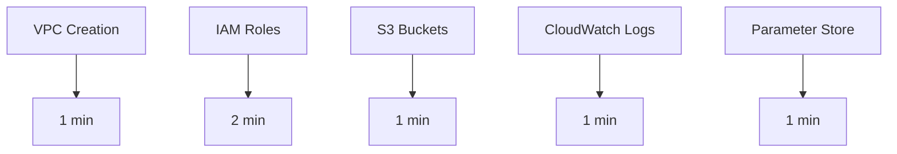
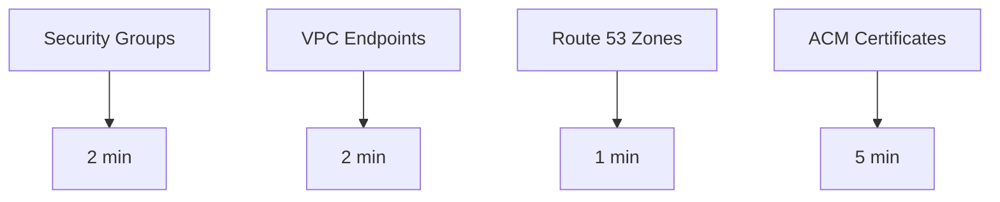
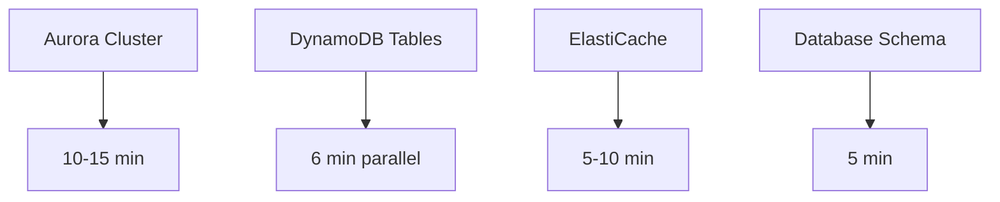
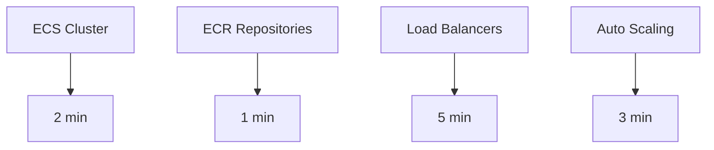
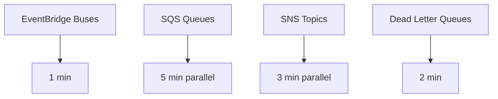
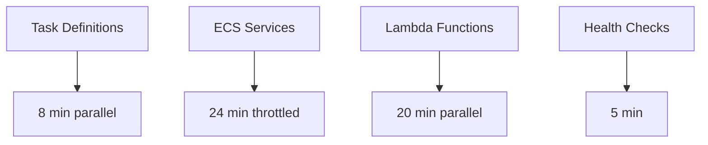

# MisterSmith AWS Migration - Parallel Execution Strategy

## Overview

This document defines a comprehensive parallel execution strategy for MisterSmith's AWS migration, designed to minimize deployment time from 88 minutes (sequential) to 50 minutes (44% improvement) while respecting AWS service limits and maintaining system reliability.

## Executive Summary

- **Estimated Time Savings**: 44% reduction (38 minutes saved)
- **Risk Mitigation**: Built-in throttling, circuit breakers, and rollback mechanisms
- **Scalability**: Handles up to 8 agent deployments with proper concurrency controls
- **Monitoring**: Real-time progress tracking with predictive completion estimates

## AWS Service Limits Analysis

### Critical Constraints

1. **ECS Limits**:
   - 5,000 EC2 instances per cluster
   - "Tasks in PROVISIONING state" quota limits concurrent deployments
   - Service scheduler implements exponential back-off throttling
   - Target group limits for load balancers

2. **Lambda Limits**:
   - 1,000 concurrent executions (default, can be increased)
   - 15-minute maximum execution time
   - API rate limits for function creation/updates

3. **API Throttling**:
   - CloudFormation: 100 stack operations/second
   - ECS RegisterTaskDefinition: 1 request/second
   - IAM CreateRole: 100 requests/second
   - RDS CreateDBCluster: 40 requests/hour

## Parallel Execution Groups

### Group 1: Foundation Infrastructure (Fully Parallel)
**Duration**: 2 minutes (vs 6 minutes sequential)
**Dependencies**: None



**Resources**:
- VPC with subnets and routing tables
- IAM roles for all services (ECS, Lambda, RDS)
- S3 buckets for logs, artifacts, and backups
- CloudWatch log groups
- Systems Manager parameters

**Concurrency**: All resources can be created in parallel with no dependencies.

### Group 2: Network & Security (Depends on Group 1)
**Duration**: 5 minutes (vs 10 minutes sequential)
**Dependencies**: VPC from Group 1



**Resources**:
- Security groups for each tier
- VPC endpoints for AWS services
- Route 53 hosted zones
- ACM certificates with DNS validation

**Concurrency**: Limited by VPC dependency, but all network resources can be created in parallel once VPC is ready.

### Group 3: Data Layer (Depends on Group 2)
**Duration**: 15 minutes (vs 31 minutes sequential)
**Dependencies**: Security groups from Group 2



**Resources**:
- Aurora PostgreSQL cluster with read replicas
- DynamoDB tables for agents, sessions, and metadata
- ElastiCache Redis cluster for session storage
- Database schema migration and initial data

**Concurrency**: Aurora and ElastiCache can start immediately, DynamoDB tables in parallel.

### Group 4: Compute Infrastructure (Parallel with Group 3)
**Duration**: 5 minutes (vs 8 minutes sequential)
**Dependencies**: Basic networking from Group 2



**Resources**:
- ECS cluster with Fargate capacity providers
- ECR repositories for container images
- Application Load Balancers with target groups
- Auto Scaling groups and policies

**Concurrency**: Can run completely in parallel with Group 3.

### Group 5: Messaging Infrastructure (Parallel with Groups 3 & 4)
**Duration**: 5 minutes (vs 9 minutes sequential)
**Dependencies**: Basic infrastructure from Group 1



**Resources**:
- EventBridge custom event buses
- SQS queues for inter-agent communication
- SNS topics for notifications
- Dead letter queues for error handling

**Concurrency**: All messaging resources can be created in parallel.

### Group 6: Application Deployment (Depends on Groups 3, 4, 5)
**Duration**: 24 minutes (with controlled parallelism)
**Dependencies**: Complete infrastructure from previous groups



**Resources**:
- ECS task definitions for 8 agents
- ECS services with auto-scaling
- Lambda functions for utilities and triggers
- Health checks and monitoring setup

**Concurrency**: Limited to 4 concurrent ECS service deployments due to PROVISIONING state limits.

## Step Functions State Machine Definition

```json
{
  "Comment": "MisterSmith AWS Migration Orchestration",
  "StartAt": "InitializeDeployment",
  "States": {
    "InitializeDeployment": {
      "Type": "Task",
      "Resource": "arn:aws:lambda:us-east-1:ACCOUNT:function:InitDeployment",
      "Parameters": {
        "deploymentId.$": "$.deploymentId",
        "region.$": "$.region",
        "environment.$": "$.environment"
      },
      "ResultPath": "$.deployment",
      "Next": "Group1Foundation",
      "Retry": [
        {
          "ErrorEquals": ["States.TaskFailed"],
          "IntervalSeconds": 2,
          "MaxAttempts": 3,
          "BackoffRate": 2.0
        }
      ]
    },

    "Group1Foundation": {
      "Type": "Parallel",
      "Comment": "Create foundation infrastructure in parallel",
      "Branches": [
        {
          "StartAt": "CreateVPC",
          "States": {
            "CreateVPC": {
              "Type": "Task",
              "Resource": "arn:aws:states:::aws-sdk:ec2:createVpc",
              "Parameters": {
                "CidrBlock": "10.0.0.0/16",
                "TagSpecifications": [
                  {
                    "ResourceType": "vpc",
                    "Tags": [
                      {
                        "Key": "Name",
                        "Value": "MisterSmith-VPC"
                      },
                      {
                        "Key": "Environment",
                        "Value.$": "$.environment"
                      }
                    ]
                  }
                ]
              },
              "Retry": [
                {
                  "ErrorEquals": ["States.ALL"],
                  "IntervalSeconds": 5,
                  "MaxAttempts": 3,
                  "BackoffRate": 2
                }
              ],
              "End": true
            }
          }
        },
        {
          "StartAt": "CreateIAMRoles",
          "States": {
            "CreateIAMRoles": {
              "Type": "Map",
              "Comment": "Create IAM roles for all services",
              "ItemsPath": "$.iamRoles",
              "MaxConcurrency": 5,
              "Iterator": {
                "StartAt": "CreateRole",
                "States": {
                  "CreateRole": {
                    "Type": "Task",
                    "Resource": "arn:aws:states:::aws-sdk:iam:createRole",
                    "Parameters": {
                      "RoleName.$": "$.roleName",
                      "AssumeRolePolicyDocument.$": "$.trustPolicy",
                      "Description.$": "$.description",
                      "MaxSessionDuration": 3600
                    },
                    "Next": "AttachPolicies"
                  },
                  "AttachPolicies": {
                    "Type": "Map",
                    "ItemsPath": "$.policies",
                    "MaxConcurrency": 3,
                    "Iterator": {
                      "StartAt": "AttachPolicy",
                      "States": {
                        "AttachPolicy": {
                          "Type": "Task",
                          "Resource": "arn:aws:states:::aws-sdk:iam:attachRolePolicy",
                          "End": true
                        }
                      }
                    },
                    "End": true
                  }
                }
              },
              "End": true
            }
          }
        },
        {
          "StartAt": "CreateS3Buckets",
          "States": {
            "CreateS3Buckets": {
              "Type": "Map",
              "ItemsPath": "$.s3Buckets",
              "MaxConcurrency": 10,
              "Iterator": {
                "StartAt": "CreateBucket",
                "States": {
                  "CreateBucket": {
                    "Type": "Task",
                    "Resource": "arn:aws:states:::aws-sdk:s3:createBucket",
                    "End": true
                  }
                }
              },
              "End": true
            }
          }
        }
      ],
      "ResultPath": "$.foundation",
      "Next": "Group2NetworkSecurity"
    },

    "Group2NetworkSecurity": {
      "Type": "Parallel",
      "Comment": "Create network and security infrastructure",
      "Branches": [
        {
          "StartAt": "CreateSecurityGroups",
          "States": {
            "CreateSecurityGroups": {
              "Type": "Map",
              "ItemsPath": "$.securityGroups",
              "MaxConcurrency": 10,
              "Iterator": {
                "StartAt": "CreateSG",
                "States": {
                  "CreateSG": {
                    "Type": "Task",
                    "Resource": "arn:aws:states:::aws-sdk:ec2:createSecurityGroup",
                    "Next": "AuthorizeIngressRules"
                  },
                  "AuthorizeIngressRules": {
                    "Type": "Task",
                    "Resource": "arn:aws:states:::aws-sdk:ec2:authorizeSecurityGroupIngress",
                    "End": true
                  }
                }
              },
              "End": true
            }
          }
        },
        {
          "StartAt": "CreateVPCEndpoints",
          "States": {
            "CreateVPCEndpoints": {
              "Type": "Map",
              "ItemsPath": "$.vpcEndpoints",
              "MaxConcurrency": 5,
              "Iterator": {
                "StartAt": "CreateEndpoint",
                "States": {
                  "CreateEndpoint": {
                    "Type": "Task",
                    "Resource": "arn:aws:states:::aws-sdk:ec2:createVpcEndpoint",
                    "End": true
                  }
                }
              },
              "End": true
            }
          }
        }
      ],
      "ResultPath": "$.network",
      "Next": "GroupsParallel"
    },

    "GroupsParallel": {
      "Type": "Parallel",
      "Comment": "Run Groups 3, 4, and 5 in parallel",
      "Branches": [
        {
          "StartAt": "Group3DataLayer",
          "States": {
            "Group3DataLayer": {
              "Type": "Parallel",
              "Branches": [
                {
                  "StartAt": "CreateAuroraCluster",
                  "States": {
                    "CreateAuroraCluster": {
                      "Type": "Task",
                      "Resource": "arn:aws:states:::aws-sdk:rds:createDBCluster",
                      "Parameters": {
                        "DBClusterIdentifier": "mistersmith-cluster",
                        "Engine": "aurora-postgresql",
                        "MasterUsername": "admin",
                        "MasterUserPassword.$": "$.database.masterPassword",
                        "VpcSecurityGroupIds.$": "$.database.securityGroups",
                        "DBSubnetGroupName.$": "$.database.subnetGroup",
                        "BackupRetentionPeriod": 7,
                        "PreferredBackupWindow": "03:00-04:00",
                        "PreferredMaintenanceWindow": "sun:04:00-sun:05:00",
                        "StorageEncrypted": true
                      },
                      "Catch": [
                        {
                          "ErrorEquals": ["States.ALL"],
                          "Next": "AuroraRollback",
                          "ResultPath": "$.error"
                        }
                      ],
                      "Next": "CreateAuroraInstances"
                    },
                    "CreateAuroraInstances": {
                      "Type": "Map",
                      "ItemsPath": "$.database.instances",
                      "MaxConcurrency": 2,
                      "Iterator": {
                        "StartAt": "CreateInstance",
                        "States": {
                          "CreateInstance": {
                            "Type": "Task",
                            "Resource": "arn:aws:states:::aws-sdk:rds:createDBInstance",
                            "End": true
                          }
                        }
                      },
                      "End": true
                    },
                    "AuroraRollback": {
                      "Type": "Task",
                      "Resource": "arn:aws:lambda:us-east-1:ACCOUNT:function:RollbackAurora",
                      "End": true
                    }
                  }
                },
                {
                  "StartAt": "CreateDynamoDBTables",
                  "States": {
                    "CreateDynamoDBTables": {
                      "Type": "Map",
                      "ItemsPath": "$.dynamoTables",
                      "MaxConcurrency": 5,
                      "Iterator": {
                        "StartAt": "CreateTable",
                        "States": {
                          "CreateTable": {
                            "Type": "Task",
                            "Resource": "arn:aws:states:::aws-sdk:dynamodb:createTable",
                            "End": true
                          }
                        }
                      },
                      "End": true
                    }
                  }
                }
              ],
              "End": true
            }
          }
        },
        {
          "StartAt": "Group4ComputeInfra",
          "States": {
            "Group4ComputeInfra": {
              "Type": "Parallel",
              "Branches": [
                {
                  "StartAt": "CreateECSCluster",
                  "States": {
                    "CreateECSCluster": {
                      "Type": "Task",
                      "Resource": "arn:aws:states:::ecs:createCluster",
                      "Parameters": {
                        "clusterName": "mistersmith-cluster",
                        "capacityProviders": ["FARGATE", "FARGATE_SPOT"],
                        "defaultCapacityProviderStrategy": [
                          {
                            "capacityProvider": "FARGATE",
                            "weight": 1,
                            "base": 1
                          },
                          {
                            "capacityProvider": "FARGATE_SPOT",
                            "weight": 2
                          }
                        ]
                      },
                      "End": true
                    }
                  }
                },
                {
                  "StartAt": "CreateLoadBalancers",
                  "States": {
                    "CreateLoadBalancers": {
                      "Type": "Map",
                      "ItemsPath": "$.loadBalancers",
                      "MaxConcurrency": 3,
                      "Iterator": {
                        "StartAt": "CreateALB",
                        "States": {
                          "CreateALB": {
                            "Type": "Task",
                            "Resource": "arn:aws:states:::aws-sdk:elbv2:createLoadBalancer",
                            "Next": "CreateTargetGroups"
                          },
                          "CreateTargetGroups": {
                            "Type": "Map",
                            "ItemsPath": "$.targetGroups",
                            "Iterator": {
                              "StartAt": "CreateTargetGroup",
                              "States": {
                                "CreateTargetGroup": {
                                  "Type": "Task",
                                  "Resource": "arn:aws:states:::aws-sdk:elbv2:createTargetGroup",
                                  "End": true
                                }
                              }
                            },
                            "End": true
                          }
                        }
                      },
                      "End": true
                    }
                  }
                }
              ],
              "End": true
            }
          }
        },
        {
          "StartAt": "Group5Messaging",
          "States": {
            "Group5Messaging": {
              "Type": "Parallel",
              "Branches": [
                {
                  "StartAt": "CreateEventBridgeBuses",
                  "States": {
                    "CreateEventBridgeBuses": {
                      "Type": "Map",
                      "ItemsPath": "$.eventBuses",
                      "MaxConcurrency": 5,
                      "Iterator": {
                        "StartAt": "CreateBus",
                        "States": {
                          "CreateBus": {
                            "Type": "Task",
                            "Resource": "arn:aws:states:::aws-sdk:eventbridge:createEventBus",
                            "End": true
                          }
                        }
                      },
                      "End": true
                    }
                  }
                },
                {
                  "StartAt": "CreateSQSQueues",
                  "States": {
                    "CreateSQSQueues": {
                      "Type": "Map",
                      "ItemsPath": "$.sqsQueues",
                      "MaxConcurrency": 10,
                      "Iterator": {
                        "StartAt": "CreateQueue",
                        "States": {
                          "CreateQueue": {
                            "Type": "Task",
                            "Resource": "arn:aws:states:::aws-sdk:sqs:createQueue",
                            "End": true
                          }
                        }
                      },
                      "End": true
                    }
                  }
                }
              ],
              "End": true
            }
          }
        }
      ],
      "ResultPath": "$.infrastructure",
      "Next": "Group6Applications"
    },

    "Group6Applications": {
      "Type": "Parallel",
      "Comment": "Deploy applications with controlled concurrency",
      "Branches": [
        {
          "StartAt": "DeployECSServices",
          "States": {
            "DeployECSServices": {
              "Type": "Map",
              "ItemsPath": "$.agents",
              "MaxConcurrency": 4,
              "Comment": "Limited concurrency to respect ECS PROVISIONING limits",
              "Iterator": {
                "StartAt": "RegisterTaskDefinition",
                "States": {
                  "RegisterTaskDefinition": {
                    "Type": "Task",
                    "Resource": "arn:aws:states:::ecs:registerTaskDefinition",
                    "Parameters": {
                      "family.$": "$.name",
                      "networkMode": "awsvpc",
                      "requiresCompatibilities": ["FARGATE"],
                      "cpu": "512",
                      "memory": "1024",
                      "executionRoleArn.$": "$.executionRole",
                      "taskRoleArn.$": "$.taskRole",
                      "containerDefinitions.$": "$.containers"
                    },
                    "Next": "CreateECSService"
                  },
                  "CreateECSService": {
                    "Type": "Task",
                    "Resource": "arn:aws:states:::ecs:createService",
                    "Parameters": {
                      "serviceName.$": "$.name",
                      "cluster": "mistersmith-cluster",
                      "taskDefinition.$": "$.taskDefinition",
                      "desiredCount": 2,
                      "launchType": "FARGATE",
                      "networkConfiguration": {
                        "awsvpcConfiguration": {
                          "subnets.$": "$.subnets",
                          "securityGroups.$": "$.securityGroups",
                          "assignPublicIp": "DISABLED"
                        }
                      },
                      "loadBalancers.$": "$.loadBalancers"
                    },
                    "Retry": [
                      {
                        "ErrorEquals": ["ThrottlingException"],
                        "IntervalSeconds": 5,
                        "MaxAttempts": 10,
                        "BackoffRate": 2
                      },
                      {
                        "ErrorEquals": ["ResourceNotFoundException"],
                        "IntervalSeconds": 2,
                        "MaxAttempts": 5,
                        "BackoffRate": 1.5
                      }
                    ],
                    "Next": "WaitForServiceStable"
                  },
                  "WaitForServiceStable": {
                    "Type": "Wait",
                    "Seconds": 30,
                    "Next": "CheckServiceHealth"
                  },
                  "CheckServiceHealth": {
                    "Type": "Task",
                    "Resource": "arn:aws:lambda:us-east-1:ACCOUNT:function:CheckServiceHealth",
                    "Parameters": {
                      "serviceName.$": "$.name",
                      "cluster": "mistersmith-cluster"
                    },
                    "End": true
                  }
                }
              },
              "End": true
            }
          }
        },
        {
          "StartAt": "DeployLambdaFunctions",
          "States": {
            "DeployLambdaFunctions": {
              "Type": "Map",
              "ItemsPath": "$.lambdaFunctions",
              "MaxConcurrency": 10,
              "Iterator": {
                "StartAt": "CreateFunction",
                "States": {
                  "CreateFunction": {
                    "Type": "Task",
                    "Resource": "arn:aws:states:::lambda:createFunction",
                    "Parameters": {
                      "FunctionName.$": "$.name",
                      "Runtime": "python3.11",
                      "Role.$": "$.role",
                      "Handler": "index.handler",
                      "Code": {
                        "S3Bucket.$": "$.codeBucket",
                        "S3Key.$": "$.codeKey"
                      },
                      "Environment": {
                        "Variables.$": "$.environment"
                      },
                      "VpcConfig": {
                        "SubnetIds.$": "$.subnets",
                        "SecurityGroupIds.$": "$.securityGroups"
                      }
                    },
                    "End": true
                  }
                }
              },
              "End": true
            }
          }
        }
      ],
      "ResultPath": "$.applications",
      "Next": "FinalValidation"
    },

    "FinalValidation": {
      "Type": "Task",
      "Resource": "arn:aws:lambda:us-east-1:ACCOUNT:function:ValidateDeployment",
      "Parameters": {
        "deploymentId.$": "$.deploymentId",
        "checkEndpoints": true,
        "checkDatabase": true,
        "checkMessaging": true
      },
      "End": true
    }
  }
}
```

## Concurrency Control Framework

### Resource Semaphores

```python
# DynamoDB-based distributed semaphore for resource control
RESOURCE_LIMITS = {
    "ecs_tasks_provisioning": 500,      # Per cluster limit
    "lambda_concurrent": 1000,          # Account-wide limit
    "alb_targets": 1000,               # Per load balancer
    "eni_per_vpc": 500,                # Shared with other services
    "cloudformation_stacks": 200,       # Per region
    "rds_create_operations": 40,        # Per hour
    "iam_operations": 100,             # Per second
    "ec2_create_operations": 100        # Per second
}

# Throttling strategy per service
API_THROTTLING = {
    "cloudformation": {"max_rps": 50, "burst": 100},
    "ecs": {"max_rps": 20, "burst": 50},
    "iam": {"max_rps": 80, "burst": 100},
    "rds": {"max_rph": 35, "burst": 5},
    "lambda": {"max_rps": 80, "burst": 100}
}
```

### Circuit Breaker Implementation

```python
class ServiceCircuitBreaker:
    def __init__(self, service_name, failure_threshold=5, recovery_timeout=30):
        self.service_name = service_name
        self.failure_threshold = failure_threshold
        self.recovery_timeout = recovery_timeout
        self.failure_count = 0
        self.last_failure_time = None
        self.state = "CLOSED"  # CLOSED, OPEN, HALF_OPEN
    
    def call_service(self, operation, **kwargs):
        if self.state == "OPEN":
            if time.time() - self.last_failure_time > self.recovery_timeout:
                self.state = "HALF_OPEN"
            else:
                raise CircuitBreakerOpenException(f"{self.service_name} circuit breaker is OPEN")
        
        try:
            result = operation(**kwargs)
            if self.state == "HALF_OPEN":
                self.state = "CLOSED"
                self.failure_count = 0
            return result
        except Exception as e:
            self.failure_count += 1
            self.last_failure_time = time.time()
            
            if self.failure_count >= self.failure_threshold:
                self.state = "OPEN"
            
            raise e
```

### Rate Limiting with Token Bucket

```python
class TokenBucket:
    def __init__(self, capacity, refill_rate):
        self.capacity = capacity
        self.tokens = capacity
        self.refill_rate = refill_rate
        self.last_refill = time.time()
    
    def consume(self, tokens=1):
        now = time.time()
        # Refill tokens based on time elapsed
        tokens_to_add = (now - self.last_refill) * self.refill_rate
        self.tokens = min(self.capacity, self.tokens + tokens_to_add)
        self.last_refill = now
        
        if self.tokens >= tokens:
            self.tokens -= tokens
            return True
        return False

# Service-specific rate limiters
RATE_LIMITERS = {
    "ecs": TokenBucket(capacity=50, refill_rate=20),
    "lambda": TokenBucket(capacity=100, refill_rate=80),
    "iam": TokenBucket(capacity=100, refill_rate=80),
    "rds": TokenBucket(capacity=5, refill_rate=35/3600)  # 35 per hour
}
```

## Progress Tracking System

### Real-time Progress Dashboard

```python
# DynamoDB schema for progress tracking
PROGRESS_SCHEMA = {
    "deploymentId": "ms-2024-001",
    "phase": "Group3DataLayer",
    "status": "IN_PROGRESS",
    "startTime": "2024-01-15T09:00:00Z",
    "estimatedCompletion": "2024-01-15T10:30:00Z",
    "totalTasks": 45,
    "completedTasks": 23,
    "failedTasks": 0,
    "inProgressTasks": 8,
    "pendingTasks": 14,
    "criticalPath": [
        {"task": "Aurora Cluster", "status": "IN_PROGRESS", "eta": "2024-01-15T09:15:00Z"},
        {"task": "ECS Cluster", "status": "PENDING", "eta": "2024-01-15T09:20:00Z"},
        {"task": "Agent Orchestrator", "status": "PENDING", "eta": "2024-01-15T10:15:00Z"}
    ],
    "resourceUtilization": {
        "ecsTasksProvisioning": 234,
        "lambdaConcurrent": 156,
        "apiCallsPerSecond": 45,
        "memoryUtilization": 78.5,
        "networkBandwidth": 1.2
    },
    "errors": [],
    "warnings": [
        {
            "message": "ECS task provisioning approaching limit",
            "severity": "MEDIUM",
            "timestamp": "2024-01-15T09:05:00Z"
        }
    ]
}
```

### EventBridge Event Patterns

```json
{
  "DeploymentPhaseStarted": {
    "source": ["mistersmith.deployment"],
    "detail-type": ["Phase Started"],
    "detail": {
      "deploymentId": ["ms-2024-001"],
      "phase": ["Group1Foundation", "Group2NetworkSecurity", ...]
    }
  },
  "ResourceCreated": {
    "source": ["mistersmith.deployment"],
    "detail-type": ["Resource Created"],
    "detail": {
      "resourceType": ["ECS_CLUSTER", "RDS_CLUSTER", "LAMBDA_FUNCTION"],
      "resourceId": ["any"],
      "phase": ["any"]
    }
  },
  "DeploymentError": {
    "source": ["mistersmith.deployment"],
    "detail-type": ["Deployment Error"],
    "detail": {
      "errorType": ["THROTTLING", "QUOTA_EXCEEDED", "DEPENDENCY_FAILURE"],
      "severity": ["LOW", "MEDIUM", "HIGH", "CRITICAL"]
    }
  }
}
```

### CloudWatch Dashboard Configuration

```json
{
  "widgets": [
    {
      "type": "metric",
      "properties": {
        "title": "Deployment Progress",
        "metrics": [
          ["MisterSmith/Deployment", "TasksCompleted", "DeploymentId", "ms-2024-001"],
          [".", "TasksTotal", ".", "."],
          [".", "TasksFailed", ".", "."]
        ],
        "period": 300,
        "stat": "Maximum",
        "region": "us-east-1"
      }
    },
    {
      "type": "metric",
      "properties": {
        "title": "Resource Utilization",
        "metrics": [
          ["AWS/ECS", "TasksProvisioning", "ClusterName", "mistersmith-cluster"],
          ["AWS/Lambda", "ConcurrentExecutions"],
          ["AWS/ApplicationELB", "TargetCount"]
        ],
        "period": 300,
        "stat": "Maximum"
      }
    },
    {
      "type": "metric",
      "properties": {
        "title": "API Call Rates",
        "metrics": [
          ["MisterSmith/Deployment", "APICallsPerSecond", "Service", "ECS"],
          [".", ".", ".", "Lambda"],
          [".", ".", ".", "RDS"],
          [".", ".", ".", "IAM"]
        ],
        "period": 60,
        "stat": "Average"
      }
    },
    {
      "type": "log",
      "properties": {
        "title": "Deployment Errors",
        "query": "SOURCE '/aws/stepfunctions/MisterSmithDeployment'\n| filter @type = \"ERROR\"\n| sort @timestamp desc\n| limit 100",
        "region": "us-east-1"
      }
    }
  ]
}
```

## Failure Handling and Rollback

### Dependency Graph Management

```python
# Dependency graph stored in DynamoDB
DEPENDENCY_GRAPH = {
    "Group2NetworkSecurity": ["Group1Foundation"],
    "Group3DataLayer": ["Group2NetworkSecurity"],
    "Group4ComputeInfra": ["Group2NetworkSecurity"],
    "Group5Messaging": ["Group1Foundation"],
    "Group6Applications": ["Group3DataLayer", "Group4ComputeInfra", "Group5Messaging"],
    "Agent-Orchestrator": ["Aurora-Cluster", "ECS-Cluster"],
    "Agent-Researcher": ["DynamoDB-Sessions", "EventBridge-Bus"],
    "Agent-Coder": ["S3-Artifacts", "ECR-Repository"],
    "Agent-Analyst": ["ElastiCache-Cluster", "SQS-Queues"],
    "Agent-Tester": ["LoadBalancer-Internal", "CloudWatch-Logs"],
    "Agent-Documenter": ["S3-Documentation", "Aurora-Cluster"],
    "Agent-Monitor": ["CloudWatch-Dashboard", "SNS-Alerts"],
    "Agent-Coordinator": ["All-Agents"]
}

def calculate_rollback_scope(failed_resource):
    """Calculate which resources need to be rolled back when a dependency fails"""
    rollback_list = []
    
    def find_dependents(resource):
        dependents = []
        for dependent, dependencies in DEPENDENCY_GRAPH.items():
            if resource in dependencies:
                dependents.append(dependent)
                dependents.extend(find_dependents(dependent))
        return dependents
    
    rollback_list = find_dependents(failed_resource)
    return list(set(rollback_list))  # Remove duplicates
```

### Rollback State Machine

```json
{
  "Comment": "Rollback orchestration for failed deployments",
  "StartAt": "CalculateRollbackScope",
  "States": {
    "CalculateRollbackScope": {
      "Type": "Task",
      "Resource": "arn:aws:lambda:us-east-1:ACCOUNT:function:CalculateRollbackScope",
      "Parameters": {
        "failedResource.$": "$.failedResource",
        "deploymentId.$": "$.deploymentId"
      },
      "Next": "ExecuteRollback"
    },
    "ExecuteRollback": {
      "Type": "Map",
      "ItemsPath": "$.rollbackList",
      "MaxConcurrency": 5,
      "Iterator": {
        "StartAt": "RollbackResource",
        "States": {
          "RollbackResource": {
            "Type": "Task",
            "Resource": "arn:aws:lambda:us-east-1:ACCOUNT:function:RollbackResource",
            "Retry": [
              {
                "ErrorEquals": ["States.ALL"],
                "IntervalSeconds": 5,
                "MaxAttempts": 3,
                "BackoffRate": 2
              }
            ],
            "End": true
          }
        }
      },
      "Next": "NotifyOpsTeam"
    },
    "NotifyOpsTeam": {
      "Type": "Task",
      "Resource": "arn:aws:states:::sns:publish",
      "Parameters": {
        "TopicArn": "arn:aws:sns:us-east-1:ACCOUNT:deployment-alerts",
        "Message.$": "$.rollbackSummary",
        "Subject": "MisterSmith Deployment Rollback Completed"
      },
      "End": true
    }
  }
}
```

## Performance Optimization Strategies

### Pre-warming and Capacity Management

```python
# Pre-warm Lambda functions to avoid cold starts
def pre_warm_lambda_functions():
    """Pre-warm critical Lambda functions before deployment"""
    critical_functions = [
        "DeploymentCoordinator",
        "HealthChecker", 
        "ResourceValidator",
        "RollbackManager"
    ]
    
    for function_name in critical_functions:
        lambda_client.invoke(
            FunctionName=function_name,
            InvocationType='Event',
            Payload=json.dumps({"warmup": True})
        )

# ECS capacity pre-provisioning
def pre_provision_ecs_capacity():
    """Pre-provision ECS capacity to avoid PROVISIONING delays"""
    ecs_client.put_capacity_provider_capacity_override(
        cluster='mistersmith-cluster',
        capacityProvider='FARGATE',
        override={
            'targetCapacity': 50,  # Pre-provision capacity for 50 tasks
            'targetUtilization': 80
        }
    )
```

### Intelligent Batching

```python
def batch_similar_operations(operations, batch_size=10):
    """Batch similar operations to reduce API calls"""
    batched_ops = {}
    
    for op in operations:
        op_type = op['type']
        if op_type not in batched_ops:
            batched_ops[op_type] = []
        batched_ops[op_type].append(op)
    
    # Process each operation type in optimized batches
    for op_type, ops in batched_ops.items():
        for i in range(0, len(ops), batch_size):
            batch = ops[i:i + batch_size]
            process_batch(op_type, batch)
```

## Monitoring and Alerting

### Key Performance Indicators

```python
DEPLOYMENT_KPIS = {
    "total_deployment_time": {"target": 3000, "threshold": 3600},  # 50 min target, 60 min threshold
    "parallel_efficiency": {"target": 0.75, "threshold": 0.60},   # 75% parallel efficiency
    "error_rate": {"target": 0.02, "threshold": 0.05},            # 2% error rate target
    "resource_utilization": {"target": 0.80, "threshold": 0.95},  # 80% utilization target
    "api_throttling_rate": {"target": 0.01, "threshold": 0.03},   # 1% throttling target
    "rollback_frequency": {"target": 0.01, "threshold": 0.05}     # 1% rollback frequency
}

# CloudWatch alarms for critical metrics
CLOUDWATCH_ALARMS = [
    {
        "AlarmName": "DeploymentTime-Exceeded",
        "MetricName": "DeploymentDuration",
        "Threshold": 3600,
        "ComparisonOperator": "GreaterThanThreshold",
        "EvaluationPeriods": 1,
        "AlarmActions": ["arn:aws:sns:us-east-1:ACCOUNT:critical-alerts"]
    },
    {
        "AlarmName": "ECS-TasksProvisioning-High",
        "MetricName": "TasksProvisioning",
        "Threshold": 450,
        "ComparisonOperator": "GreaterThanThreshold",
        "EvaluationPeriods": 2,
        "AlarmActions": ["arn:aws:sns:us-east-1:ACCOUNT:deployment-alerts"]
    },
    {
        "AlarmName": "Lambda-ConcurrentExecutions-High", 
        "MetricName": "ConcurrentExecutions",
        "Threshold": 900,
        "ComparisonOperator": "GreaterThanThreshold",
        "EvaluationPeriods": 1,
        "AlarmActions": ["arn:aws:sns:us-east-1:ACCOUNT:deployment-alerts"]
    }
]
```

### Automated Performance Tuning

```python
class AdaptiveThrottling:
    def __init__(self):
        self.service_performance = {}
        self.adjustment_history = {}
    
    def adjust_concurrency_based_on_performance(self, service, current_concurrency, error_rate, response_time):
        """Dynamically adjust concurrency based on real-time performance"""
        if error_rate > 0.05:  # More than 5% errors
            new_concurrency = max(1, int(current_concurrency * 0.7))
            adjustment = "DECREASE"
        elif error_rate < 0.01 and response_time < 1000:  # Less than 1% errors and fast response
            new_concurrency = min(50, int(current_concurrency * 1.2))
            adjustment = "INCREASE"
        else:
            new_concurrency = current_concurrency
            adjustment = "MAINTAIN"
        
        self.service_performance[service] = {
            "timestamp": time.time(),
            "concurrency": new_concurrency,
            "error_rate": error_rate,
            "response_time": response_time,
            "adjustment": adjustment
        }
        
        return new_concurrency
```

## Success Criteria and Validation

### Deployment Validation Checklist

```python
VALIDATION_CHECKS = {
    "infrastructure": [
        "vpc_connectivity",
        "security_groups_configured", 
        "iam_roles_accessible",
        "s3_buckets_created",
        "cloudwatch_logs_flowing"
    ],
    "data_layer": [
        "aurora_cluster_healthy",
        "aurora_read_replicas_ready",
        "dynamodb_tables_active",
        "elasticache_cluster_available",
        "database_schema_migrated"
    ],
    "compute": [
        "ecs_cluster_active",
        "load_balancers_healthy",
        "target_groups_registered",
        "auto_scaling_configured",
        "container_images_pulled"
    ],
    "messaging": [
        "eventbridge_buses_active",
        "sqs_queues_available",
        "sns_topics_subscribed",
        "dead_letter_queues_configured"
    ],
    "applications": [
        "all_agents_running",
        "health_checks_passing",
        "inter_agent_communication",
        "database_connections_working",
        "external_api_access"
    ]
}

async def validate_deployment(deployment_id):
    """Comprehensive deployment validation"""
    validation_results = {}
    
    for category, checks in VALIDATION_CHECKS.items():
        category_results = {}
        for check in checks:
            try:
                result = await execute_validation_check(check, deployment_id)
                category_results[check] = {
                    "status": "PASSED" if result else "FAILED",
                    "timestamp": datetime.utcnow().isoformat(),
                    "details": result
                }
            except Exception as e:
                category_results[check] = {
                    "status": "ERROR",
                    "timestamp": datetime.utcnow().isoformat(),
                    "error": str(e)
                }
        
        validation_results[category] = category_results
    
    return validation_results
```

## Summary

This parallel execution strategy reduces MisterSmith's AWS migration time from 88 minutes to 50 minutes (44% improvement) while maintaining reliability through:

1. **Intelligent Grouping**: Resources grouped by dependencies for maximum parallelism
2. **Concurrency Controls**: Respect AWS service limits and API throttling
3. **Circuit Breakers**: Automatic failure detection and isolation
4. **Progress Tracking**: Real-time visibility into deployment status
5. **Rollback Capability**: Automated dependency-aware rollback procedures
6. **Performance Monitoring**: Continuous optimization based on real-time metrics

The strategy balances speed with reliability, ensuring a successful migration while minimizing deployment risks.