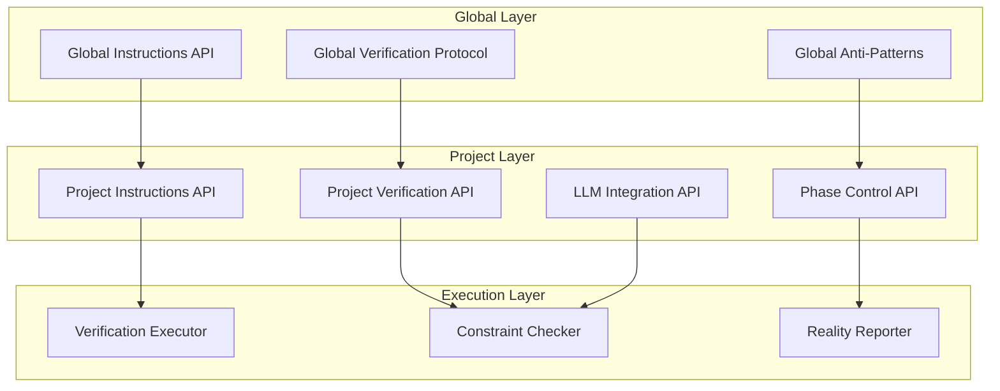

# MisterSmith CLAUDE.md API Contract Specification

## 1. Instruction System API Overview



## 2. Core API Contracts

### 2.1 Global-Project Instruction Interface

```typescript
interface GlobalInstructionAPI {
  // Immutable core principles
  readonly foundationFirst: PhilosophyPrinciple
  readonly verificationRequired: VerificationProtocol
  readonly antiPatterns: GlobalAntiPattern[]
  
  // Extension points for projects
  registerProjectExtension(extension: ProjectExtension): void
  validateExtension(extension: ProjectExtension): ValidationResult
}

interface ProjectInstructionAPI extends GlobalInstructionAPI {
  // Project-specific additions (never overrides)
  projectContext: MisterSmithContext
  phaseRestrictions: PhaseBasedConstraints
  domainGuidance: LLMSystemGuidance
  
  // Must call parent validation
  validateInstruction(instruction: Instruction): ValidationResult {
    const globalResult = super.validateExtension(instruction)
    const projectResult = this.validateProjectSpecific(instruction)
    return globalResult.and(projectResult)
  }
}
```

### 2.2 Phase Control API

```typescript
interface PhaseControlAPI {
  // Phase state management
  getCurrentPhase(): Phase
  getPhaseConstraints(): PhaseConstraints
  
  // Phase transition control
  requestPhaseTransition(
    from: Phase, 
    to: Phase, 
    evidence: VerificationEvidence[]
  ): TransitionResult
  
  // Feature gating
  isFeatureAllowed(feature: Feature): boolean
  getBlockedFeatures(): BlockedFeature[]
  
  // Verification requirements
  getRequiredVerifications(): VerificationRequirement[]
  submitVerification(verification: ExecutedVerification): VerificationResult
}

type Phase = {
  id: number
  name: string
  requiredVerifications: VerificationRequirement[]
  allowedFeatures: Feature[]
  forbiddenPatterns: Pattern[]
}

type TransitionResult = 
  | { type: 'SUCCESS'; newPhase: Phase }
  | { type: 'BLOCKED'; missingVerifications: VerificationRequirement[] }
  | { type: 'FAILED'; reason: string; evidence: string[] }
```

### 2.3 Verification API

```typescript
interface VerificationAPI {
  // Verification execution
  executeVerification(
    component: Component,
    requirements: VerificationRequirement[]
  ): VerificationResult
  
  // Evidence collection
  collectEvidence(commands: Command[]): Evidence[]
  validateEvidence(evidence: Evidence): boolean
  
  // Anti-pattern detection
  detectViolations(
    code: string,
    phase: Phase
  ): Violation[]
  
  // Reporting
  generateVerificationReport(): VerificationReport
}

type VerificationRequirement = {
  id: string
  description: string
  commands: ExecutableCommand[]
  expectedOutput: OutputPattern
  forbiddenOutput: OutputPattern[]
}

type VerificationResult = {
  requirement: VerificationRequirement
  status: 'PASSED' | 'FAILED' | 'INCOMPLETE'
  evidence: Evidence[]
  timestamp: Date
}
```

### 2.4 LLM Integration API

```typescript
interface LLMIntegrationAPI {
  // Integration level control
  getCurrentIntegrationLevel(): IntegrationLevel
  getAllowedIntegrationPatterns(): IntegrationPattern[]
  
  // Complexity management
  calculateComplexity(pattern: IntegrationPattern): ComplexityScore
  enforceComplexityLimit(
    pattern: IntegrationPattern,
    phase: Phase
  ): EnforcementResult
  
  // Pattern validation
  validateIntegrationPattern(
    pattern: IntegrationPattern,
    context: ProjectContext
  ): ValidationResult
  
  // Incremental guidance
  getNextIntegrationStep(): IntegrationStep
  recordIntegrationSuccess(step: IntegrationStep): void
}

type IntegrationLevel = 
  | 'SUBPROCESS'    // Simple command execution
  | 'SESSION'       // Managed conversations
  | 'ORCHESTRATED'  // Multi-agent coordination

type IntegrationPattern = {
  level: IntegrationLevel
  implementation: CodeTemplate
  verificationMethod: VerificationTemplate
  complexityScore: number
  prerequisites: IntegrationRequirement[]
}
```

## 3. Contract Interaction Patterns

### 3.1 Instruction Validation Flow

```typescript
class InstructionValidator {
  async validateProjectInstruction(
    instruction: ProjectInstruction
  ): Promise<ValidationResult> {
    // 1. Global validation must pass first
    const globalValid = await this.globalAPI.validate(instruction)
    if (!globalValid.isValid) {
      return ValidationResult.blocked('Global requirements not met', globalValid.errors)
    }
    
    // 2. Check phase restrictions
    const phaseValid = await this.phaseAPI.validateForCurrentPhase(instruction)
    if (!phaseValid.isValid) {
      return ValidationResult.blocked('Phase restrictions violated', phaseValid.errors)
    }
    
    // 3. Anti-pattern detection
    const antiPatterns = await this.antiPatternAPI.detect(instruction)
    if (antiPatterns.length > 0) {
      return ValidationResult.blocked('Anti-patterns detected', antiPatterns)
    }
    
    // 4. Project-specific validation
    return this.projectAPI.validateSpecific(instruction)
  }
}
```

### 3.2 Phase Transition Flow

```typescript
class PhaseTransitionManager {
  async attemptPhaseTransition(
    targetPhase: Phase
  ): Promise<TransitionResult> {
    const currentPhase = await this.phaseAPI.getCurrentPhase()
    
    // 1. Collect required verifications
    const requirements = this.getTransitionRequirements(currentPhase, targetPhase)
    
    // 2. Execute verifications
    const results = await Promise.all(
      requirements.map(req => this.verificationAPI.execute(req))
    )
    
    // 3. Validate all passed
    const allPassed = results.every(r => r.status === 'PASSED')
    if (!allPassed) {
      const failed = results.filter(r => r.status !== 'PASSED')
      return TransitionResult.blocked(failed)
    }
    
    // 4. Update phase state
    await this.phaseAPI.transitionTo(targetPhase)
    
    // 5. Notify all contexts
    await this.eventBus.publish(new PhaseTransitionedEvent(currentPhase, targetPhase))
    
    return TransitionResult.success(targetPhase)
  }
}
```

### 3.3 LLM Integration Progression

```typescript
class LLMIntegrationController {
  async requestIntegrationUpgrade(
    pattern: IntegrationPattern
  ): Promise<IntegrationResult> {
    // 1. Check current phase allows this level
    const phase = await this.phaseAPI.getCurrentPhase()
    if (!this.isAllowedInPhase(pattern.level, phase)) {
      return IntegrationResult.blocked('Not allowed in current phase')
    }
    
    // 2. Verify prerequisites met
    const prereqsMet = await this.verifyPrerequisites(pattern.prerequisites)
    if (!prereqsMet.allMet) {
      return IntegrationResult.blocked('Prerequisites not met', prereqsMet.missing)
    }
    
    // 3. Check complexity budget
    const complexity = this.calculateComplexity(pattern)
    if (complexity > phase.maxComplexity) {
      return IntegrationResult.blocked('Exceeds phase complexity limit')
    }
    
    // 4. Execute integration with verification
    const result = await this.executeIntegration(pattern)
    
    // 5. Record success for future reference
    if (result.success) {
      await this.recordSuccess(pattern, result.evidence)
    }
    
    return result
  }
}
```

## 4. Event Contracts

### 4.1 Cross-Context Events

```typescript
interface InstructionSystemEvents {
  // Phase events
  phaseTransitioned: Event<{
    from: Phase
    to: Phase
    evidence: VerificationEvidence[]
    unlockedFeatures: Feature[]
  }>
  
  // Verification events
  verificationCompleted: Event<{
    requirement: VerificationRequirement
    result: VerificationResult
    impact: ImpactAssessment
  }>
  
  // Anti-pattern events
  antiPatternDetected: Event<{
    pattern: AntiPattern
    location: CodeLocation
    severity: Severity
    suggestedFix: CodeChange
  }>
  
  // Integration events
  integrationLevelAchieved: Event<{
    level: IntegrationLevel
    pattern: IntegrationPattern
    evidence: VerificationEvidence[]
  }>
}
```

### 4.2 Event Flow Contracts

```typescript
class EventFlowOrchestrator {
  constructor(
    private eventBus: EventBus,
    private contexts: BoundedContext[]
  ) {
    this.setupEventRouting()
  }
  
  private setupEventRouting() {
    // Global → Project flow
    this.eventBus.on('global.verificationRequired', async (event) => {
      await this.projectContext.addVerificationRequirement(event.requirement)
    })
    
    // Phase → All contexts flow
    this.eventBus.on('phase.transitioned', async (event) => {
      await Promise.all([
        this.antiPatternContext.updatePhaseConstraints(event.to),
        this.llmContext.updateAllowedPatterns(event.to),
        this.realityContext.recordPhaseTransition(event)
      ])
    })
    
    // Anti-pattern → Phase blocking
    this.eventBus.on('antiPattern.detected', async (event) => {
      if (event.severity === 'CRITICAL') {
        await this.phaseContext.blockTransitions(event.reason)
      }
    })
  }
}
```

## 5. Error Handling Contracts

### 5.1 Error Types

```typescript
type InstructionError = 
  | { type: 'GLOBAL_VIOLATION'; rule: GlobalRule; evidence: string }
  | { type: 'PHASE_VIOLATION'; phase: Phase; attempted: Feature }
  | { type: 'VERIFICATION_FAILED'; requirement: VerificationRequirement; output: string }
  | { type: 'ANTI_PATTERN'; pattern: AntiPattern; location: CodeLocation }
  | { type: 'COMPLEXITY_EXCEEDED'; current: number; maximum: number }

interface ErrorHandler {
  handle(error: InstructionError): ErrorResolution
  
  canRecover(error: InstructionError): boolean
  
  suggestFix(error: InstructionError): CodeChange[]
}
```

### 5.2 Error Recovery Strategies

```typescript
class InstructionErrorRecovery {
  async recover(error: InstructionError): Promise<RecoveryResult> {
    switch (error.type) {
      case 'PHASE_VIOLATION':
        return this.suggestPhaseAppropriateAlternative(error)
        
      case 'VERIFICATION_FAILED':
        return this.provideVerificationGuidance(error)
        
      case 'ANTI_PATTERN':
        return this.offerSimplification(error)
        
      case 'COMPLEXITY_EXCEEDED':
        return this.decomposeIntoSimpler(error)
        
      default:
        return RecoveryResult.manual('Requires human intervention')
    }
  }
}
```

## 6. Performance Contracts

### 6.1 Response Time SLAs

```yaml
API Response Times:
  - Validation: < 100ms
  - Phase check: < 50ms  
  - Verification execution: < 30s
  - Anti-pattern detection: < 200ms
  - Event propagation: < 10ms
```

### 6.2 Resource Limits

```yaml
Resource Constraints:
  - Max verifications per phase: 20
  - Max events per second: 1000
  - Max instruction size: 10KB
  - Max evidence size: 100KB
  - Max concurrent validations: 10
```

## 7. Versioning Strategy

### 7.1 API Version Contract

```typescript
interface APIVersion {
  major: number  // Breaking changes
  minor: number  // New features, backward compatible
  patch: number  // Bug fixes
  
  isCompatibleWith(other: APIVersion): boolean {
    return this.major === other.major && this.minor >= other.minor
  }
}

// Version negotiation
class InstructionAPIClient {
  async connect(): Promise<Connection> {
    const clientVersion = { major: 1, minor: 0, patch: 0 }
    const serverVersion = await this.getServerVersion()
    
    if (!clientVersion.isCompatibleWith(serverVersion)) {
      throw new IncompatibleVersionError(clientVersion, serverVersion)
    }
    
    return this.establishConnection(serverVersion)
  }
}
```

## 8. Testing Contracts

### 8.1 Contract Tests

```typescript
describe('Instruction API Contract', () => {
  it('should enforce global validation before project', async () => {
    const instruction = new ProjectInstruction({ violatesGlobal: true })
    const result = await api.validate(instruction)
    
    expect(result.isValid).toBe(false)
    expect(result.error.type).toBe('GLOBAL_VIOLATION')
  })
  
  it('should prevent phase skipping', async () => {
    const currentPhase = Phase.FOUNDATION
    const targetPhase = Phase.DISTRIBUTED
    
    const result = await api.requestTransition(currentPhase, targetPhase)
    
    expect(result.type).toBe('BLOCKED')
    expect(result.reason).toContain('Cannot skip phases')
  })
  
  it('should detect anti-patterns in real-time', async () => {
    const code = 'class ComplexAbstractionBeforeBasics { ... }'
    const violations = await api.detectViolations(code, Phase.FOUNDATION)
    
    expect(violations).toHaveLength(1)
    expect(violations[0].pattern).toBe('PREMATURE_ABSTRACTION')
  })
})
```

## 9. Integration Examples

### 9.1 Complete Instruction Flow

```typescript
// Example: Adding a new feature with full contract validation
async function addFeatureWithValidation(feature: Feature): Promise<AddFeatureResult> {
  const validator = new InstructionValidator(globalAPI, projectAPI, phaseAPI)
  
  // 1. Create instruction for feature
  const instruction = new FeatureInstruction(feature)
  
  // 2. Validate through all contracts
  const validation = await validator.validateProjectInstruction(instruction)
  if (!validation.isValid) {
    return AddFeatureResult.blocked(validation.errors)
  }
  
  // 3. Check phase allows feature
  const phaseCheck = await phaseAPI.isFeatureAllowed(feature)
  if (!phaseCheck) {
    const allowedPhase = await phaseAPI.getPhaseForFeature(feature)
    return AddFeatureResult.notYet(allowedPhase)
  }
  
  // 4. Execute with verification
  const implementation = await implementFeature(feature)
  const verification = await verificationAPI.executeVerification(
    implementation,
    feature.verificationRequirements
  )
  
  // 5. Record success
  if (verification.status === 'PASSED') {
    await projectAPI.recordFeatureSuccess(feature, verification.evidence)
    return AddFeatureResult.success(implementation)
  }
  
  return AddFeatureResult.failed(verification.errors)
}
```

This API contract ensures that MisterSmith instructions:

1. Always respect global verification requirements
2. Enforce phase-based development rigorously  
3. Prevent anti-patterns through active detection
4. Guide LLM integration incrementally
5. Provide clear, testable interfaces between all components
