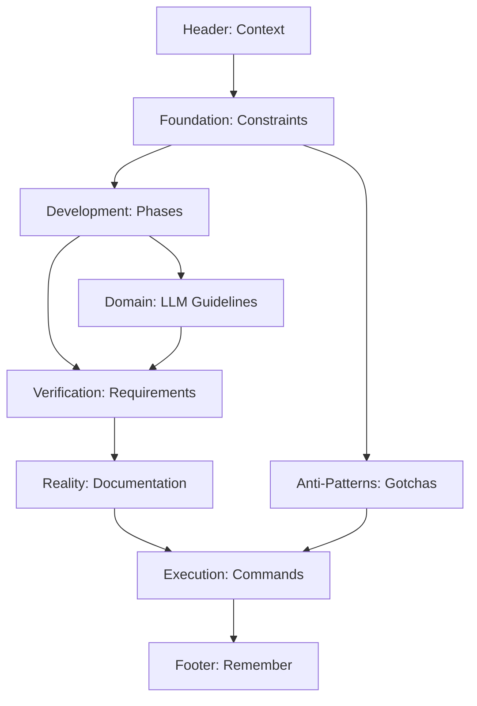

# MisterSmith CLAUDE.md Content Hierarchy Design

## Content Architecture Overview

```
CLAUDE.md
├── 1. HEADER BLOCK
│   └── Project Context Declaration
├── 2. FOUNDATION BLOCK
│   ├── Project Reality Statement
│   └── Critical Constraints
├── 3. DEVELOPMENT CONTROL BLOCK
│   ├── Incremental Development Path
│   └── Phase-Based Restrictions
├── 4. DOMAIN GUIDANCE BLOCK
│   ├── LLM/AI System Guidelines
│   └── Multi-Agent Patterns
├── 5. VERIFICATION BLOCK
│   ├── Universal Requirements
│   └── Domain-Specific Tests
├── 6. REALITY MANAGEMENT BLOCK
│   ├── Documentation vs Implementation
│   └── Specification Debt Tracking
├── 7. ANTI-PATTERN BLOCK
│   ├── Project-Specific Gotchas
│   └── Complexity Traps
├── 8. EXECUTION BLOCK
│   ├── Success Metrics
│   └── Development Commands
└── 9. FOOTER BLOCK
    └── Remember Section
```

## Detailed Section Specifications

### 1. HEADER BLOCK

**Purpose**: Immediate context setting
**Content Pattern**: Declaration + Reality Check

```markdown
# MisterSmith Project-Specific Instructions

## PROJECT CONTEXT

MisterSmith is a multi-agent orchestration framework for distributed AI systems. Currently in documentation phase with NO IMPLEMENTATION. Your role: transform specifications into working code INCREMENTALLY.
```

**Key Elements**:
- Project identity in one sentence
- Current state (DOCUMENTATION ONLY)
- Developer role (INCREMENTAL BUILDER)

### 2. FOUNDATION BLOCK

**Purpose**: Establish non-negotiable constraints
**Content Pattern**: FORBIDDEN/REQUIRED pairs

```markdown
## CRITICAL PROJECT CONSTRAINTS

### ANTI-PATTERN PREVENTION
**FORBIDDEN**: Creating complex abstractions before basic functionality works
**FORBIDDEN**: Implementing all 9 agent types simultaneously
**REQUIRED**: One working component before adding another
**REQUIRED**: Verification before advancement

### MISTERSMITH-SPECIFIC REALITY CHECKS
Before ANY implementation:
1. Can I make ONE agent type work in isolation first?
2. Does this component work WITHOUT distributed messaging?
3. Can I verify this with a 10-line test program?
```

**Key Elements**:
- Explicit FORBIDDEN behaviors
- Corresponding REQUIRED alternatives
- Reality check questions (numbered)
- Concrete, measurable criteria

### 3. DEVELOPMENT CONTROL BLOCK

**Purpose**: Enforce phase-based progression
**Content Pattern**: Phase Definition + Code Examples

```markdown
## INCREMENTAL DEVELOPMENT PATH

### PHASE 0: Foundation (You Are Here)
```rust
// FIRST: Prove basic async execution works
#[tokio::main]
async fn main() {
    println!("MisterSmith agent starting");
    tokio::time::sleep(Duration::from_secs(1)).await;
    println!("Agent completed");
}
```

### PHASE 1: Single Agent
- ONE agent type (start with Worker)
- NO supervision trees
- VERIFICATION: `cargo run` spawns and completes
```

**Key Elements**:
- Phase number and name
- Minimal working code example
- Bullet points of allowed features
- Explicit verification command

### 4. DOMAIN GUIDANCE BLOCK

**Purpose**: LLM/AI-specific implementation guidance
**Content Pattern**: Start Simple → Add Complexity

```markdown
## LLM/AI SYSTEM GUIDELINES

### Claude Integration Reality
**START WITH**: Subprocess execution, NOT complex session management
```rust
// CORRECT: Start simple
let output = Command::new("claude")
    .arg("What is 2+2?")
    .output()
    .await?;

// INCORRECT: Complex session management before basics work
let session = ClaudeCliController::new()
    .with_resource_pool(8)
    .initialize().await?;
```
```

**Key Elements**:
- CORRECT/INCORRECT code pairs
- Progressive complexity levels
- Concrete implementation examples
- Clear starting points

### 5. VERIFICATION BLOCK

**Purpose**: Define proof requirements
**Content Pattern**: Commands → Expected Output

```markdown
## VERIFICATION REQUIREMENTS

### For EVERY MisterSmith Component
```bash
# MUST provide:
cargo test --lib         # Unit tests pass
cargo run --example simple_agent  # Minimal example works
ps aux | grep mistersmith  # Process actually running

# FORBIDDEN:
"The supervision tree should handle failures"  # Without crash test
"Agents communicate via NATS"  # Without message logs
```
```

**Key Elements**:
- Executable commands with comments
- Expected concrete output
- Forbidden theoretical claims
- Clear MUST/FORBIDDEN sections

### 6. REALITY MANAGEMENT BLOCK

**Purpose**: Maintain spec vs implementation awareness
**Content Pattern**: What Exists vs What Works

```markdown
## DOCUMENTATION REALITY

### What Exists vs What Works
- 150+ pages of specifications = FUTURE VISION
- Your implementation = CURRENT REALITY
- NEVER claim spec compliance without working code

### Documentation Updates
When implementing:
```markdown
## Supervisor Agent
**Specification**: Manages complex supervision trees
**Current Implementation**: Spawns one worker, restarts on exit
**Verified**: `cargo run --example restart_worker`
**Next Step**: Add second worker type
```
```

**Key Elements**:
- Clear distinction markers
- Update template with examples
- Verification evidence required
- Next step guidance

### 7. ANTI-PATTERN BLOCK

**Purpose**: Prevent specific project pitfalls
**Content Pattern**: Trap → Recognition → Avoidance

```markdown
## PROJECT-SPECIFIC GOTCHAS

### Distributed Systems Trap
The specifications describe a distributed system. You're building LOCAL first.
- NO Kubernetes manifests until local clustering works
- NO NATS subscriptions until channel communication proven
- Recognition: Mentions of "distributed", "scaled", "clustered"
- Avoidance: Build single-process version first
```

**Key Elements**:
- Trap name clearly stated
- Specific recognition patterns
- Concrete avoidance steps
- NO/UNTIL constructions

### 8. EXECUTION BLOCK

**Purpose**: Define success and provide tools
**Content Pattern**: Metrics + Commands

```markdown
## SUCCESS METRICS FOR MISTERSMITH

### Phase Success = Working Code
- Phase 1 Success: `cargo run` spawns one agent that completes
- Phase 2 Success: Two agents exchange one message
- NOT Success: "Adheres to specification document"

### DEVELOPMENT COMMANDS
Always Run in Order:
```bash
# 1. Minimal compile check
cargo check

# 2. Unit test current module
cargo test --lib module_name

# 3. Run minimal example
cargo run --example minimal_agent
```
```

**Key Elements**:
- Concrete success criteria per phase
- Explicit NOT success examples
- Numbered command sequences
- Clear execution order

### 9. FOOTER BLOCK

**Purpose**: Final reinforcement
**Content Pattern**: Memorable closing principle

```markdown
## REMEMBER

MisterSmith's extensive documentation represents the DESTINATION, not the starting point. Your job: build the simplest possible agent system that actually runs, then expand incrementally with verified functionality at each step.

Every complex distributed AI system started with `println!("Hello");`. Build that first.
```

**Key Elements**:
- Destination vs starting point
- Concrete first step
- Memorable closing line

## Content Patterns and Templates

### Pattern 1: Forbidden/Required Pairs
```
**FORBIDDEN**: [Complex behavior]
**REQUIRED**: [Simple alternative]
**VERIFICATION**: [Concrete test]
```

### Pattern 2: Correct/Incorrect Examples
```rust
// CORRECT: [Description]
[minimal code]

// INCORRECT: [Description]
[complex code]
```

### Pattern 3: Phase Definition
```
### PHASE N: [Name]
- [Allowed feature 1]
- [Allowed feature 2]
- NO [Forbidden feature]
- VERIFICATION: [command]
```

### Pattern 4: Reality Check Questions
```
Before [ACTION]:
1. [Concrete question]?
2. [Measurable question]?
3. [Binary question]?
```

### Pattern 5: Command Sequences
```bash
# 1. [Purpose]
[command]  # [Expected outcome]

# 2. [Purpose]
[command]  # [Expected outcome]
```

## Information Architecture Principles

### 1. Progressive Disclosure
- Most restrictive rules first
- Simplest examples first
- Add complexity only after basics

### 2. Cognitive Load Management
- Maximum 3-4 items per section
- Clear visual hierarchy
- Consistent formatting patterns

### 3. Scannability
- Bold keywords (FORBIDDEN, REQUIRED)
- Numbered lists for sequences
- Code blocks for examples
- Clear section headers

### 4. Action-Oriented
- Every section enables action
- Commands ready to execute
- Clear next steps

### 5. Error Prevention
- Forbidden patterns prominent
- Common traps highlighted
- Success criteria explicit

## Section Dependencies



## Content Maintenance Rules

### When to Update Sections

1. **Foundation Block**: Only when new critical anti-patterns discovered
2. **Development Control**: When phase proven unnecessary or new phase needed
3. **Domain Guidance**: When new LLM pattern validated
4. **Verification Block**: When new test type required
5. **Reality Management**: After each implementation milestone
6. **Anti-Pattern Block**: When new trap discovered
7. **Execution Block**: When commands change or new tools added

### Update Triggers

- Implementation reveals specification impossibility → Update Reality Block
- Common failure pattern emerges → Add to Anti-Pattern Block
- Verification method proves insufficient → Enhance Verification Block
- Phase transition succeeds → Update Development Control Block

## Content Metrics

### Effectiveness Indicators
- Lines of code shown < Lines of explanation
- Executable commands > Theoretical concepts
- Concrete examples > Abstract principles
- FORBIDDEN items ≈ REQUIRED items

### Warning Signs
- Section > 1 page without code example
- > 5 bullet points in any list
- Abstract concepts without concrete examples
- Missing verification commands

## Style Guide

### Language Patterns
- Active voice: "Build X" not "X should be built"
- Concrete: "Run `cargo test`" not "Execute tests"
- Direct: "FORBIDDEN" not "It is recommended to avoid"

### Formatting Standards
- **Bold** for keywords only
- `Code` for all commands/code
- ```blocks``` for multi-line examples
- CAPS for critical keywords only

### Prohibited Language
- "Should", "Could", "Might"
- "Best practice" without example
- "Production-ready" claims
- "Enterprise-grade" descriptions
- Theoretical benefits without proof