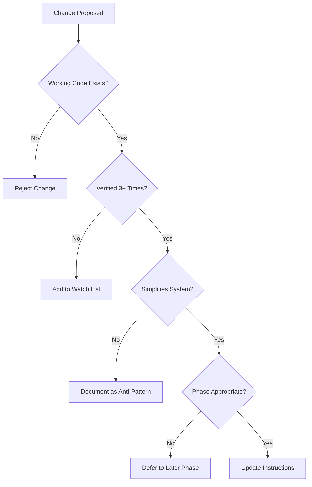

# MisterSmith CLAUDE.md Evolution & Maintenance Strategy

## 1. Evolution Philosophy

### Core Principles

- **Evidence-Driven Evolution**: Changes only after verified implementation experience
- **Constraint Relaxation**: Restrictions ease as maturity increases
- **Reality Precedence**: Working code drives instruction updates
- **Incremental Adaptation**: Small, validated changes over major rewrites

## 2. Lifecycle Stages

### Stage 1: Foundation (Weeks 0-4)

**Characteristics**:

- Maximum constraints in place
- No implementation exists
- Specification-heavy environment

**Instruction State**:

```yaml
Constraints: MAXIMUM
Allowed Features: MINIMAL
Phase Locks: STRICT
Verification: MANDATORY
```

**Key Metrics**:

- First working component: 0 → 1
- Verified functionality: None → Basic
- Anti-patterns prevented: Track all attempts

### Stage 2: Early Implementation (Weeks 4-12)

**Characteristics**:

- Basic components working
- Learning which patterns succeed
- Reality diverging from specification

**Instruction Updates**:

- Document working patterns
- Identify impossible specifications
- Refine phase transitions
- Add discovered gotchas

**Evolution Triggers**:

```markdown
IF: Basic agent spawn/execute works consistently
THEN: Relax "NO supervision" constraint to "SIMPLE supervision"

IF: Channel communication proven reliable
THEN: Allow exploration of NATS for specific use cases

IF: Specification proves impossible
THEN: Update documentation reality section
```

### Stage 3: Stable Core (Weeks 12-20)

**Characteristics**:

- Core patterns established
- Some multi-agent coordination working
- Performance patterns emerging

**Instruction Evolution**:

- Promote proven patterns
- Deprecate failed approaches
- Add performance guidelines
- Expand allowed complexity

### Stage 4: Maturing System (Weeks 20+)

**Characteristics**:

- Multiple components integrated
- Distributed features viable
- Production considerations relevant

**Final Evolution**:

- Shift from prevention to guidance
- Focus on optimization over correctness
- Allow advanced patterns with proof

## 3. Maintenance Protocol

### 3.1 Regular Review Cycles

**Weekly Review** (During active development):

```bash
# Questions to ask:
1. What anti-patterns did we encounter?
2. Which phase transitions succeeded?
3. What verifications proved insufficient?
4. Which constraints helped vs hindered?

# Actions:
- Update gotchas with new discoveries
- Refine verification requirements
- Adjust phase gates if needed
```

**Monthly Architecture Review**:

```bash
# Analyze:
- Specification vs Reality gap
- Instruction effectiveness metrics
- Developer friction points
- Unnecessary constraints

# Update:
- Documentation reality section
- Success metrics
- Command sequences
```

### 3.2 Update Decision Framework



### 3.3 Change Categories

**Type A: Constraint Relaxation**

- Requires: 3+ successful implementations
- Process: Document evidence → Update constraint → Monitor impact
- Example: "NO distributed" → "Local first, then distributed"

**Type B: Anti-Pattern Addition**

- Requires: 2+ failure instances
- Process: Document failure → Add pattern → Provide alternative
- Example: New complexity trap discovered

**Type C: Phase Adjustment**

- Requires: Consistent phase completion data
- Process: Analyze velocity → Adjust gates → Update transitions
- Example: Merge phases that always complete together

**Type D: Verification Enhancement**

- Requires: Verification insufficiency proven
- Process: Identify gap → Add requirement → Test effectiveness
- Example: Add performance verification

## 4. Evolution Patterns

### 4.1 Constraint Lifecycle

```
STRICT PROHIBITION → CONDITIONAL ALLOWANCE → GUIDED USAGE → BEST PRACTICE
         ↓                    ↓                      ↓                ↓
"FORBIDDEN: X"     "X only after Y"      "Consider X when..."   "X recommended for..."
```

### 4.2 Evidence Accumulation

```yaml
Evidence Types:
  - Working Examples: Code that runs successfully
  - Failure Patterns: Documented what doesn't work
  - Performance Data: Measured improvements
  - Developer Feedback: Friction points identified
  
Evidence Threshold:
  Minor Change: 3+ examples
  Major Change: 5+ examples + 2 weeks
  Phase Change: 10+ examples + 1 month
```

### 4.3 Deprecation Path

```
Active Constraint → Warning Status → Deprecated → Removed
       ↓                 ↓               ↓           ↓
   Enforced         Still shown     Historical    Deleted
                   but optional       record
```

## 5. Metrics & Monitoring

### 5.1 Evolution Health Metrics

**Constraint Effectiveness Rate**:

```
CER = (Constraints Preventing Issues) / (Total Constraints) × 100
Target: > 80%
Action if < 60%: Review and prune
```

**Phase Progression Velocity**:

```
PPV = (Phases Completed) / (Weeks Elapsed)
Healthy: 0.5-1.0 phases/week early, 0.25-0.5 later
Too Fast: May indicate insufficient verification
Too Slow: May indicate over-constraint
```

**Reality Alignment Score**:

```
RAS = (Implemented Features) / (Documented Features) × 100
Target: Increasing over time
Warning: If decreases, spec may be diverging
```

### 5.2 Maintenance Burden Metrics

**Update Frequency**:

- Healthy: 2-3 updates/week during active development
- Warning: >5 updates/week (too volatile)
- Warning: <1 update/month (too rigid)

**Section Stability**:

- Core sections: Should stabilize after week 4
- Phase sections: Evolve with implementation
- Gotchas: Continuous additions expected

## 6. Tooling & Automation

### 6.1 Evolution Tracking

```toml
# .claude-evolution.toml
[phase-1]
started = "2024-01-15"
completed = "2024-01-22"
changes_required = [
  "Relaxed subprocess constraint",
  "Added error handling verification"
]

[anti-patterns]
discovered = [
  { date = "2024-01-18", pattern = "Premature async complexity" },
  { date = "2024-01-20", pattern = "Over-engineered error types" }
]
```

### 6.2 Automated Checks

```bash
#!/bin/bash
# claude-instruction-lint.sh

# Check for theoretical claims without verification
grep -n "should\|could\|might" CLAUDE.md

# Ensure all code blocks are executable
extract_code_blocks CLAUDE.md | cargo check

# Verify phase progression requirements
check_phase_gates CLAUDE.md
```

## 7. Communication Strategy

### 7.1 Change Announcements

```markdown
## CLAUDE.md Update: [Date]

### Changed
- Relaxed X constraint based on evidence from [examples]
- Added Y anti-pattern discovered in [incident]

### Evidence
- [Link to working code]
- [Verification results]

### Impact
- Developers can now [specific capability]
- Still forbidden: [maintained constraints]
```

### 7.2 Feedback Collection

- Git commit messages when updating CLAUDE.md
- Issue tracking for proposed changes
- Developer surveys on constraint effectiveness

## 8. Long-Term Vision

### 8.1 Instruction Maturity Path

```
Months 0-3:  Protective constraints, maximum guardrails
Months 3-6:  Evidence-based relaxation, pattern emergence
Months 6-12: Stable core with guided flexibility
Months 12+:  Minimal constraints, maximum patterns
```

### 8.2 End State Characteristics

- Constraints exist only where repeatedly proven necessary
- Patterns documented with extensive working examples
- Phase gates based on actual complexity jumps
- Verification focused on regression prevention

### 8.3 Success Indicators

- New developers build working components without fighting instructions
- Instruction updates become rare (system stabilized)
- Anti-patterns successfully prevented in practice
- Phase progression smooth and predictable

## 9. Risk Management

### 9.1 Evolution Risks

**Risk: Premature Relaxation**

- Mitigation: Require extensive evidence
- Indicator: Regression in working functionality
- Response: Revert and increase evidence threshold

**Risk: Instruction Bloat**

- Mitigation: Regular pruning reviews
- Indicator: >10 pages of instructions
- Response: Consolidate and simplify

**Risk: Drift from Global Instructions**

- Mitigation: Regular compatibility checks
- Indicator: Conflicts in verification approach
- Response: Realign with global principles

### 9.2 Maintenance Risks

**Risk: Update Fatigue**

- Mitigation: Batch related changes
- Indicator: Developer complaints
- Response: Stabilize for 1-2 weeks

**Risk: Stale Instructions**

- Mitigation: Automated freshness checks
- Indicator: No updates despite active development
- Response: Scheduled review sessions

## 10. Implementation Checklist

### Initial Setup

- [ ] Create .claude-evolution.toml
- [ ] Set up instruction linting scripts
- [ ] Establish feedback channels
- [ ] Document baseline metrics

### Weekly Tasks

- [ ] Review encountered anti-patterns
- [ ] Update verification requirements
- [ ] Check phase progression health
- [ ] Collect developer feedback

### Monthly Tasks

- [ ] Calculate evolution metrics
- [ ] Prune ineffective constraints
- [ ] Update documentation reality
- [ ] Plan next month's focus

### Quarterly Tasks

- [ ] Major instruction revision
- [ ] Stakeholder feedback session
- [ ] Long-term vision alignment
- [ ] Tooling improvements

## Summary

The MisterSmith CLAUDE.md evolution strategy ensures instructions:

1. Start maximally constrained for safety
2. Evolve based on verified implementation
3. Relax constraints with evidence
4. Maintain alignment with reality
5. Serve developers, not doctrine

Remember: Instructions that don't evolve with the code become obstacles rather than guides.
