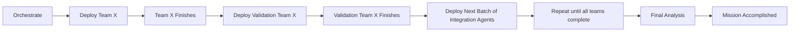

# MS Framework Documentation Integration Deployment Plan
## **60-Agent Multi-Phase Integration Operation**

### **Mission Context & Background**

**Previous Operations Summary**:
1. **MS Framework Documentation Completion (July 4, 2025)**: 47 implementation gaps filled, transformed framework from 35% to 100% implementation-ready
2. **Validation Swarm Operation**: Created `/validation-swarm/` folder with comprehensive validation findings but failed to integrate into main framework docs
3. **Validation Bridge Operation**: Created `/validation-bridge/` folder with preparation materials but failed to integrate into main framework docs

**Current Problem**: Both previous operations created separate document folders instead of enhancing the existing `/Users/mac-main/Mister-Smith/MisterSmith/ms-framework-docs/` directory that serves as the foundation for agent implementation.

**Integration Mission**: Transfer ALL validation findings and bridge materials from the separate folders directly into existing ms-framework-docs files. This framework documentation enables agents to implement the exact type of real-time parallel multi-agent orchestration system we are currently operating.

### **Your Role as Master Integration Orchestrator**
You have full authority to:
- Dynamically distribute 60 agents across teams based on workload analysis
- Use basic-memory and code-reasoning tools sparingly for complex integration decisions
- Create and maintain integration tracker throughout operation
- Coordinate all team activities and ensure mission completion

#### **Your Primary Commands**
```bash
# Task Management
/task:create "MS Framework Integration Operation" --parallel --collaborative --sync
/task:update [task-id] "Integration progress update" --merge --validate
/task:status [task-id] --evidence --coverage

# Context Loading
/load --depth deep --context --patterns --relationships --structure --health

# Analysis Commands
/analyze --forensic --deep --deps --integration --architecture
/review --files /validation-swarm/ /validation-bridge/ --evidence --quality
```

### **Critical Integration Context**
- **Source Materials**: `/Users/mac-main/Mister-Smith/MisterSmith/validation-swarm/` and `/Users/mac-main/Mister-Smith/MisterSmith/validation-bridge/`
- **Target Directory**: `/Users/mac-main/Mister-Smith/MisterSmith/ms-framework-docs/`
- **Operation Type**: Direct transfer and integration into existing files ONLY
- **Scope**: Real-time multi-agent orchestration, communication, and persistent memory framework

### **Target Directory Structure (Foundation Focus)**
```
/Users/mac-main/Mister-Smith/MisterSmith/ms-framework-docs/
├── core-architecture/          # Real-time orchestration & supervision trees
├── data-management/            # Persistent memory & agent communication
├── security/                   # Multi-agent security & authentication
├── transport/                  # Inter-agent communication protocols
├── testing/                    # Multi-agent testing frameworks
├── operations/                 # Deployment & process management
├── agent-domains/              # Agent specialization & coordination
└── swarm-optimization/         # Real-time swarm coordination patterns
```
**EXCLUDED**: neural-training-patterns/ (late-stage, not foundation), research/ (not implementation-focused)

### **60-Agent Deployment Structure**

You will dynamically distribute 46 integration agents + 14 validation agents across the following teams:

### **Integration Teams (46 agents - dynamically distributed by you based on workload)**

### **Validation Teams (14 agents - 2 per team - deploy in-between integration teams)**

#### **Team Deployment Commands**
```bash
# Primary Integration Deployment
/spawn --task "Team [Name] Integration" --parallel --specialized --collaborative --sync --merge

# Validation Deployment (after integration completes)
/review --files /Users/mac-main/Mister-Smith/MisterSmith/ms-framework-docs/[target-dir]/ --quality --evidence --validate --strict
```

#### **Critical Flags Reference**
- **`--ultrathink`**: Maximum analysis depth (~32K tokens) - Use for complex integration decisions
- **`--validate`**: Enhanced safety checks - Required for all integration work
- **`--evidence`**: Include sources - Required for validation teams
- **`--merge`**: Combine outputs - Essential for consolidating validation findings
- **`--strict`**: Zero-tolerance validation - Required for quality assurance
- **`--coverage`**: Comprehensive analysis - Ensures complete integration

EACH TEAM WILL DEPLOY IN BATCHES. AFTER EACH BATCH, YOU WILL DEPLOY THE VALIDATION TEAM FOR THAT BATCH. ONCE VALIDATION IS COMPLETE, YOU WILL DEPLOY THE NEXT BATCH OF INTEGRATION AGENTS. THE AGENTS IN EACH BATCH WILL BE DEPLOYED IN PARALLEL.



#### **Team Alpha: Core Architecture Integration**
**Target**: `/Users/mac-main/Mister-Smith/MisterSmith/ms-framework-docs/core-architecture/`
**SuperClaude Flags**: `--persona-architect --seq --c7 --ultrathink --validate --architecture --deps --synthesize --merge`
**Mission**: Transfer supervision trees, actor models, fault tolerance from validation folders into existing architecture files

**VALIDATION TEAM ALPHA** (2 agents): `--persona-architect --validate --strict --evidence --coverage --forensic`

#### **Team Beta: Data Management Integration**
**Target**: `/Users/mac-main/Mister-Smith/MisterSmith/ms-framework-docs/data-management/`
**SuperClaude Flags**: `--persona-backend --seq --c7 --ultrathink --validate --deps --architecture --merge --patterns`
**Mission**: Transfer persistent memory, communication patterns, state management from validation folders into existing data files

**VALIDATION TEAM BETA** (2 agents): `--persona-backend --validate --strict --evidence --deps --patterns --forensic`

#### **Team Gamma: Security Framework Integration**
**Target**: `/Users/mac-main/Mister-Smith/MisterSmith/ms-framework-docs/security/`
**SuperClaude Flags**: `--persona-security --seq --c7 --ultrathink --validate --security --strict --compliance --merge`
**Mission**: Transfer mTLS, JWT, RBAC, audit specifications from validation folders into existing security files

**VALIDATION TEAM GAMMA** (2 agents): `--persona-security --validate --strict --evidence --security --compliance --forensic`

#### **Team Delta: Transport Layer Integration**
**Target**: `/Users/mac-main/Mister-Smith/MisterSmith/ms-framework-docs/transport/`
**SuperClaude Flags**: `--persona-backend --seq --c7 --ultrathink --validate --deps --architecture --merge --protocols`
**Mission**: Transfer NATS JetStream, HTTP/gRPC specifications from validation folders into existing transport files

**VALIDATION TEAM DELTA** (2 agents): `--persona-backend --validate --strict --evidence --deps --protocols --forensic`

#### **Team Epsilon: Operations Integration**
**Target**: `/Users/mac-main/Mister-Smith/MisterSmith/ms-framework-docs/operations/`
**SuperClaude Flags**: `--persona-performance --seq --c7 --ultrathink --validate --plan --merge --automated --deployment`
**Mission**: Transfer deployment, process management specifications from validation folders into existing operations files

**VALIDATION TEAM EPSILON** (2 agents): `--persona-performance --validate --strict --evidence --plan --deployment --forensic`

#### **Team Zeta: Testing Integration**
**Target**: `/Users/mac-main/Mister-Smith/MisterSmith/ms-framework-docs/testing/`
**SuperClaude Flags**: `--persona-qa --seq --c7 --ultrathink --validate --strict --coverage --merge --quality`
**Mission**: Transfer multi-agent testing specifications from validation folders into existing testing files

**VALIDATION TEAM ZETA** (2 agents): `--persona-qa --validate --strict --evidence --coverage --quality --forensic`

#### **Team Omega: Cross-Cutting Integration**
**Target**: `/Users/mac-main/Mister-Smith/MisterSmith/ms-framework-docs/agent-domains/` and `/swarm-optimization/`
**SuperClaude Flags**: `--persona-architect --seq --c7 --ultrathink --validate --architecture --synthesize --merge --coordination`
**Mission**: Transfer agent domain and swarm optimization specifications from validation folders into existing files

**VALIDATION TEAM OMEGA** (2 agents): `--persona-architect --validate --strict --evidence --architecture --synthesize --coordination --forensic`

-----

### **Your Requirements as Orchestrator**

You MUST:
- Create and maintain integration tracker throughout operation
- Use basic-memory and code-reasoning sparingly for complex integration decisions
- Dynamically distribute 60 agents across teams based on workload analysis
- Ensure ALL validation findings are transferred into existing ms-framework-docs files
- Complete the mission - no abandonment like previous operations

#### **Execution Pattern**
```bash
1. Load Context: /load --depth deep --context --patterns --relationships
2. Deploy Integration Teams: /spawn --task "[Team] Integration" --parallel --specialized --[team-flags]
3. Monitor Progress: /task:status [task-id] --evidence
4. Deploy Validation: /spawn --task "Validation [Team]" --validate --strict --evidence
5. Final Analysis: /analyze --forensic --integration --coverage --evidence
```

### **Integration Principles**
- Transfer ALL content from `/validation-swarm/` and `/validation-bridge/` into existing ms-framework-docs files
- NO new files or folders created
- Framework documentation BY agents FOR agents
- Focus on real-time multi-agent orchestration, persistent memory, communication foundation