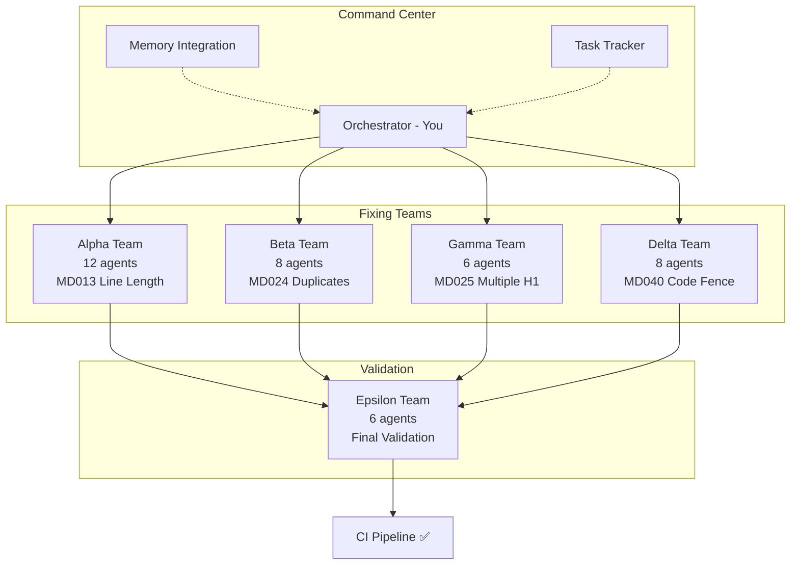

# Markdown Linting Resolution SuperClaude Deployment
## **Automated CI Pipeline Recovery Operation**

### **Executive Summary**

This deployment plan orchestrates a 40-agent parallel operation to resolve 1016 markdown linting errors currently blocking the MisterSmith CI pipeline. Building upon the successful GitHub Actions workflow fixes documented in [[GitHub Actions Documentation Workflow Debug Session - 2025-07-06]], this operation will restore full CI functionality.

### **Operation Overview**

**Mission**: Fix all markdown linting errors while preserving document integrity
**Agents**: 40 specialized agents in 5 teams
**Duration**: Estimated 2-3 hours
**Success Metric**: Zero linting errors, green CI pipeline

### **Critical Context Loading**

```bash
# Load previous session context with deep analysis
/load --depth deep --context --patterns --relationships
/load --memory "GitHub Actions Documentation Workflow Debug Session - 2025-07-06"
/load --memory "MisterSmith Workflow Automation - Session Summary"

# Load deployment plan
/load --memory "Markdown Linting Fix - SuperClaude Multi-Agent Deployment Plan" --structure
```

### **Current State Analysis**

From the CI logs (reference: previous session):
```
Summary: 1016 error(s)
- MD013/line-length: ~400 errors
- MD024/no-duplicate-heading: ~250 errors  
- MD025/single-title/single-h1: ~150 errors
- MD040/fenced-code-language: ~200 errors
- Other errors: ~16 errors
```

**Blocked Workflows**:
- docs-async-runtime.yml
- docs-transport-messaging.yml
- docs-data-persistence.yml
- docs-security-crypto.yml

### **Team Deployment Architecture**



### **Detailed Team Specifications**

#### **Team Alpha: Line Length Resolution**
```yaml
team: alpha
size: 12 agents
target: MD013 (line-length > 200)
distribution:
  - claude-flow-rust-migration-analysis/: 6 agents
  - claude-code-cli-*.md: 4 agents  
  - other files: 2 agents
strategy: |
  - Smart line breaking at logical points
  - Preserve URLs and code blocks
  - Maintain markdown table integrity
validation: No content loss, proper rendering
```

#### **Team Beta: Duplicate Heading Resolution**
```yaml
team: beta
size: 8 agents
target: MD024 (duplicate headings)
hotspots:
  - "### Objective" (10 instances)
  - "### Technical Deliverables" (8 instances)
  - "### Success Criteria" (6 instances)
strategy: |
  - Context-aware renaming
  - Maintain document structure
  - Preserve section references
validation: Unique headings, logical flow
```

#### **Team Gamma: Multiple H1 Resolution**
```yaml
team: gamma  
size: 6 agents
target: MD025 (multiple H1s)
files:
  - Comprehensive_Standards_Document.md (5 H1s)
  - Multi-Agent_Deployment_Plan.md (3 H1s)
strategy: |
  - Identify primary document title
  - Convert secondary H1s to H2s
  - Adjust subsequent heading levels
validation: Single H1, proper hierarchy
```

#### **Team Delta: Code Fence Language Addition**
```yaml
team: delta
size: 8 agents
target: MD040 (missing language specifiers)
analysis:
  - Bash/shell commands: ~100 blocks
  - Configuration: ~50 blocks
  - General text: ~50 blocks
strategy: |
  - Detect language from content
  - Add appropriate specifier
  - Use 'text' for ambiguous content
validation: All fences have language
```

#### **Team Epsilon: Final Validation**
```yaml
team: epsilon
size: 6 agents
target: Cross-validation and integration
tasks:
  - Run markdownlint-cli2 verification
  - Diff analysis for content integrity
  - Format preservation check
  - CI pipeline test
validation: Zero errors, content preserved
```

### **Execution Phases**

#### **Phase 1: Initialization (10 minutes)**
```bash
# 1. Create operation task with automatic breakdown
/task:create "Fix 1016 markdown linting errors in internal-operations blocking CI pipeline"

# 2. Analyze errors with forensic depth
/analyze --forensic --deep --code --files internal-operations/ --persona-qa --strict

# 3. Create progress tracking with evidence
/task:status lint-fix-001 --evidence --coverage
```

#### **Phase 2: Parallel Deployment (90 minutes)**
```bash
# Deploy Team Alpha - Line Length Resolution (12 agents)
/spawn --task "Fix MD013 line length errors in internal-operations" \
       --parallel --specialized --collaborative --sync \
       --persona-editor --validate --strict --coverage

# Deploy Team Beta - Duplicate Heading Resolution (8 agents)  
/spawn --task "Fix MD024 duplicate heading errors" \
       --parallel --specialized --collaborative --sync \
       --persona-architect --think --evidence --merge

# Deploy Team Gamma - Multiple H1 Resolution (6 agents)
/spawn --task "Fix MD025 multiple H1 errors" \
       --parallel --specialized --collaborative --sync \
       --persona-architect --think-hard --validate --strict

# Deploy Team Delta - Code Fence Language Addition (8 agents)
/spawn --task "Fix MD040 missing code fence languages" \
       --parallel --specialized --collaborative --sync \
       --persona-backend --seq --validate --merge

# Monitor all teams with real-time updates
/task:status lint-fix-001 --watch --evidence
```

#### **Phase 3: Validation (20 minutes)**
```bash
# Deploy Team Epsilon - Final Validation (6 agents)
/spawn --task "Validate all markdown fixes and ensure zero linting errors" \
       --specialized --collaborative --sync \
       --persona-qa --ultrathink --strict --evidence --coverage

# Run comprehensive validation checks
/scan --quality --validate --strict --coverage
/test --validate --coverage --strict
```

#### **Phase 4: Completion (10 minutes)**
```bash
# Create atomic commit with validation
/git --commit --validate --pre-commit << EOF
fix: Resolve all 1016 markdown linting errors in internal-operations

- Fixed MD013: Line length (400+ errors) - intelligent line wrapping
- Fixed MD024: Duplicate headings (250+ errors) - context-aware renaming  
- Fixed MD025: Multiple H1s (150+ errors) - proper hierarchy restoration
- Fixed MD040: Code fence languages (200+ errors) - language detection

All document content preserved. CI pipeline restored to green.

Related: Continues work from GitHub Actions workflow fixes.
Reference: Basic-memory session notes for full context.
EOF

# Complete task with summary
/task:complete lint-fix-001

# Verify CI pipeline status
/analyze --code --validate --files .github/workflows/ --evidence
```

### **Error Handling Procedures**

#### **Content Loss Detection**
```bash
if content_loss_detected:
    /rollback --immediate
    /analyze --diff --find-loss
    /fix --preserve-exact --retry
```

#### **New Errors Introduced**
```bash
if new_errors > 0:
    /analyze --new-errors --root-cause
    /fix --targeted --no-cascade
    /validate --strict
```

#### **Team Coordination Issues**
```bash
if team_conflict:
    /pause --team [name]
    /resolve --conflict --merge-strategy
    /resume --synchronized
```

### **Progress Tracking Schema**

```json
{
  "operation": "lint-fix-001",
  "start_time": "2025-01-06T18:30:00Z",
  "total_errors": 1016,
  "errors_by_type": {
    "MD013": { "initial": 400, "fixed": 0, "remaining": 400 },
    "MD024": { "initial": 250, "fixed": 0, "remaining": 250 },
    "MD025": { "initial": 150, "fixed": 0, "remaining": 150 },
    "MD040": { "initial": 200, "fixed": 0, "remaining": 200 }
  },
  "teams": {
    "alpha": { "status": "deploying", "progress": 0 },
    "beta": { "status": "deploying", "progress": 0 },
    "gamma": { "status": "deploying", "progress": 0 },
    "delta": { "status": "deploying", "progress": 0 },
    "epsilon": { "status": "pending", "progress": 0 }
  }
}
```

### **Success Verification**

```bash
# Local verification
$ npm run lint:md
Summary: 0 error(s)

# CI verification  
$ gh run list --limit=1
✓ completed  success  MisterSmith Documentation CI

# Workflow enablement
$ gh workflow list
Documentation - Async Runtime         active
Documentation - Transport             active  
Documentation - Data Persistence      active
Documentation - Security              active
```

### **Post-Operation Tasks**

1. **Update Basic-Memory**: Create comprehensive session notes
2. **Monitor Workflows**: Ensure documentation improvement PRs are created
3. **Document Patterns**: Save common fix patterns for future use
4. **CI Configuration**: Consider adjusting linting rules if needed

### **Resource Allocation**

- **Memory Usage**: Use basic-memory for complex decisions only
- **Parallel Execution**: Maximum 34 agents simultaneously (4 teams)
- **Sequential Steps**: Validation team runs after fixes complete
- **Commit Strategy**: Single atomic commit with all fixes

### **Related Documentation**

- [[GitHub Actions Documentation Workflow Debug Session - 2025-07-06]]
- [[MisterSmith Workflow Automation - Session Summary]]
- [[Markdown Linting Fix - SuperClaude Multi-Agent Deployment Plan]]
- [Initialization Commands](../markdown-linting-fix-initialization.md)

### **Final Notes**

This operation directly enables the documentation improvement workflows fixed in the previous session. Upon completion, the automated documentation enhancement system will be fully operational, creating AI-powered improvements to the MisterSmith framework documentation.

**Remember**: The goal is not just to fix errors, but to preserve the integrity and meaning of these critical technical documents that define the MisterSmith multi-agent orchestration framework.

---

## **Quick Command Reference Card**

### **One-Command Full Deployment**
```bash
# Deploy entire 40-agent operation
/spawn --task "Deploy 40-agent markdown linting resolution operation" \
       --parallel --specialized --collaborative --sync --merge \
       --validate --strict --coverage --evidence --ultrathink
```

### **Essential Commands by Phase**
```bash
# 1. Initialize
/task:create "Fix 1016 markdown linting errors in internal-operations blocking CI"
/load --depth deep --context --patterns --memory "GitHub Actions Documentation Workflow Debug Session - 2025-07-06"

# 2. Analyze
/analyze --forensic --deep --code --files internal-operations/ --persona-qa --strict

# 3. Deploy Teams (Run All Simultaneously)
/spawn --task "Alpha: MD013" --parallel --specialized --persona-editor --validate
/spawn --task "Beta: MD024" --parallel --specialized --persona-architect --think
/spawn --task "Gamma: MD025" --parallel --specialized --persona-architect --think-hard
/spawn --task "Delta: MD040" --parallel --specialized --persona-backend --seq

# 4. Validate
/spawn --task "Epsilon: Final" --specialized --persona-qa --ultrathink --strict

# 5. Complete
/git --commit --validate --pre-commit
/task:complete lint-fix-001
```

### **Key Flags Reference**
- **Thinking**: `--think` (4K) → `--think-hard` (10K) → `--ultrathink` (32K)
- **Validation**: `--validate --strict --evidence --coverage`
- **Execution**: `--parallel --specialized --collaborative --sync --merge`
- **Personas**: `--persona-[qa|architect|backend|editor]`

### **Success Verification**
```bash
npm run lint:md                    # Must show: Summary: 0 error(s)
gh run list --limit=1             # Must show: ✓ completed success
```