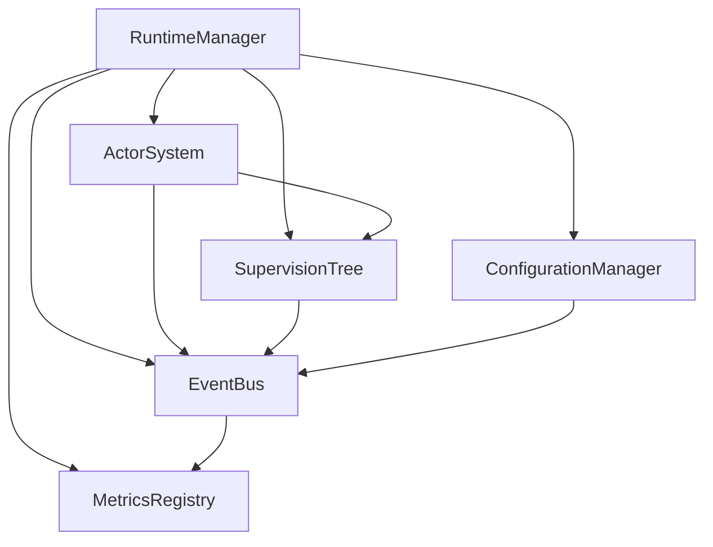

# Component Architecture - Foundational System Design

**Framework Documentation > Core Architecture > Component Architecture**

**Quick Links**: [System Architecture](system-architecture.md) | [Supervision Trees](supervision-trees.md) | [Integration Patterns](./integration-patterns.md) | [Async Patterns](async-patterns.md)

---

## Navigation

[← Back to Core Architecture](./CLAUDE.md) | [System Architecture](./system-architecture.md) | [Supervision Trees](./supervision-trees.md) | [Integration Patterns →](./integration-patterns.md)

---

## 🔍 VALIDATION STATUS

**Last Validated**: 2025-07-07  
**Validator**: Agent 1 - Team Alpha  
**Validation Score**: Optimized for Agent Readability  
**Status**: Active Development  

### Implementation Status

- ✅ Core component architecture specifications complete
- ✅ Event-driven patterns documented
- ✅ Resource management patterns established
- ✅ Configuration management framework defined
- ⚠️ Pseudocode patterns require Rust implementation

---

## Document Purpose & Scope

This document contains the foundational system design specifications extracted from the comprehensive system architecture. It focuses on the core components that form the basis of the Mister Smith AI Agent Framework:

- **Component Architecture**: Core system structure and initialization
- **Event-Driven Architecture**: Asynchronous event handling and routing
- **Resource Management**: Connection pooling and resource lifecycle
- **Configuration Management**: Dynamic configuration loading and watching

---

## Table of Contents

1. [Overview](#overview)
2. [Component Architecture](#component-architecture)
3. [Event-Driven Architecture](#event-driven-architecture)
4. [Resource Management](#resource-management)
5. [Data Management Architecture](#data-management-architecture)
6. [Configuration Management](#configuration-management)
7. [Implementation Best Practices](#implementation-best-practices)
8. [Performance Guidelines](#performance-guidelines)

---

## Overview

The MisterSmith framework uses a modular, event-driven architecture built on Rust's async runtime ecosystem. All components are designed for high concurrency, fault tolerance, and observability.

### Design Principles

1. **Async-First**: All I/O operations are non-blocking
2. **Event-Driven**: Loose coupling through event bus
3. **Resource-Bounded**: Prevent resource exhaustion
4. **Observable**: Comprehensive metrics and tracing
5. **Fault-Tolerant**: Graceful degradation and recovery

### Component Relationships



### Initialization Flow

1. Runtime manager initializes Tokio runtime
2. Core components are created
3. Components are wired together
4. Event bus subscriptions established
5. Health checks registered
6. System ready for agent spawning

---

## Component Architecture

⚠️ **Note**: This section uses pseudocode patterns. See [system-architecture.md](system-architecture.md) for concrete Rust implementations.

```rust
// Core system component structure
struct SystemCore {
    runtime_manager: RuntimeManager,
    actor_system: ActorSystem,
    supervision_tree: SupervisionTree,
    event_bus: EventBus,
    metrics_registry: MetricsRegistry,
    configuration_manager: ConfigurationManager,
}

// Metrics Registry Implementation
struct MetricsRegistry {
    counters: DashMap<String, Counter>,
    gauges: DashMap<String, Gauge>,
    histograms: DashMap<String, Histogram>,
    export_interval: Duration,
    exporters: Vec<Box<dyn MetricsExporter>>,
    overhead_monitor: OverheadMonitor,  // Track metrics collection overhead
}

struct OverheadMonitor {
    max_collection_time: Duration,     // Maximum time for metric collection
    sampling_rate: f64,                // Reduce overhead via sampling
    batch_size: usize,                 // Batch metric updates
}

impl MetricsRegistry {
    fn new() -> Self {
        Self {
            counters: DashMap::new(),
            gauges: DashMap::new(),
            histograms: DashMap::new(),
            export_interval: Duration::from_secs(60),
            exporters: Vec::new(),
            overhead_monitor: OverheadMonitor {
                max_collection_time: Duration::from_millis(10),
                sampling_rate: 1.0,  // Start with full sampling
                batch_size: 1000,
            }
        }
    }
    
    fn increment_counter(&self, name: &str, value: u64) {
        // Check overhead and apply sampling if needed
        if !self.overhead_monitor.should_sample() {
            return;
        }
        
        self.counters
            .entry(name.to_string())
            .or_insert_with(Counter::new)
            .increment(value);
    }
}

impl SystemCore {
    async fn initialize() -> Result<Self, SystemError> {
        let runtime_manager = RuntimeManager::initialize()?;
        let actor_system = ActorSystem::new();
        let supervision_tree = SupervisionTree::new();
        let event_bus = EventBus::new();
        let metrics_registry = MetricsRegistry::new();
        let configuration_manager = ConfigurationManager::load_config()?;
        
        let core = Self {
            runtime_manager,
            actor_system,
            supervision_tree,
            event_bus,
            metrics_registry,
            configuration_manager,
        };
        
        core.wire_components().await?;
        Ok(core)
    }
    
    async fn wire_components(&self) -> Result<(), SystemError> {
        // Wire supervision tree to actor system
        self.supervision_tree.set_actor_system(self.actor_system.clone());
        
        // Wire event bus to all components
        self.actor_system.set_event_bus(self.event_bus.clone());
        self.supervision_tree.set_event_bus(self.event_bus.clone());
        
        // Wire metrics to all components
        self.actor_system.set_metrics(self.metrics_registry.clone());
        self.supervision_tree.set_metrics(self.metrics_registry.clone());
        
        Ok(())
    }
    
    async fn start(&self) -> Result<(), SystemError> {
        self.runtime_manager.start_system().await?;
        self.supervision_tree.start().await?;
        self.actor_system.start().await?;
        self.event_bus.start().await?;
        
        Ok(())
    }
}
```

---

## Event-Driven Architecture

```rust
// Event bus implementation for system-wide communication
struct EventBus {
    channels: Arc<RwLock<HashMap<EventType, Vec<EventChannel>>>>,
    event_store: EventStore,
    serializer: EventSerializer,
    dead_letter_queue: DeadLetterQueue,
}

trait EventHandler {
    type Event;
    
    async fn handle_event(&self, event: Self::Event) -> EventResult;
    fn event_types(&self) -> Vec<EventType>;
    fn handler_id(&self) -> HandlerId;
}

impl EventBus {
    async fn publish<E: Event>(&self, event: E) -> Result<(), EventError> {
        let serialized_event = self.serializer.serialize(&event)?;
        let event_type = E::event_type();
        
        let channels = self.channels.read().await;
        let handlers = channels.get(&event_type).unwrap_or(&Vec::new());
        
        let futures = handlers.iter().map(|channel| {
            channel.send(serialized_event.clone())
        }).collect::<Vec<_>>();
        
        let results = futures::future::join_all(futures).await;
        
        for result in results {
            if result.is_err() {
                self.dead_letter_queue.enqueue(serialized_event.clone()).await?;
            }
        }
        
        self.event_store.persist(serialized_event).await?;
        Ok(())
    }
    
    async fn subscribe<H: EventHandler>(&self, handler: H) -> Result<SubscriptionId, EventError> {
        let subscription_id = SubscriptionId::new();
        let event_types = handler.event_types();
        
        for event_type in event_types {
            let channel = EventChannel::new(handler.clone());
            
            let mut channels = self.channels.write().await;
            channels.entry(event_type).or_insert_with(Vec::new).push(channel);
        }
        
        Ok(subscription_id)
    }
}
```

---

## Resource Management

### Secure Resource Pool Management

```rust
// Resource management with mTLS security and connection pooling
struct ResourceManager {
    connection_pools: HashMap<PoolType, ConnectionPool>,
    memory_manager: MemoryManager,
    file_handles: FileHandlePool,
    thread_pools: ThreadPoolManager,
    security_context: SecurityContext,
}

trait Resource {
    type Config;
    
    async fn acquire(config: Self::Config) -> Result<Self, ResourceError>;
    async fn release(self) -> Result<(), ResourceError>;
    fn is_healthy(&self) -> bool;
    async fn secure_handshake(&mut self, context: &SecurityContext) -> Result<(), SecurityError>;
}

struct ConnectionPool<R: Resource> {
    pool: Arc<Mutex<VecDeque<R>>>,
    max_size: usize,
    min_size: usize,
    acquire_timeout: Duration,
    idle_timeout: Duration,
    health_check_interval: Duration,
    tls_config: TlsConfig,
}

impl<R: Resource> ConnectionPool<R> {
    async fn acquire(&self) -> Result<PooledResource<R>, ResourceError> {
        timeout(self.acquire_timeout, async {
            loop {
                {
                    let mut pool = self.pool.lock().await;
                    if let Some(resource) = pool.pop_front() {
                        if resource.is_healthy() {
                            return Ok(PooledResource::new(resource, self.pool.clone()));
                        }
                    }
                }
                
                if self.can_create_new() {
                    let mut resource = R::acquire(Default::default()).await?;
                    resource.secure_handshake(&self.security_context).await?;
                    return Ok(PooledResource::new(resource, self.pool.clone()));
                }
                
                tokio::time::sleep(POLLING_INTERVAL).await;
            }
        }).await?
    }
    
    async fn return_resource(&self, resource: R) -> Result<(), ResourceError> {
        if resource.is_healthy() && self.pool.lock().await.len() < self.max_size {
            self.pool.lock().await.push_back(resource);
        } else {
            resource.release().await?;
        }
        
        Ok(())
    }
}
```

---

## Data Management Architecture

### Database Integration Layer

```rust
// Database management with connection pooling and metrics
struct DatabaseManager {
    postgresql_pool: Arc<PostgreSQLPool>,
    redis_pools: HashMap<RedisPoolType, Arc<RedisPool>>,
    migration_framework: MigrationFramework,
    event_store: EventStore,
    metrics: Arc<DataMetrics>,
}

// PostgreSQL Connection Pool Configuration
struct PostgreSQLPool {
    config: DatabaseConfig,
    pool: Arc<Pool<PostgresConnectionManager>>,
    health_checker: HealthChecker,
    metrics_collector: MetricsCollector,
}

struct DatabaseConfig {
    host: String,
    port: u16,
    database: String,
    username: String,
    password: SecretString,
    max_connections: u32,
    min_connections: u32,
    connection_timeout: Duration,
    idle_timeout: Duration,
    max_lifetime: Duration,
}

impl PostgreSQLPool {
    async fn new(config: DatabaseConfig) -> Result<Self, DatabaseError> {
        let manager = PostgresConnectionManager::new(
            config.to_connection_string(),
            NoTls,
        );
        
        let pool = Pool::builder()
            .max_size(config.max_connections)
            .min_idle(Some(config.min_connections))
            .connection_timeout(config.connection_timeout)
            .idle_timeout(Some(config.idle_timeout))
            .max_lifetime(Some(config.max_lifetime))
            .build(manager)
            .await?;
            
        Ok(Self {
            config,
            pool: Arc::new(pool),
            health_checker: HealthChecker::new(),
            metrics_collector: MetricsCollector::new(),
        })
    }
    
    async fn acquire(&self) -> Result<PooledConnection<PostgresConnectionManager<NoTls>>, DatabaseError> {
        let start = Instant::now();
        let conn = self.pool.get().await?;
        
        self.metrics_collector.record_acquisition_time(start.elapsed());
        self.metrics_collector.increment_active_connections();
        
        Ok(conn)
    }
}
```

### Migration Framework

```rust
// Database migration management
struct MigrationManager {
    migrations: Vec<Box<dyn Migration>>,
    state_store: MigrationStateStore,
    validator: SchemaValidator,
}

#[async_trait]
trait Migration: Send + Sync {
    fn version(&self) -> Version;
    fn description(&self) -> &str;
    async fn up(&self, conn: &mut PgConnection) -> Result<(), MigrationError>;
    async fn down(&self, conn: &mut PgConnection) -> Result<(), MigrationError>;
    fn checksum(&self) -> String;
}

impl MigrationManager {
    async fn run_migrations(&self, pool: &PostgreSQLPool) -> Result<MigrationReport, MigrationError> {
        let mut conn = pool.acquire().await?;
        let mut report = MigrationReport::new();
        
        // Start transaction
        let transaction = conn.transaction().await?;
        
        // Get current migration state
        let current_state = self.state_store.get_current_state(&transaction).await?;
        
        // Find pending migrations
        let pending = self.find_pending_migrations(&current_state)?;
        
        for migration in pending {
            let start = Instant::now();
            
            // Run migration
            migration.up(&mut transaction).await?;
            
            // Record migration
            self.state_store.record_migration(&transaction, &migration).await?;
            
            report.add_success(migration.version(), start.elapsed());
        }
        
        // Validate schema after migrations
        self.validator.validate_schema(&transaction).await?;
        
        // Commit transaction
        transaction.commit().await?;
        
        Ok(report)
    }
}
```

### Event Sourcing and CQRS

```rust
// Event sourcing implementation for audit trails
struct EventStore {
    write_pool: Arc<PostgreSQLPool>,
    read_pool: Arc<PostgreSQLPool>,
    event_bus: Arc<EventBus>,
    snapshot_store: SnapshotStore,
}

#[derive(Debug, Serialize, Deserialize)]
struct StoredEvent {
    event_id: Uuid,
    aggregate_id: Uuid,
    aggregate_type: String,
    event_type: String,
    event_data: JsonValue,
    event_metadata: EventMetadata,
    sequence_number: i64,
    timestamp: DateTime<Utc>,
}

impl EventStore {
    async fn append_events(&self, events: Vec<DomainEvent>) -> Result<(), EventStoreError> {
        let mut conn = self.write_pool.acquire().await?;
        let transaction = conn.transaction().await?;
        
        for event in events {
            let stored_event = self.to_stored_event(event)?;
            
            // Insert event
            sqlx::query!(
                r#"
                INSERT INTO events (
                    event_id, aggregate_id, aggregate_type,
                    event_type, event_data, event_metadata,
                    sequence_number, timestamp
                )
                VALUES ($1, $2, $3, $4, $5, $6, $7, $8)
                "#,
                stored_event.event_id,
                stored_event.aggregate_id,
                stored_event.aggregate_type,
                stored_event.event_type,
                stored_event.event_data,
                stored_event.event_metadata,
                stored_event.sequence_number,
                stored_event.timestamp
            )
            .execute(&mut transaction)
            .await?;
            
            // Publish to event bus
            self.event_bus.publish(stored_event.clone()).await?;
        }
        
        transaction.commit().await?;
        Ok(())
    }
    
    async fn get_events(
        &self,
        aggregate_id: Uuid,
        from_sequence: Option<i64>,
    ) -> Result<Vec<StoredEvent>, EventStoreError> {
        let conn = self.read_pool.acquire().await?;
        
        let events = sqlx::query_as!(
            StoredEvent,
            r#"
            SELECT * FROM events
            WHERE aggregate_id = $1
            AND ($2::bigint IS NULL OR sequence_number > $2)
            ORDER BY sequence_number ASC
            "#,
            aggregate_id,
            from_sequence
        )
        .fetch_all(&conn)
        .await?;
        
        Ok(events)
    }
}
```

---

## Configuration Management

```rust
// Dynamic configuration management with hot reloading
struct ConfigurationManager {
    config_store: Arc<RwLock<ConfigurationStore>>,
    watchers: Arc<Mutex<Vec<ConfigurationWatcher>>>,
    reload_strategy: ReloadStrategy,
}

trait Configuration: Serialize + DeserializeOwned {
    fn validate(&self) -> Result<(), ConfigError>;
    fn merge(&mut self, other: Self) -> Result<(), ConfigError>;
    fn key() -> ConfigurationKey;
}

impl ConfigurationManager {
    async fn load_config<C: Configuration>(&self) -> Result<C, ConfigError> {
        let config_data = self.config_store.read().await.get(C::key())?;
        let config: C = serde_json::from_value(config_data)?;
        config.validate()?;
        
        Ok(config)
    }
    
    async fn reload_config<C: Configuration>(&self) -> Result<(), ConfigError> {
        let new_config = self.load_config::<C>().await?;
        
        match self.reload_strategy {
            ReloadStrategy::Immediate => {
                self.apply_config(new_config).await?;
            }
            ReloadStrategy::Graceful => {
                self.schedule_graceful_reload(new_config).await?;
            }
            ReloadStrategy::OnNextRequest => {
                self.stage_config(new_config).await?;
            }
        }
        
        Ok(())
    }
    
    async fn watch_config<C: Configuration>(&self, callback: ConfigurationCallback<C>) -> Result<WatcherId, ConfigError> {
        let watcher = ConfigurationWatcher::new(C::key(), callback);
        let watcher_id = watcher.id();
        
        self.watchers.lock().await.push(watcher);
        Ok(watcher_id)
    }
}
```

---

## Implementation Best Practices

### Component Architecture Best Practices

1. **Single Responsibility**: Each component has one clear purpose
2. **Dependency Injection**: Components receive dependencies through constructors
3. **Interface Segregation**: Use traits to define minimal interfaces
4. **Async Throughout**: All I/O operations must be async
5. **Resource Cleanup**: Implement proper Drop traits for resource cleanup

### Error Recovery Patterns

#### Exponential Backoff Implementation

```rust
struct ExponentialBackoff {
    initial_delay: Duration,
    max_delay: Duration,
    multiplier: f64,
    jitter: bool,
}

impl ExponentialBackoff {
    async fn retry<F, T, E>(&self, mut operation: F) -> Result<T, E>
    where
        F: FnMut() -> Future<Output = Result<T, E>>,
        E: std::error::Error,
    {
        let mut delay = self.initial_delay;
        let mut attempt = 0;
        
        loop {
            match operation().await {
                Ok(result) => return Ok(result),
                Err(e) if attempt >= MAX_RETRIES => return Err(e),
                Err(_) => {
                    if self.jitter {
                        let jitter = rand::random::<f64>() * delay.as_secs_f64();
                        tokio::time::sleep(Duration::from_secs_f64(delay.as_secs_f64() + jitter)).await;
                    } else {
                        tokio::time::sleep(delay).await;
                    }
                    
                    delay = std::cmp::min(
                        Duration::from_secs_f64(delay.as_secs_f64() * self.multiplier),
                        self.max_delay
                    );
                    attempt += 1;
                }
            }
        }
    }
}
```

#### Circuit Breaker Pattern

```rust
#[derive(Debug, Clone, Copy)]
enum CircuitState {
    Closed,
    Open,
    HalfOpen,
}

struct CircuitBreaker {
    state: Arc<Mutex<CircuitState>>,
    failure_count: Arc<AtomicU32>,
    success_count: Arc<AtomicU32>,
    failure_threshold: u32,
    success_threshold: u32,
    timeout: Duration,
    last_failure_time: Arc<Mutex<Option<Instant>>>,
}

impl CircuitBreaker {
    async fn call<F, T>(&self, operation: F) -> Result<T, CircuitBreakerError>
    where
        F: Future<Output = Result<T, Box<dyn std::error::Error>>>,
    {
        let state = *self.state.lock().await;
        
        match state {
            CircuitState::Open => {
                let last_failure = self.last_failure_time.lock().await;
                if let Some(time) = *last_failure {
                    if time.elapsed() > self.timeout {
                        *self.state.lock().await = CircuitState::HalfOpen;
                        self.success_count.store(0, Ordering::SeqCst);
                    } else {
                        return Err(CircuitBreakerError::Open);
                    }
                }
            }
            _ => {}
        }
        
        match operation.await {
            Ok(result) => {
                self.on_success().await;
                Ok(result)
            }
            Err(e) => {
                self.on_failure().await;
                Err(CircuitBreakerError::OperationFailed(e))
            }
        }
    }
}
```

---

## Performance Guidelines

### Component Operation Latency Targets

| Operation | Target Latency | Maximum Latency |
|-----------|----------------|-----------------|
| Event Bus Publish | < 1ms | 5ms |
| Actor Message Send | < 100μs | 1ms |
| Configuration Load | < 10ms | 50ms |
| Health Check | < 50ms | 200ms |
| Metrics Collection | < 100μs | 1ms |
| Resource Acquisition | < 5ms | 20ms |

### Throughput Requirements

| Component | Minimum Throughput | Target Throughput |
|-----------|-------------------|-------------------|
| Event Bus | 10,000 msg/s | 100,000 msg/s |
| Actor System | 50,000 msg/s | 500,000 msg/s |
| Metrics Registry | 100,000 ops/s | 1,000,000 ops/s |
| Task Executor | 1,000 tasks/s | 10,000 tasks/s |

### Resource Utilization Targets

- **CPU Usage**: < 70% under normal load
- **Memory Usage**: < 80% of allocated memory
- **Connection Pool**: 50-80% utilization
- **Thread Pool**: < 90% active threads
- **Event Queue**: < 70% capacity

---

## Cross-References

### Related Framework Documentation

- [System Architecture Overview](system-architecture.md) - Complete system design
- [Runtime and Errors](runtime-and-errors.md) - Error handling patterns
- [Async Patterns](async-patterns-detailed.md) - Async implementation details
- [Supervision Trees](supervision-trees.md) - Fault tolerance mechanisms

### Related Architecture Documents

- [Data Management](../data-management/README.md) - Full data layer documentation
- [Security Framework](../security/README.md) - Security implementation
- [Transport Layer](../transport/README.md) - Communication protocols
- [Operations Guide](../operations/README.md) - Deployment patterns

### External References

- [Tokio Documentation](https://tokio.rs) - Async runtime
- [Rust Async Book](https://rust-lang.github.io/async-book/) - Async patterns
- [Actor Model](https://doc.akka.io/docs/akka/current/typed/guide/actors-intro.html) - Actor concepts

---

## Summary

This component architecture provides the foundation for building reliable, scalable AI agent systems. Key aspects include:

1. **Modular Design** - Clear separation of concerns
2. **Async-First** - Non-blocking operations throughout
3. **Event-Driven** - Loose coupling via event bus
4. **Resource Management** - Bounded pools and lifecycles
5. **Observability** - Comprehensive metrics and tracing
6. **Fault Tolerance** - Recovery patterns and supervision
7. **Performance** - Clear targets and monitoring

All components are designed to work together seamlessly while maintaining independence for testing and deployment flexibility.