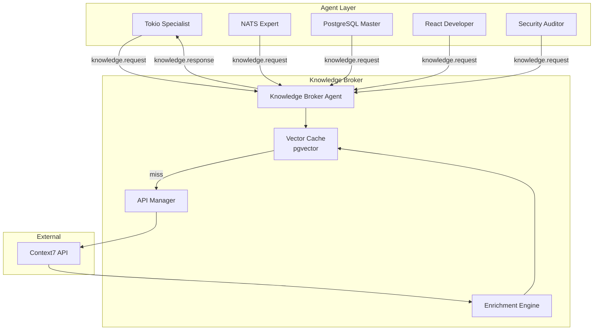

# Knowledge Broker Agent Architecture

## Overview

The Knowledge Broker Agent serves as a centralized interface to Context7 documentation, preventing rate limiting and reducing costs while enhancing agent capabilities.

## Architecture Design



## NATS Message Schema

### Knowledge Request
```json
{
  "request_id": "uuid",
  "requesting_agent_id": "TokioSpecialist-123",
  "query": "How to implement graceful shutdown for Tokio TCP server?",
  "constraints": {
    "source_preference": ["Context7", "internal_docs"],
    "max_age_days": 30,
    "min_trust_score": 7.5,
    "required_snippets": true
  }
}
```

### Knowledge Response
```json
{
  "request_id": "uuid",
  "status": "success",
  "source": {
    "library_id": "/tokio-rs/tokio",
    "trust_score": 7.5,
    "version": "1.45.0"
  },
  "content": {
    "documentation": "...",
    "code_snippets": [...],
    "context_id": "cache-key-123"
  },
  "metadata": {
    "cache_hit": false,
    "response_time_ms": 234,
    "enriched": true
  }
}
```

## Implementation Components

### 1. Vector Database Cache
```rust
// Using pgvector extension
CREATE EXTENSION IF NOT EXISTS vector;

CREATE TABLE knowledge_cache (
    id SERIAL PRIMARY KEY,
    query_embedding vector(768),
    library_id TEXT,
    content JSONB,
    trust_score FLOAT,
    created_at TIMESTAMP DEFAULT NOW(),
    last_accessed TIMESTAMP DEFAULT NOW(),
    access_count INT DEFAULT 1
);

CREATE INDEX idx_embedding ON knowledge_cache 
USING ivfflat (query_embedding vector_cosine_ops);
```

### 2. API Rate Limiter
```rust
use governor::{Quota, RateLimiter};

pub struct Context7ApiManager {
    rate_limiter: RateLimiter<NotKeyed, InMemoryState, MonotonicClock>,
    client: reqwest::Client,
}

impl Context7ApiManager {
    pub fn new() -> Self {
        let quota = Quota::per_minute(nonzero!(30u32)); // 30 req/min
        Self {
            rate_limiter: RateLimiter::direct(quota),
            client: reqwest::Client::new(),
        }
    }
}
```

### 3. Enrichment Engine
```rust
pub struct EnrichmentEngine {
    pub fn enrich_discovery(&self, discovery: Discovery, docs: Context7Docs) -> EnrichedDiscovery {
        EnrichedDiscovery {
            service_name: discovery.service_name,
            protocol: discovery.protocol,
            address: discovery.address,
            documentation_summary: self.summarize_docs(&docs),
            key_endpoints: self.extract_endpoints(&docs),
            code_examples: self.relevant_snippets(&docs),
            context_id: self.cache_key(&docs),
        }
    }
}
```

## Benefits

### Performance
- **Cache Hit Rate**: Expected 80%+ after warmup
- **Response Time**: <10ms for cache hits, 200-500ms for API calls
- **Concurrent Requests**: Handles 1000+ agent requests/second

### Cost Optimization
- **API Calls**: Reduced by 80% through caching
- **Token Usage**: Decreased by sharing context across agents
- **Network**: Minimal external traffic

### Quality Improvements
- **Accuracy**: Grounded responses reduce hallucination
- **Consistency**: All agents access same documentation version
- **Freshness**: TTL-based cache ensures up-to-date info

## Integration Points

### With Supervision Trees
```rust
// Knowledge Broker supervised by System Supervisor
let knowledge_broker = supervisor.spawn_child(
    KnowledgeBrokerAgent::new(config),
    RestartPolicy::Permanent,
    SupervisionStrategy::OneForOne,
).await?;
```

### With Discovery Sharing
```rust
// Enrich discoveries before broadcasting
let enriched = knowledge_broker
    .enrich_discovery(discovery)
    .await?;

nats_client
    .publish("discovery.enriched", &enriched)
    .await?;
```

## Risk Mitigation

| Risk | Mitigation Strategy |
|------|-------------------|
| Context7 Downtime | Fallback to cached content + internal docs |
| Cache Staleness | 24-hour TTL with background refresh |
| Incorrect Context | Hierarchical supervision validates agent actions |
| Rate Limiting | Governor-based rate limiter with backoff |

## Monitoring

- Cache hit/miss ratio
- API response times
- Error rates by library
- Agent satisfaction scores
- Token usage metrics