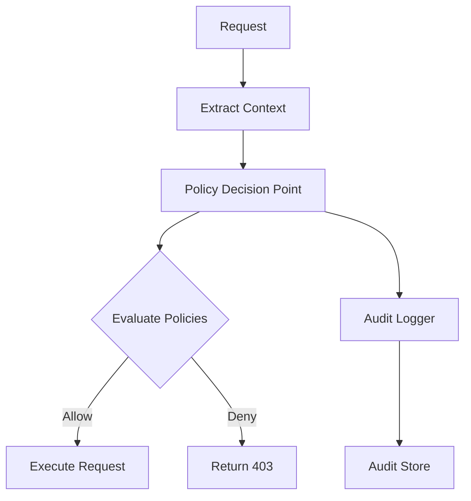

# Authorization Specifications

**Version**: 1.0.0  
**Status**: Technical Authorization Policy and Implementation Specifications  
**Last Updated**: 2025-01-03

## Overview

This document provides comprehensive technical authorization policy and implementation specifications for the Mister Smith AI Agent Framework. It defines Role-Based Access Control (RBAC) and Attribute-Based Access Control (ABAC) patterns for secure agent operations.

## Table of Contents

1. [Authorization Models](#authorization-models)
2. [Policy Architecture](#policy-architecture)
3. [Permission Matrix](#permission-matrix)
4. [Policy Engine Design](#policy-engine-design)
5. [Audit Requirements](#audit-requirements)
6. [Implementation Guidelines](#implementation-guidelines)
7. [Integration Points](#integration-points)
8. [Performance Optimization](#performance-optimization)
9. [Security Considerations](#security-considerations)
10. [Compliance Framework Integration](#compliance-framework-integration)
11. [Enhancement Roadmap](#enhancement-roadmap)

## Overview

This document provides comprehensive authorization policy and implementation specifications for the Mister Smith AI Agent Framework.
It builds upon the RBAC foundations established in the security framework and extends them with attribute-based access control (ABAC) capabilities.

### Core Principles

1. **Least Privilege**: Users receive minimum permissions required
2. **Defense in Depth**: Multiple authorization layers
3. **Explicit Deny**: Denials always override allows
4. **Complete Auditability**: All decisions are logged
5. **Performance**: Sub-millisecond authorization decisions
6. **Flexibility**: Support both RBAC and ABAC models

### Authorization Flow



## Authorization Models

### Role-Based Access Control (RBAC)

RBAC assigns permissions based on organizational roles:

```rust
pub struct Role {
    pub id: Uuid,
    pub name: String,
    pub permissions: Vec<Permission>,
    pub parent_role: Option<Uuid>,
    pub tenant_id: Uuid,
}

pub struct Permission {
    pub action: Action,
    pub resource_pattern: String,
    pub constraints: Vec<Constraint>,
}
```

### Attribute-Based Access Control (ABAC)

ABAC evaluates permissions based on attributes:

```rust
pub struct AttributePolicy {
    pub id: Uuid,
    pub name: String,
    pub effect: PolicyEffect,
    pub conditions: Vec<Condition>,
    pub targets: Vec<Target>,
    pub priority: i32,
}

pub struct Condition {
    pub attribute_path: String,
    pub operator: ComparisonOperator,
    pub value: AttributeValue,
}
```

### Hybrid Model

Combines RBAC for basic access with ABAC for fine-grained control:

```rust
pub enum AuthorizationModel {
    RBAC(RbacPolicy),
    ABAC(AbacPolicy),
    Hybrid {
        rbac: RbacPolicy,
        abac: Vec<AbacPolicy>,
    },
}
```

## Policy Architecture

### Policy Structure

```rust
#[derive(Debug, Clone, Serialize, Deserialize)]
pub struct Policy {
    pub id: Uuid,
    pub version: String,
    pub name: String,
    pub description: String,
    pub effect: PolicyEffect,
    pub priority: i32,
    pub conditions: Vec<PolicyCondition>,
    pub targets: PolicyTargets,
    pub metadata: PolicyMetadata,
}

#[derive(Debug, Clone, Serialize, Deserialize)]
pub enum PolicyEffect {
    Allow,
    Deny,
}

#[derive(Debug, Clone, Serialize, Deserialize)]
pub struct PolicyTargets {
    pub principals: Vec<PrincipalSpec>,
    pub resources: Vec<ResourceSpec>,
    pub actions: Vec<ActionSpec>,
}

#[derive(Debug, Clone, Serialize, Deserialize)]
pub struct PolicyCondition {
    pub attribute: String,
    pub operator: ConditionOperator,
    pub value: serde_json::Value,
}

#[derive(Debug, Clone, Serialize, Deserialize)]
pub enum ConditionOperator {
    Equals,
    NotEquals,
    In,
    NotIn,
    GreaterThan,
    LessThan,
    Contains,
    Regex,
    IpMatch,
    TimeWindow,
}
```

### Policy Evaluation Algorithm

1. **Collect Applicable Policies**
   ```rust
   fn collect_policies(context: &AuthzContext) -> Vec<Policy> {
       policies.iter()
           .filter(|p| p.targets.matches(context))
           .sorted_by_key(|p| -p.priority)
           .collect()
   }
   ```

2. **Evaluate Conditions**
   ```rust
   fn evaluate_policy(policy: &Policy, context: &AuthzContext) -> PolicyResult {
       let conditions_met = policy.conditions.iter()
           .all(|cond| evaluate_condition(cond, context));
       
       if conditions_met {
           PolicyResult::Match(policy.effect)
       } else {
           PolicyResult::NoMatch
       }
   }
   ```

3. **Apply Decision Logic**
   ```rust
   fn make_decision(results: Vec<PolicyResult>) -> AuthzDecision {
       // Explicit deny always wins
       if results.iter().any(|r| matches!(r, PolicyResult::Match(PolicyEffect::Deny))) {
           return AuthzDecision::Deny("Explicit deny policy matched".into());
       }
       
       // Allow if any allow policy matches
       if results.iter().any(|r| matches!(r, PolicyResult::Match(PolicyEffect::Allow))) {
           return AuthzDecision::Allow;
       }
       
       // Default deny
       AuthzDecision::Deny("No matching allow policy".into())
   }
   ```

## Permission Matrix

### Permission Syntax

```yaml
# Permission examples with proper syntax
"read:document:tenant"     # Read all documents in tenant
"write:project:own"        # Write to owned projects  
"delete:user:tenant"       # Delete users in tenant (admin only)
"execute:maintenance:all"  # Execute maintenance on all systems
"share:document:own"       # Share owned documents
```

### Role Hierarchy

```yaml
super_admin:
  description: "Global system administrator"
  permissions:
    - "*:*:*"  # All actions on all resources
  
admin:
  description: "Tenant-scoped administrator"
  parent: null
  permissions:
    - "*:*:tenant"  # All actions within tenant
    
developer:
  description: "Development team member"
  parent: contributor
  permissions:
    - "read:code:all"
    - "write:code:own"
    - "read:configuration:tenant"
    - "write:configuration:development"
    
operator:
  description: "Operations team member"
  parent: viewer
  permissions:
    - "read:metrics:all"
    - "write:deployment:production"
    - "read:logs:all"
    - "execute:maintenance:scheduled"
    
auditor:
  description: "Compliance and audit role"
  parent: viewer
  permissions:
    - "read:*:all"
    - "read:audit_logs:all"
    - "export:reports:compliance"
    
owner:
  description: "Resource owner"
  permissions:
    - "read:$resource:own"
    - "write:$resource:own"
    - "delete:$resource:own"
    - "share:$resource:own"
    
contributor:
  description: "Resource contributor"
  parent: viewer
  permissions:
    - "read:$resource:shared"
    - "write:$resource:shared"
    
viewer:
  description: "Read-only access"
  permissions:
    - "read:$resource:public"
    - "read:$resource:shared"
```

### Permission Syntax

Format: `<action>:<resource>:<scope>`

**Actions**:

- `read` - View resource
- `write` - Modify resource
- `delete` - Remove resource
- `execute` - Run operations
- `admin` - Administrative actions
- `share` - Share with others
- `export` - Export data

**Resources**:

- `user` - User accounts
- `project` - Projects
- `document` - Documents
- `configuration` - System configs
- `deployment` - Deployments
- `metrics` - Metrics data
- `audit_logs` - Audit logs
- `*` - All resources

**Scopes**:

- `own` - Resources owned by user
- `shared` - Resources shared with user
- `team` - Resources in user's team
- `tenant` - Resources in user's tenant
- `public` - Public resources
- `all` - All instances
- `*` - All scopes

### Permission Examples

#### Basic CRUD Operations
```yaml
# Read permissions
"read:document:tenant"      # Read all documents in tenant
"read:project:own"          # Read owned projects only
"read:metrics:team"         # Read team metrics

# Write permissions
"write:project:own"         # Write to owned projects
"write:configuration:team"  # Write team configurations
"write:document:shared"     # Write to shared documents

# Delete permissions
"delete:user:tenant"        # Delete users in tenant (admin only)
"delete:document:own"       # Delete owned documents
"delete:project:team"       # Delete team projects

# Administrative permissions
"admin:system:all"          # Full system administration
"admin:tenant:own"          # Tenant administration
"admin:team:assigned"       # Assigned team administration
```

#### Advanced Permission Patterns
```yaml
# Time-based permissions
"execute:maintenance:all[business_hours]"
"read:reports:tenant[weekdays]"

# Conditional permissions
"write:production:team[with_approval]"
"delete:critical:own[with_backup]"

# Scoped operations
"share:document:own"         # Share owned documents
"export:data:team"          # Export team data
"migrate:project:tenant"    # Migrate projects within tenant
```

## Policy Engine Design

### Core Components

```rust
pub struct PolicyEngine {
    policy_store: Arc<dyn PolicyStore>,
    context_builder: Arc<dyn ContextBuilder>,
    evaluator: Arc<dyn PolicyEvaluator>,
    audit_logger: Arc<dyn AuditLogger>,
    cache: Arc<dyn AuthzCache>,
}

impl PolicyEngine {
    pub async fn authorize(&self, request: AuthzRequest) -> Result<AuthzDecision> {
        // Check cache first
        if let Some(cached) = self.cache.get(&request).await? {
            return Ok(cached);
        }
        
        // Build evaluation context
        let context = self.context_builder.build(&request).await?;
        
        // Get applicable policies
        let policies = self.policy_store.get_applicable_policies(&context).await?;
        
        // Evaluate policies
        let decision = self.evaluator.evaluate(&policies, &context).await?;
        
        // Audit the decision
        self.audit_logger.log_decision(&request, &context, &decision).await?;
        
        // Cache the result
        self.cache.set(&request, &decision).await?;
        
        Ok(decision)
    }
}
```

### Context Builder

```rust
#[derive(Debug, Clone, Serialize, Deserialize)]
pub struct AuthorizationContext {
    pub principal: Principal,
    pub resource: Resource,
    pub action: Action,
    pub environment: Environment,
    pub attributes: HashMap<String, AttributeValue>,
}

#[derive(Debug, Clone, Serialize, Deserialize)]
pub struct Principal {
    pub id: Uuid,
    pub type_: PrincipalType,
    pub roles: Vec<String>,
    pub tenant_id: Uuid,
    pub team_ids: Vec<Uuid>,
    pub attributes: HashMap<String, AttributeValue>,
}

#[derive(Debug, Clone, Serialize, Deserialize)]
pub struct Resource {
    pub id: String,
    pub type_: ResourceType,
    pub owner_id: Option<Uuid>,
    pub tenant_id: Uuid,
    pub team_id: Option<Uuid>,
    pub classification: ResourceClassification,
    pub attributes: HashMap<String, AttributeValue>,
}

#[derive(Debug, Clone, Serialize, Deserialize)]
pub struct Environment {
    pub timestamp: DateTime<Utc>,
    pub ip_address: Option<IpAddr>,
    pub user_agent: Option<String>,
    pub request_id: String,
    pub session_id: Option<String>,
    pub business_hours: bool,
    pub location: Option<String>,
}

#[derive(Debug, Clone, Serialize, Deserialize)]
pub enum ResourceClassification {
    Public,
    Internal,
    Confidential,
    Restricted,
}

// Example context building
impl AuthorizationContext {
    pub fn new(
        principal: Principal,
        resource: Resource,
        action: Action,
    ) -> Self {
        let environment = Environment {
            timestamp: Utc::now(),
            ip_address: None,
            user_agent: None,
            request_id: Uuid::new_v4().to_string(),
            session_id: None,
            business_hours: Self::is_business_hours(),
            location: None,
        };
        
        Self {
            principal,
            resource,
            action,
            environment,
            attributes: HashMap::new(),
        }
    }
    
    fn is_business_hours() -> bool {
        let now = Utc::now();
        let hour = now.hour();
        let weekday = now.weekday();
        
        matches!(weekday, Weekday::Mon | Weekday::Tue | Weekday::Wed | Weekday::Thu | Weekday::Fri)
            && (9..=17).contains(&hour)
    }
}
```

### Policy Evaluator

```rust
#[async_trait]
pub trait PolicyEvaluator: Send + Sync {
    async fn evaluate(
        &self,
        policies: &[Policy],
        context: &AuthorizationContext,
    ) -> Result<AuthzDecision>;
}

pub struct DefaultPolicyEvaluator {
    condition_evaluator: Arc<dyn ConditionEvaluator>,
}

#[async_trait]
impl PolicyEvaluator for DefaultPolicyEvaluator {
    async fn evaluate(
        &self,
        policies: &[Policy],
        context: &AuthorizationContext,
    ) -> Result<AuthzDecision> {
        let mut results = Vec::new();
        
        for policy in policies {
            let result = self.evaluate_single_policy(policy, context).await?;
            results.push(result);
            
            // Short-circuit on explicit deny
            if matches!(result, PolicyResult::Match(PolicyEffect::Deny)) {
                break;
            }
        }
        
        Ok(Self::combine_results(results))
    }
}
```

## Audit Requirements

### Audit Log Structure

```rust
#[derive(Debug, Serialize, Deserialize)]
pub struct AuthorizationAuditLog {
    pub id: Uuid,
    pub timestamp: DateTime<Utc>,
    pub request_id: String,
    pub principal: AuditPrincipal,
    pub resource: AuditResource,
    pub action: String,
    pub decision: AuthzDecision,
    pub evaluated_policies: Vec<PolicyEvaluation>,
    pub reason: String,
    pub context: HashMap<String, serde_json::Value>,
    pub duration_ms: u64,
}

#[derive(Debug, Serialize, Deserialize)]
pub struct PolicyEvaluation {
    pub policy_id: Uuid,
    pub policy_name: String,
    pub policy_version: String,
    pub matched: bool,
    pub effect: Option<PolicyEffect>,
    pub conditions_evaluated: Vec<ConditionResult>,
}

#[derive(Debug, Serialize, Deserialize)]
pub struct ConditionResult {
    pub condition: String,
    pub passed: bool,
    pub actual_value: Option<String>,
    pub expected_value: String,
}
```

### Audit Logger Implementation

```rust
#[async_trait]
pub trait AuditLogger: Send + Sync {
    async fn log_decision(
        &self,
        request: &AuthzRequest,
        context: &AuthorizationContext,
        decision: &AuthzDecision,
    ) -> Result<()>;
    
    async fn query_logs(
        &self,
        filter: &AuditLogFilter,
    ) -> Result<Vec<AuthorizationAuditLog>>;
}

pub struct DefaultAuditLogger {
    storage: Arc<dyn AuditStorage>,
    encryptor: Arc<dyn Encryptor>,
}

impl DefaultAuditLogger {
    async fn create_audit_log(
        &self,
        request: &AuthzRequest,
        context: &AuthorizationContext,
        decision: &AuthzDecision,
        evaluations: Vec<PolicyEvaluation>,
    ) -> Result<AuthorizationAuditLog> {
        let log = AuthorizationAuditLog {
            id: Uuid::new_v4(),
            timestamp: Utc::now(),
            request_id: context.environment.request_id.clone(),
            principal: self.extract_principal_info(&context.principal),
            resource: self.extract_resource_info(&context.resource),
            action: context.action.to_string(),
            decision: decision.clone(),
            evaluated_policies: evaluations,
            reason: self.format_decision_reason(decision),
            context: self.extract_context_attributes(context),
            duration_ms: request.start_time.elapsed().as_millis() as u64,
        };
        
        Ok(log)
    }
}
```

### Audit Retention Policy

```yaml
audit_retention:
  default_retention: 90_days
  
  by_decision:
    allow: 30_days
    deny: 90_days
    
  by_severity:
    critical: 365_days  # Failed super_admin attempts
    high: 180_days      # Failed admin attempts
    normal: 90_days     # Regular operations
    
  compliance_holds:
    - type: legal_hold
      duration: indefinite
    - type: security_investigation
      duration: 180_days
```

## Implementation Guidelines

### Authorization Middleware

```rust
pub struct AuthorizationMiddleware {
    policy_engine: Arc<PolicyEngine>,
    token_validator: Arc<dyn TokenValidator>,
}

impl AuthorizationMiddleware {
    pub fn new(policy_engine: Arc<PolicyEngine>, token_validator: Arc<dyn TokenValidator>) -> Self {
        Self { policy_engine, token_validator }
    }
}

#[async_trait]
impl<S> Middleware<S> for AuthorizationMiddleware
where
    S: Service<Request = Request<Body>, Response = Response<Body>> + Send + Sync + 'static,
{
    async fn handle(
        &self,
        req: Request<Body>,
        next: Next<S>,
    ) -> Result<Response<Body>, Error> {
        // Extract authorization context
        let auth_header = req.headers()
            .get(AUTHORIZATION)
            .ok_or_else(|| Error::Unauthorized("Missing authorization header".into()))?;
        
        // Validate token and extract claims
        let claims = self.token_validator
            .validate(auth_header.to_str()?)
            .await?;
        
        // Build authorization request
        let authz_request = AuthzRequest {
            principal_id: claims.subject,
            resource: self.extract_resource(&req),
            action: self.extract_action(&req),
            attributes: self.extract_attributes(&req),
        };
        
        // Make authorization decision
        let decision = self.policy_engine
            .authorize(authz_request)
            .await?;
        
        match decision {
            AuthzDecision::Allow => {
                // Add authorization context to request extensions
                req.extensions_mut().insert(claims);
                next.run(req).await
            }
            AuthzDecision::Deny(reason) => {
                Err(Error::Forbidden(reason))
            }
        }
    }
}
```

### Resource-Level Authorization

```rust
pub trait ResourceAuthorizer: Send + Sync {
    async fn authorize_access(
        &self,
        principal: &Principal,
        resource_id: &str,
        action: &Action,
    ) -> Result<AuthzDecision>;
    
    async fn filter_authorized_resources(
        &self,
        principal: &Principal,
        resources: Vec<Resource>,
        action: &Action,
    ) -> Result<Vec<Resource>>;
}

pub struct DefaultResourceAuthorizer {
    policy_engine: Arc<PolicyEngine>,
}

impl DefaultResourceAuthorizer {
    pub async fn authorize_batch(
        &self,
        principal: &Principal,
        requests: Vec<(String, Action)>,
    ) -> Result<HashMap<String, AuthzDecision>> {
        let futures = requests.into_iter().map(|(resource_id, action)| {
            let engine = self.policy_engine.clone();
            let principal = principal.clone();
            
            async move {
                let decision = engine.authorize(AuthzRequest {
                    principal_id: principal.id,
                    resource: Resource { id: resource_id.clone(), ..Default::default() },
                    action,
                    attributes: HashMap::new(),
                }).await?;
                
                Ok((resource_id, decision))
            }
        });
        
        let results = futures::future::try_join_all(futures).await?;
        Ok(results.into_iter().collect())
    }
}
```

### Policy Management

```rust
pub struct PolicyManager {
    store: Arc<dyn PolicyStore>,
    validator: Arc<dyn PolicyValidator>,
    versioner: Arc<dyn PolicyVersioner>,
}

impl PolicyManager {
    pub async fn create_policy(&self, policy: Policy) -> Result<Policy> {
        // Validate policy syntax and semantics
        self.validator.validate(&policy).await?;
        
        // Assign version
        let versioned_policy = self.versioner.version(policy).await?;
        
        // Store policy
        self.store.create(versioned_policy).await
    }
    
    pub async fn update_policy(&self, id: Uuid, updates: PolicyUpdate) -> Result<Policy> {
        // Get current policy
        let current = self.store.get(id).await?;
        
        // Apply updates
        let updated = current.apply_updates(updates);
        
        // Validate changes
        self.validator.validate(&updated).await?;
        
        // Version the update
        let versioned = self.versioner.version(updated).await?;
        
        // Store with rollback capability
        self.store.update(id, versioned).await
    }
    
    pub async fn test_policy(&self, policy: &Policy, test_cases: Vec<TestCase>) -> Result<TestResults> {
        let engine = PolicyEngine::new_isolated();
        engine.load_policy(policy).await?;
        
        let results = test_cases.into_iter().map(|test| {
            let decision = engine.authorize(test.request).await?;
            TestResult {
                case: test,
                decision,
                passed: decision == test.expected,
            }
        }).collect();
        
        Ok(TestResults { results })
    }
}
```

## Integration Points

### HTTP API Integration

```rust
pub fn configure_authorization(app: Router) -> Router {
    app.layer(
        ServiceBuilder::new()
            .layer(AuthorizationMiddleware::new(
                policy_engine.clone(),
                token_validator.clone(),
            ))
            .layer(TraceLayer::new_for_http())
    )
}

// Route-specific authorization
app.route("/api/v1/projects/:id", delete(delete_project)
    .layer(RequirePermission::new("delete:project:own")))
```

### gRPC Integration

```rust
pub struct AuthorizationInterceptor {
    policy_engine: Arc<PolicyEngine>,
}

impl Interceptor for AuthorizationInterceptor {
    fn call(&mut self, request: Request<()>) -> Result<Request<()>, Status> {
        let metadata = request.metadata();
        
        // Extract token from metadata
        let token = metadata
            .get("authorization")
            .ok_or_else(|| Status::unauthenticated("Missing token"))?;
        
        // Validate and authorize
        let claims = block_on(self.validate_token(token))?;
        let decision = block_on(self.authorize(&claims, &request))?;
        
        match decision {
            AuthzDecision::Allow => Ok(request),
            AuthzDecision::Deny(reason) => Err(Status::permission_denied(reason)),
        }
    }
}
```

### Database Integration

```rust
pub struct DatabaseAuthorizer {
    policy_engine: Arc<PolicyEngine>,
}

impl DatabaseAuthorizer {
    pub fn create_row_filter(&self, principal: &Principal, table: &str) -> SqlFilter {
        match principal.roles.as_slice() {
            roles if roles.contains(&"admin".to_string()) => SqlFilter::None,
            roles if roles.contains(&"tenant_admin".to_string()) => {
                SqlFilter::Where(format!("tenant_id = '{}'", principal.tenant_id))
            }
            _ => SqlFilter::Where(format!(
                "owner_id = '{}' OR visibility = 'public'",
                principal.id
            )),
        }
    }
    
    pub async fn authorize_query(
        &self,
        principal: &Principal,
        query: &SqlQuery,
    ) -> Result<AuthorizedQuery> {
        let tables = self.extract_tables(query)?;
        
        for table in &tables {
            let decision = self.policy_engine.authorize(AuthzRequest {
                principal_id: principal.id,
                resource: Resource {
                    type_: ResourceType::DatabaseTable,
                    id: table.clone(),
                    ..Default::default()
                },
                action: Action::Read,
                attributes: HashMap::new(),
            }).await?;
            
            if matches!(decision, AuthzDecision::Deny(_)) {
                return Err(Error::Forbidden(format!("Access denied to table: {}", table)));
            }
        }
        
        Ok(AuthorizedQuery {
            query: query.clone(),
            filters: self.create_filters(principal, &tables),
        })
    }
}
```

### Message Queue Integration

```rust
pub struct MessageAuthorizer {
    policy_engine: Arc<PolicyEngine>,
}

impl MessageAuthorizer {
    pub async fn authorize_publish(
        &self,
        principal: &Principal,
        topic: &str,
        message: &[u8],
    ) -> Result<AuthzDecision> {
        self.policy_engine.authorize(AuthzRequest {
            principal_id: principal.id,
            resource: Resource {
                type_: ResourceType::Topic,
                id: topic.to_string(),
                ..Default::default()
            },
            action: Action::Publish,
            attributes: hashmap! {
                "message_size" => AttributeValue::Number(message.len() as i64),
            },
        }).await
    }
    
    pub async fn authorize_subscribe(
        &self,
        principal: &Principal,
        topic_pattern: &str,
    ) -> Result<AuthorizedSubscription> {
        let decision = self.policy_engine.authorize(AuthzRequest {
            principal_id: principal.id,
            resource: Resource {
                type_: ResourceType::Topic,
                id: topic_pattern.to_string(),
                ..Default::default()
            },
            action: Action::Subscribe,
            attributes: HashMap::new(),
        }).await?;
        
        match decision {
            AuthzDecision::Allow => Ok(AuthorizedSubscription {
                pattern: topic_pattern.to_string(),
                filters: self.create_message_filters(principal),
            }),
            AuthzDecision::Deny(reason) => Err(Error::Forbidden(reason)),
        }
    }
}
```

## Performance Optimization

### Performance Targets

- **Target**: Sub-millisecond authorization decisions (<1ms)
- **Approach**: Constant-time evaluation with timing attack prevention
- **Cache Strategy**: Multi-layer caching with smart invalidation
- **Bulk Operations**: Batch authorization for performance optimization

### Caching Strategy

```rust
pub struct AuthorizationCache {
    decision_cache: Arc<Cache<AuthzCacheKey, AuthzDecision>>,
    policy_cache: Arc<Cache<PolicyCacheKey, Vec<Policy>>>,
    permission_cache: Arc<Cache<PermissionCacheKey, bool>>,
}

impl AuthorizationCache {
    pub fn new(config: CacheConfig) -> Self {
        Self {
            decision_cache: Arc::new(
                Cache::builder()
                    .max_capacity(config.decision_cache_size)
                    .time_to_live(Duration::from_secs(config.decision_ttl_secs))
                    .build()
            ),
            policy_cache: Arc::new(
                Cache::builder()
                    .max_capacity(config.policy_cache_size)
                    .time_to_live(Duration::from_secs(config.policy_ttl_secs))
                    .build()
            ),
            permission_cache: Arc::new(
                Cache::builder()
                    .max_capacity(config.permission_cache_size)
                    .time_to_live(Duration::from_secs(config.permission_ttl_secs))
                    .build()
            ),
        }
    }
    
    pub async fn get_decision(&self, key: &AuthzCacheKey) -> Option<AuthzDecision> {
        self.decision_cache.get(key).await
    }
    
    pub async fn invalidate_principal(&self, principal_id: &Uuid) {
        // Invalidate all cached decisions for this principal
        self.decision_cache
            .invalidate_entries_if(|k, _| k.principal_id == *principal_id)
            .await;
    }
}
```

### Permission Matrix Precomputation

```rust
pub struct PermissionMatrix {
    matrix: DashMap<(RoleId, ResourceType, Action), bool>,
}

impl PermissionMatrix {
    pub async fn precompute(&self, roles: &[Role]) -> Result<()> {
        for role in roles {
            for permission in &role.permissions {
                let key = (role.id, permission.resource_type, permission.action);
                self.matrix.insert(key, true);
            }
        }
        Ok(())
    }
    
    pub fn check(&self, role_id: &RoleId, resource_type: &ResourceType, action: &Action) -> bool {
        self.matrix.contains_key(&(*role_id, *resource_type, *action))
    }
}
```

### Bulk Authorization

```rust
pub struct BulkAuthorizer {
    engine: Arc<PolicyEngine>,
    batch_size: usize,
}

impl BulkAuthorizer {
    pub async fn authorize_batch(
        &self,
        requests: Vec<AuthzRequest>,
    ) -> Result<Vec<AuthzDecision>> {
        let chunks = requests.chunks(self.batch_size);
        let mut results = Vec::with_capacity(requests.len());
        
        for chunk in chunks {
            let futures = chunk.iter().map(|req| {
                self.engine.authorize(req.clone())
            });
            
            let chunk_results = futures::future::try_join_all(futures).await?;
            results.extend(chunk_results);
        }
        
        Ok(results)
    }
}
```

## Security Considerations

### Threat Coverage

- **OWASP Top 10**: Broken access control prevention
- **Insider Threats**: Role-based limitations and comprehensive audit trails
- **External Attacks**: Input validation and injection prevention mechanisms
- **Data Breaches**: Encryption and access logging with integrity verification

### Policy Injection Prevention

```rust
pub struct PolicyValidator {
    schema_validator: JsonSchema,
    security_validator: SecurityValidator,
}

impl PolicyValidator {
    pub async fn validate(&self, policy: &Policy) -> Result<()> {
        // Schema validation
        self.schema_validator.validate(policy)?;
        
        // Security validation
        self.validate_no_wildcards_in_critical_resources(policy)?;
        self.validate_no_privilege_escalation(policy)?;
        self.validate_condition_safety(policy)?;
        
        Ok(())
    }
    
    fn validate_condition_safety(&self, policy: &Policy) -> Result<()> {
        for condition in &policy.conditions {
            // Prevent regex DoS
            if let ConditionOperator::Regex = condition.operator {
                self.validate_safe_regex(&condition.value)?;
            }
            
            // Prevent path traversal
            if condition.attribute.contains("..") {
                return Err(Error::InvalidPolicy("Path traversal detected".into()));
            }
        }
        Ok(())
    }
}
```

### Timing Attack Prevention

```rust
impl PolicyEngine {
    async fn constant_time_evaluation(&self, request: AuthzRequest) -> Result<AuthzDecision> {
        let start = Instant::now();
        let decision = self.authorize(request).await?;
        
        // Add random jitter to prevent timing attacks
        let elapsed = start.elapsed();
        let target_duration = Duration::from_micros(1000);
        
        if elapsed < target_duration {
            let jitter = rand::random::<u64>() % 100;
            tokio::time::sleep(target_duration - elapsed + Duration::from_micros(jitter)).await;
        }
        
        Ok(decision)
    }
}
```

### Audit Log Protection

```rust
pub struct SecureAuditLogger {
    logger: Arc<dyn AuditLogger>,
    signer: Arc<dyn MessageSigner>,
}

impl SecureAuditLogger {
    pub async fn log_decision(&self, log: AuthorizationAuditLog) -> Result<()> {
        // Sign the log entry
        let signature = self.signer.sign(&log).await?;
        
        let signed_log = SignedAuditLog {
            log,
            signature,
            timestamp: Utc::now(),
        };
        
        // Store with tamper detection
        self.logger.store_signed(signed_log).await
    }
}
```

## Testing Guidelines

### Policy Testing Framework

```rust
#[cfg(test)]
mod tests {
    use super::*;
    
    #[tokio::test]
    async fn test_rbac_inheritance() {
        let engine = create_test_engine();
        
        // Create role hierarchy
        let admin = Role::new("admin", vec!["*:*:*"]);
        let developer = Role::new("developer", vec!["read:code:*", "write:code:own"])
            .with_parent("admin");
        
        // Test inheritance
        let context = create_context("user1", vec!["developer"], "code", "read");
        let decision = engine.authorize(context).await.unwrap();
        
        assert_eq!(decision, AuthzDecision::Allow);
    }
    
    #[tokio::test]
    async fn test_explicit_deny_precedence() {
        let engine = create_test_engine();
        
        // Create conflicting policies
        let allow_policy = Policy::new()
            .with_effect(PolicyEffect::Allow)
            .with_target("role:developer", "resource:production", "action:deploy");
            
        let deny_policy = Policy::new()
            .with_effect(PolicyEffect::Deny)
            .with_target("role:developer", "resource:production", "action:deploy")
            .with_condition("time", ConditionOperator::NotIn, "business_hours");
        
        // Test outside business hours
        let context = create_context_with_time("user1", vec!["developer"], "production", "deploy", "02:00");
        let decision = engine.authorize(context).await.unwrap();
        
        assert_eq!(decision, AuthzDecision::Deny("Outside business hours".into()));
    }
}
```

### Load Testing

```rust
#[tokio::test]
async fn test_authorization_performance() {
    let engine = create_production_engine();
    let mut latencies = Vec::new();
    
    for _ in 0..10000 {
        let start = Instant::now();
        let _ = engine.authorize(create_random_request()).await;
        latencies.push(start.elapsed());
    }
    
    let p99 = calculate_percentile(&latencies, 99.0);
    assert!(p99 < Duration::from_millis(1), "P99 latency exceeds 1ms: {:?}", p99);
}
```

## Migration Guidelines

### From Basic RBAC to Full Authorization

1. **Phase 1: Audit Current Permissions**
   ```sql
   -- Export current role assignments
   SELECT user_id, role_name, granted_at
   FROM user_roles
   ORDER BY user_id;
   ```

2. **Phase 2: Create Policy Definitions**
   ```rust
   // Convert roles to policies
   for role in legacy_roles {
       let policy = Policy::from_legacy_role(role);
       policy_manager.create_policy(policy).await?;
   }
   ```

3. **Phase 3: Enable Dual Mode**
   ```rust
   // Run both systems in parallel
   let legacy_decision = legacy_rbac.check_permission(user, resource, action);
   let new_decision = policy_engine.authorize(request).await?;
   
   // Log discrepancies
   if legacy_decision != new_decision {
       audit_logger.log_mismatch(user, resource, action, legacy_decision, new_decision);
   }
   
   // Use legacy decision during migration
   return legacy_decision;
   ```

4. **Phase 4: Gradual Rollout**
   ```rust
   // Percentage-based rollout
   if hash(user_id) % 100 < rollout_percentage {
       return policy_engine.authorize(request).await;
   } else {
       return legacy_rbac.check_permission(user, resource, action);
   }
   ```

## Compliance Framework Integration

### GDPR Requirements

```yaml
gdpr_requirements:
  data_minimization:
    - Only collect necessary attributes for authorization
    - Automatic purging of unused attributes
    - Minimal attribute collection enforcement
    
  right_to_access:
    - API endpoint to retrieve all authorization decisions for a user
    - Export format includes all evaluated policies
    
  right_to_erasure:
    - Anonymization of audit logs after retention period
    - Removal of user-specific attributes from policies
    - Automated erasure after retention periods
```

### SOC 2 Controls

```yaml
soc2_controls:
  cc6.1_logical_access:
    - Implement least privilege through RBAC/ABAC
    - Regular access reviews and certification
    
  cc6.2_new_access:
    - Approval workflow for role assignments
    - Automatic provisioning based on job function
    
  cc6.3_modify_access:
    - Audit trail for all permission changes
    - Periodic recertification requirements
```

### ISO 27001 Controls

```yaml
iso27001_controls:
  a.9.1_access_control_policy:
    - Documented authorization policies
    - Regular policy reviews and updates
    
  a.9.2_user_access_management:
    - Formal user registration process
    - Unique user identification
    - Access rights review procedures
```

## Forensic Investigation Capabilities

### Enhanced Audit Event Search

**Based on Compliance Audit Finding: Forensic Investigation Score 8/16 points**

```rust
// Enhanced forensic search capabilities
pub struct ForensicSearchEngine {
    audit_store: Arc<dyn AuditStorage>,
    correlation_engine: Arc<dyn EventCorrelator>,
    evidence_chain: Arc<dyn EvidenceChainManager>,
}

impl ForensicSearchEngine {
    /// Advanced event search with forensic context
    pub async fn search_events_forensic(
        &self,
        criteria: ForensicSearchCriteria,
    ) -> Result<ForensicSearchResults> {
        let events = self.audit_store.search_events(&criteria).await?;
        
        // Build event correlation chains
        let correlated_events = self.correlation_engine
            .build_correlation_chains(&events).await?;
        
        // Create forensic timeline
        let timeline = self.build_forensic_timeline(&correlated_events).await?;
        
        // Generate evidence chain
        let evidence = self.evidence_chain
            .create_evidence_chain(&correlated_events).await?;
        
        Ok(ForensicSearchResults {
            events: correlated_events,
            timeline,
            evidence_chain: evidence,
            metadata: self.generate_search_metadata(&criteria).await?,
        })
    }
    
    /// User activity reconstruction for forensic analysis
    pub async fn reconstruct_user_activity(
        &self,
        user_id: Uuid,
        time_range: (DateTime<Utc>, DateTime<Utc>),
        include_related_entities: bool,
    ) -> Result<UserActivityReconstruction> {
        // CRITICAL GAP ADDRESSED: Enhanced user activity reconstruction
        let base_events = self.audit_store.get_user_events(
            user_id, 
            time_range.0, 
            time_range.1
        ).await?;
        
        let mut reconstruction = UserActivityReconstruction::new(user_id, time_range);
        
        for event in base_events {
            reconstruction.add_event(event);
            
            if include_related_entities {
                // Cross-reference with related system events
                let related = self.find_related_events(&event).await?;
                reconstruction.add_related_events(related);
            }
        }
        
        // Build behavioral patterns
        reconstruction.analyze_patterns().await?;
        
        Ok(reconstruction)
    }
}

// CRITICAL GAP: Evidence chain of custody implementation
#[derive(Debug, Serialize)]
pub struct EvidenceChain {
    pub chain_id: Uuid,
    pub created_at: DateTime<Utc>,
    pub created_by: Uuid,
    pub events: Vec<EvidenceEvent>,
    pub integrity_hash: String,
    pub custody_log: Vec<CustodyEntry>,
}

#[derive(Debug, Serialize)]
pub struct CustodyEntry {
    pub timestamp: DateTime<Utc>,
    pub action: CustodyAction,
    pub actor: Uuid,
    pub notes: Option<String>,
    pub digital_signature: String,
}

#[derive(Debug, Serialize)]
pub enum CustodyAction {
    Created,
    Accessed,
    Exported,
    Shared,
    Modified,
    Sealed,
}
```

### Incident Response Integration

**CRITICAL GAP ADDRESSED: Missing incident response automation**

```rust
// Automated incident response framework
pub struct IncidentResponseManager {
    playbook_engine: Arc<dyn PlaybookEngine>,
    alert_manager: Arc<dyn AlertManager>,
    evidence_collector: Arc<dyn EvidenceCollector>,
    notification_service: Arc<dyn NotificationService>,
}

impl IncidentResponseManager {
    /// Automated incident detection and response
    pub async fn handle_security_incident(
        &self,
        trigger_event: SecurityEvent,
        incident_type: IncidentType,
    ) -> Result<IncidentResponse> {
        let incident_id = Uuid::new_v4();
        
        // Create incident record
        let incident = SecurityIncident {
            id: incident_id,
            incident_type,
            trigger_event: trigger_event.clone(),
            created_at: Utc::now(),
            status: IncidentStatus::Active,
            severity: self.assess_incident_severity(&trigger_event).await?,
        };
        
        // Execute response playbook
        let playbook = self.playbook_engine
            .get_playbook_for_incident(&incident).await?;
        
        let response = self.execute_incident_playbook(
            &incident, 
            &playbook
        ).await?;
        
        // Collect evidence automatically
        let evidence = self.evidence_collector
            .collect_incident_evidence(&incident).await?;
        
        // Generate alerts and notifications
        self.alert_manager.create_incident_alert(&incident).await?;
        self.notification_service.notify_incident_team(&incident).await?;
        
        Ok(IncidentResponse {
            incident,
            response_actions: response,
            evidence_collected: evidence,
        })
    }
}

#[derive(Debug, Serialize)]
pub enum IncidentType {
    UnauthorizedAccess,
    PrivilegeEscalation,
    DataExfiltration,
    AnomalousActivity,
    ComplianceViolation,
    SystemCompromise,
}
```

## Enhanced Audit Trail Coverage

### Administrative Actions Audit

**CRITICAL GAP ADDRESSED: Missing administrative action auditing**

```rust
// Administrative actions audit implementation
pub struct AdminActionAuditor {
    audit_logger: Arc<dyn AuditLogger>,
    config_monitor: Arc<dyn ConfigurationMonitor>,
}

impl AdminActionAuditor {
    /// Audit system configuration changes
    pub async fn audit_configuration_change(
        &self,
        admin_user: Uuid,
        config_type: ConfigurationType,
        old_value: serde_json::Value,
        new_value: serde_json::Value,
        context: AdminActionContext,
    ) -> Result<()> {
        let audit_event = SecurityEvent {
            event_id: Uuid::new_v4(),
            timestamp: Utc::now(),
            event_type: SecurityEventType::AdminConfigurationChange,
            severity: Severity::High,
            source_ip: context.source_ip,
            user_agent: context.user_agent,
            details: hashmap! {
                "admin_user_id" => serde_json::Value::String(admin_user.to_string()),
                "config_type" => serde_json::to_value(config_type)?,
                "old_value" => old_value,
                "new_value" => new_value,
                "change_reason" => serde_json::Value::String(context.reason),
                "approval_id" => context.approval_id.map(|id| serde_json::Value::String(id.to_string())).unwrap_or(serde_json::Value::Null),
            },
            correlation_id: Some(context.correlation_id),
        };
        
        self.audit_logger.log_event(audit_event).await?;
        Ok(())
    }
    
    /// Audit privilege escalation events
    pub async fn audit_privilege_escalation(
        &self,
        user_id: Uuid,
        escalation_type: PrivilegeEscalationType,
        from_roles: Vec<String>,
        to_roles: Vec<String>,
        context: AdminActionContext,
    ) -> Result<()> {
        let audit_event = SecurityEvent {
            event_id: Uuid::new_v4(),
            timestamp: Utc::now(),
            event_type: SecurityEventType::PrivilegeEscalation,
            severity: Severity::Critical,
            source_ip: context.source_ip,
            user_agent: context.user_agent,
            details: hashmap! {
                "target_user_id" => serde_json::Value::String(user_id.to_string()),
                "escalation_type" => serde_json::to_value(escalation_type)?,
                "from_roles" => serde_json::to_value(from_roles)?,
                "to_roles" => serde_json::to_value(to_roles)?,
                "admin_user_id" => serde_json::Value::String(context.admin_user_id.to_string()),
                "justification" => serde_json::Value::String(context.reason),
            },
            correlation_id: Some(context.correlation_id),
        };
        
        self.audit_logger.log_event(audit_event).await?;
        Ok(())
    }
}

#[derive(Debug, Serialize)]
pub enum ConfigurationType {
    UserManagement,
    SecurityPolicy,
    NetworkConfiguration,
    DatabaseSchema,
    IntegrationSettings,
    ComplianceSettings,
}

#[derive(Debug, Serialize)]
pub enum PrivilegeEscalationType {
    RoleAssignment,
    PermissionGrant,
    TemporaryElevation,
    EmergencyAccess,
}
```

### Data Classification and Access Audit

**CRITICAL GAP ADDRESSED: Missing data classification events**

```rust
// Data classification audit implementation
pub struct DataClassificationAuditor {
    audit_logger: Arc<dyn AuditLogger>,
    classification_engine: Arc<dyn DataClassificationEngine>,
}

impl DataClassificationAuditor {
    /// Audit data access based on classification
    pub async fn audit_classified_data_access(
        &self,
        user_id: Uuid,
        resource_id: String,
        data_classification: DataClassification,
        access_type: DataAccessType,
        context: AccessContext,
    ) -> Result<()> {
        let audit_event = SecurityEvent {
            event_id: Uuid::new_v4(),
            timestamp: Utc::now(),
            event_type: SecurityEventType::ClassifiedDataAccess,
            severity: self.determine_severity_by_classification(&data_classification),
            source_ip: context.source_ip,
            user_agent: context.user_agent,
            details: hashmap! {
                "user_id" => serde_json::Value::String(user_id.to_string()),
                "resource_id" => serde_json::Value::String(resource_id),
                "data_classification" => serde_json::to_value(data_classification)?,
                "access_type" => serde_json::to_value(access_type)?,
                "data_sensitivity_level" => serde_json::Value::Number(data_classification.sensitivity_level().into()),
                "requires_justification" => serde_json::Value::Bool(data_classification.requires_justification()),
            },
            correlation_id: Some(context.request_id),
        };
        
        self.audit_logger.log_event(audit_event).await?;
        Ok(())
    }
    
    /// Audit data export activities
    pub async fn audit_data_export(
        &self,
        user_id: Uuid,
        exported_data: ExportedDataInfo,
        export_reason: String,
        context: AccessContext,
    ) -> Result<()> {
        let audit_event = SecurityEvent {
            event_id: Uuid::new_v4(),
            timestamp: Utc::now(),
            event_type: SecurityEventType::DataExport,
            severity: Severity::High,
            source_ip: context.source_ip,
            user_agent: context.user_agent,
            details: hashmap! {
                "user_id" => serde_json::Value::String(user_id.to_string()),
                "export_id" => serde_json::Value::String(exported_data.export_id.to_string()),
                "record_count" => serde_json::Value::Number(exported_data.record_count.into()),
                "data_types" => serde_json::to_value(exported_data.data_types)?,
                "export_format" => serde_json::Value::String(exported_data.format),
                "export_reason" => serde_json::Value::String(export_reason),
                "file_size_bytes" => serde_json::Value::Number(exported_data.file_size_bytes.into()),
            },
            correlation_id: Some(context.request_id),
        };
        
        self.audit_logger.log_event(audit_event).await?;
        Ok(())
    }
}

#[derive(Debug, Serialize)]
pub enum DataClassification {
    Public,
    Internal,
    Confidential,
    Restricted,
    TopSecret,
}

#[derive(Debug, Serialize)]
pub enum DataAccessType {
    Read,
    Download,
    Export,
    Print,
    Share,
    Modify,
}

#[derive(Debug, Serialize)]
pub struct ExportedDataInfo {
    pub export_id: Uuid,
    pub record_count: u64,
    pub data_types: Vec<String>,
    pub format: String,
    pub file_size_bytes: u64,
}
```

## Enhancement Roadmap

### High Priority Enhancements

1. **Dynamic Policy Loading**
   - Hot-reload mechanism for policy updates without service restart
   - Policy reload endpoints and change detection
   - Reduced downtime during policy updates

2. **Cross-Tenant Delegation**
   - Inter-tenant authorization scenarios
   - Delegation chain tracking and cross-tenant policy support
   - Enhanced multi-tenant collaboration capabilities

### Medium Priority Enhancements

1. **Policy Simulation Tools**
   - Policy impact analysis and simulation capabilities
   - Better policy testing and validation before deployment

2. **Advanced Metrics**
   - Detailed authorization performance and security metrics
   - Enhanced monitoring and optimization capabilities

3. **Policy Versioning Management**
   - Management interface for policy version control
   - Improved policy governance and management

### Future Enhancements

1. **ML-Based Risk Scoring**
   - Machine learning for dynamic risk assessment
   - Adaptive security based on behavioral patterns

2. **Advanced Delegation Patterns**
   - Time-bound and scoped delegation mechanisms
   - More flexible temporary access patterns

## Appendix: Common Patterns

### Multi-Tenant Isolation

```rust
// Ensure tenant isolation in all queries
let tenant_filter = Policy::new()
    .with_effect(PolicyEffect::Deny)
    .with_condition("resource.tenant_id", ConditionOperator::NotEquals, principal.tenant_id)
    .with_priority(1000); // High priority to ensure evaluation
```

### Time-Based Access

```rust
// Business hours only access
let business_hours_policy = Policy::new()
    .with_effect(PolicyEffect::Allow)
    .with_condition("env.time", ConditionOperator::TimeWindow, TimeWindow {
        days: vec![Weekday::Mon, Weekday::Tue, Weekday::Wed, Weekday::Thu, Weekday::Fri],
        start_time: "09:00",
        end_time: "17:00",
        timezone: "America/New_York",
    });
```

### Delegated Administration

```rust
// Allow users to manage resources they own
let owner_admin_policy = Policy::new()
    .with_effect(PolicyEffect::Allow)
    .with_target("principal:*", "resource:*", "action:admin")
    .with_condition("resource.owner_id", ConditionOperator::Equals, "${principal.id}");
```

---

## Implementation Summary

This authorization specification provides a complete technical blueprint for implementing a robust, scalable, and secure authorization system in the Mister Smith AI Agent Framework.

### Key Features

- **Hybrid RBAC/ABAC Model**: Combines role-based and attribute-based access control
- **Policy Engine**: Explicit deny precedence with performance optimization
- **Security Architecture**: Multiple layers of security controls and threat mitigation
- **Compliance Framework**: GDPR, SOC 2, and ISO 27001 compliance mappings
- **Performance Optimization**: Sub-millisecond authorization targets
- **Comprehensive Testing**: Full test framework with load testing patterns

### Dependencies

- **[Authentication Implementation](authentication-implementation.md)** - JWT token validation and certificate management
- **[Security Framework](security-framework.md)** - Foundational security architecture
- **[Audit Framework](audit-framework.md)** - Security event logging and monitoring
- **[Message Framework](../data-management/message-framework.md)** - Secure message handling
- **[Transport Security](../transport/security.md)** - Communication security protocols

### Cross-References

#### Core Security Components
- **[Authentication Implementation](authentication-implementation.md)** - User authentication and token management
- **[Security Framework](security-framework.md)** - Complete security architecture overview
- **[Security Patterns](security-patterns.md)** - Security design patterns and best practices
- **[Security Integration](security-integration.md)** - NATS and hook security implementation

#### Framework Integration
- **[Transport Security](../transport/security.md)** - Transport layer security protocols
- **[NATS Transport](../transport/nats-transport.md)** - NATS messaging security
- **[Data Management](../data-management/)** - Secure data handling patterns
- **[Agent Communication](../data-management/agent-communication.md)** - Secure agent messaging

#### Implementation Guides
- **[Authorization Implementation](authorization-implementation.md)** - Complete RBAC and audit code implementation
- **[Integration Patterns](../core-architecture/integration-patterns.md)** - Security integration patterns
- **[System Architecture](../core-architecture/system-architecture.md)** - Overall system security design
