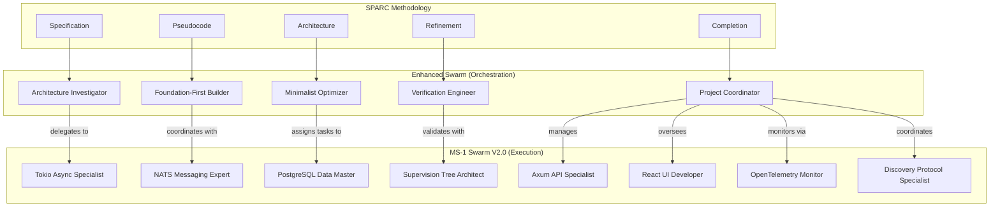

# SPARC-Enhanced Hierarchical Swarm Coordination Workflows

## Overview

This document defines advanced coordination workflows that integrate SPARC methodology with the hierarchical swarm architecture, enabling seamless collaboration between the Enhanced Swarm (orchestration) and MS-1 Swarm V2.0 (execution).

## Architecture Integration



## Core Workflow Patterns

### 1. SPARC Phase Mapping

| SPARC Phase | Enhanced Swarm Agent | MS-1 Specialist | Collaboration Pattern |
|-------------|---------------------|-----------------|---------------------|
| **Specification** | Architecture Investigator | Requirements Analyst | Context7 research + domain analysis |
| **Pseudocode** | Foundation-First Builder | Algorithm Designer | Code-reasoning + implementation planning |
| **Architecture** | Minimalist Optimizer | System Architect | Minimal design + specialist validation |
| **Refinement** | Verification Engineer | Quality Specialist | Iterative testing + performance optimization |
| **Completion** | Project Coordinator | All Specialists | Final assembly + deployment coordination |

### 2. Task Coordination Workflows

#### Workflow A: Complex Development Task
```yaml
name: "Full-Stack Feature Development"
trigger: "multi-domain feature request"
phases:
  specification:
    orchestrator: "Architecture Investigator"
    actions:
      - use_context7: "research relevant libraries and patterns"
      - use_code_reasoning: "analyze complexity and dependencies"
      - delegate_to: "Requirements Analyst (MS-1)"
      - memory_store: "specification/requirements"
    
  pseudocode:
    orchestrator: "Foundation-First Builder"  
    actions:
      - retrieve_memory: "specification/requirements"
      - use_code_reasoning: "decompose into minimal steps"
      - coordinate_with: "Algorithm Designer (MS-1)"
      - memory_store: "pseudocode/implementation-plan"
    
  architecture:
    orchestrator: "Minimalist Optimizer"
    actions:
      - retrieve_memory: "pseudocode/implementation-plan"
      - use_context7: "validate architectural patterns"
      - delegate_to: "System Architect (MS-1)"
      - parallel_assign:
          - "Tokio Async Specialist": "async runtime design"
          - "NATS Messaging Expert": "event coordination"
          - "PostgreSQL Data Master": "data layer design"
      - memory_store: "architecture/system-design"
    
  refinement:
    orchestrator: "Verification Engineer"
    actions:
      - retrieve_memory: "architecture/system-design"
      - coordinate_testing:
          - "Quality Specialist (MS-1)": "integration testing"
          - "OpenTelemetry Monitor": "performance validation"
      - iterative_improvement: "based on agent directives"
      - memory_store: "refinement/optimizations"
    
  completion:
    orchestrator: "Project Coordinator"
    actions:
      - retrieve_memory: "all phases"
      - parallel_implementation:
          - "Axum API Specialist": "REST endpoints"
          - "React UI Developer": "frontend components"
          - "Supervision Tree Architect": "error handling"
          - "Discovery Protocol Specialist": "real-time features"
      - final_verification: "against foundation-first principles"
      - memory_store: "completion/final-system"
```

#### Workflow B: Research and Analysis Task
```yaml
name: "Technology Research with Implementation Proof"
trigger: "research request with verification requirement"
phases:
  specification:
    orchestrator: "Architecture Investigator"
    actions:
      - use_context7: "comprehensive library research"
      - use_code_reasoning: "analyze research scope and methodology"
      - memory_store: "research/scope-and-methodology"
    
  pseudocode:
    orchestrator: "Foundation-First Builder"
    actions:
      - retrieve_memory: "research/scope-and-methodology"  
      - use_code_reasoning: "create research execution plan"
      - minimal_approach: "identify smallest testable implementation"
      - memory_store: "research/execution-plan"
    
  architecture:
    orchestrator: "Minimalist Optimizer"
    actions:
      - retrieve_memory: "research/execution-plan"
      - design_verification: "minimal proof-of-concept structure"
      - delegate_to: "appropriate MS-1 specialist based on domain"
      - memory_store: "research/poc-architecture"
    
  refinement:
    orchestrator: "Verification Engineer"
    actions:
      - retrieve_memory: "research/poc-architecture"
      - implement_poc: "via appropriate MS-1 specialist"
      - validate_findings: "against research objectives"
      - memory_store: "research/validated-findings"
    
  completion:
    orchestrator: "Project Coordinator"
    actions:
      - retrieve_memory: "all research phases"
      - synthesize_report: "comprehensive analysis with working examples"
      - document_learnings: "for future swarm training"
      - memory_store: "research/final-report"
```

### 3. Parallel Execution Patterns

#### Pattern 1: Domain-Specific Parallel Assignment
```javascript
// Enhanced Swarm determines task domains, MS-1 executes in parallel
const parallelAssignment = {
  coordinator: "Minimalist Optimizer",
  strategy: "domain-based-parallel",
  assignments: [
    {
      domain: "async-runtime",
      specialist: "Tokio Async Specialist",
      task: "implement graceful shutdown patterns",
      dependencies: []
    },
    {
      domain: "messaging", 
      specialist: "NATS Messaging Expert",
      task: "design event-driven coordination",
      dependencies: []
    },
    {
      domain: "data-persistence",
      specialist: "PostgreSQL Data Master", 
      task: "optimize query performance",
      dependencies: ["async-runtime"]
    },
    {
      domain: "web-framework",
      specialist: "Axum API Specialist",
      task: "implement REST endpoints",
      dependencies: ["messaging", "data-persistence"]
    }
  ],
  coordination: {
    memory_namespace: "parallel-execution",
    sync_points: ["architecture-complete", "testing-ready", "deployment-ready"],
    validation_agent: "Verification Engineer"
  }
};
```

#### Pattern 2: Iterative Refinement with Cross-Swarm Feedback
```javascript
const iterativeRefinement = {
  phases: [
    {
      name: "initial-implementation",
      enhanced_swarm_action: "Foundation-First Builder analyzes requirements",
      ms1_swarm_action: "Specialist implements minimal version",
      feedback_loop: "Verification Engineer validates against directives"
    },
    {
      name: "enhancement-iteration",
      enhanced_swarm_action: "Minimalist Optimizer identifies necessary additions",
      ms1_swarm_action: "Specialist adds minimal enhancements",
      feedback_loop: "Architecture Investigator validates with Context7"
    },
    {
      name: "final-optimization",
      enhanced_swarm_action: "Project Coordinator ensures completion",
      ms1_swarm_action: "All relevant specialists collaborate on polish",
      feedback_loop: "Verification Engineer performs final validation"
    }
  ],
  memory_coordination: {
    shared_namespace: "iterative-refinement",
    checkpoint_pattern: "phase-{n}-checkpoint",
    rollback_capability: true
  }
};
```

## Memory Coordination Strategies

### Namespace Organization for Workflows
```javascript
const workflowMemoryStructure = {
  "workflows/sparc/": {
    "active-session/": "current workflow state",
    "specifications/": "all specification phases",
    "pseudocode/": "implementation plans and algorithms", 
    "architecture/": "system designs and patterns",
    "refinement/": "optimization and testing results",
    "completion/": "final implementations and learnings"
  },
  "coordination/": {
    "swarm-sync/": "inter-swarm communication state",
    "task-assignments/": "current specialist assignments",
    "dependencies/": "task dependency tracking",
    "parallel-execution/": "concurrent task coordination"
  },
  "context/": {
    "context7-cache/": "cached documentation and patterns",
    "code-reasoning-traces/": "complex thinking patterns",
    "agent-directives-compliance/": "directive validation results"
  }
};
```

### Cross-Swarm Communication Protocol
```javascript
const communicationProtocol = {
  message_types: {
    "task-delegation": {
      from: "enhanced-swarm-agent",
      to: "ms1-specialist", 
      payload: {
        task_id: "unique-identifier",
        phase: "SPARC-phase",
        requirements: "detailed-specification",
        context: "context7-research-results",
        constraints: "agent-directive-requirements",
        dependencies: ["prerequisite-task-ids"],
        success_criteria: "verification-requirements"
      }
    },
    "progress-update": {
      from: "ms1-specialist",
      to: "enhanced-swarm-agent",
      payload: {
        task_id: "unique-identifier",
        status: "in-progress|completed|blocked",
        progress_details: "implementation-details",
        blockers: "optional-blocking-issues",
        artifacts: "code|documentation|results"
      }
    },
    "verification-request": {
      from: "verification-engineer",
      to: "relevant-specialists",
      payload: {
        artifacts_to_validate: "implementation-results",
        validation_criteria: "agent-directive-requirements",
        context7_validation: "documentation-compliance-check"
      }
    }
  }
};
```

## Integration with Existing Systems

### Hook Integration for Automatic Workflow Triggering
```json
{
  "workflowTriggerHook": {
    "command": "npx",
    "args": ["claude-flow", "hooks", "workflow-trigger", "--analyze-complexity", "true", "--auto-assign-sparc-phase", "true"],
    "triggers": {
      "multi_file_edit": "trigger complex development workflow",
      "research_request": "trigger research and analysis workflow", 
      "architecture_change": "trigger architecture refinement workflow"
    }
  }
}
```

### Performance Monitoring Integration
```javascript
const workflowMetrics = {
  sparc_phase_efficiency: {
    specification_time: "enhanced-swarm analysis duration",
    pseudocode_clarity: "ms1-specialist comprehension rate",
    architecture_optimization: "minimalist-optimizer effectiveness",
    refinement_iterations: "verification-engineer cycle count",
    completion_quality: "final-artifact validation score"
  },
  inter_swarm_coordination: {
    delegation_accuracy: "correct specialist selection rate",
    communication_latency: "message-passing efficiency",
    parallel_execution_speedup: "concurrent task performance gain",
    memory_coordination_overhead: "cross-swarm sync cost"
  }
};
```

## Advanced Coordination Patterns

### Pattern 1: Adaptive Specialist Selection
```javascript
const adaptiveSelection = {
  selector: "Architecture Investigator",
  selection_criteria: [
    {
      factor: "task_domain",
      weights: {
        "async_patterns": {"Tokio Async Specialist": 0.9, "NATS Messaging Expert": 0.3},
        "web_apis": {"Axum API Specialist": 0.9, "React UI Developer": 0.2},
        "data_operations": {"PostgreSQL Data Master": 0.9, "SQLx Database Specialist": 0.7}
      }
    },
    {
      factor: "specialist_availability",
      algorithm: "load_balancing_with_expertise_priority"
    },
    {
      factor: "context7_research_results", 
      algorithm: "documentation_alignment_scoring"
    }
  ],
  fallback_strategy: "multi_specialist_collaboration"
};
```

### Pattern 2: Self-Healing Workflow Coordination
```javascript
const selfHealingCoordination = {
  error_detection: {
    agents: ["Verification Engineer", "Project Coordinator"],
    patterns: [
      "agent_directive_violation",
      "context7_documentation_mismatch", 
      "sparc_phase_regression",
      "inter_swarm_communication_failure"
    ]
  },
  recovery_strategies: {
    "agent_directive_violation": {
      action: "revert_to_foundation_first_approach",
      coordinator: "Foundation-First Builder"
    },
    "context7_documentation_mismatch": {
      action: "re_research_with_updated_context",
      coordinator: "Architecture Investigator"
    },
    "sparc_phase_regression": {
      action: "rollback_to_last_valid_checkpoint",
      coordinator: "Project Coordinator"
    },
    "inter_swarm_communication_failure": {
      action: "reinitialize_coordination_protocols",
      coordinator: "Minimalist Optimizer"
    }
  }
};
```

## Usage Examples

### Example 1: Full-Stack Authentication System
```bash
# Trigger complex development workflow
npx claude-flow workflow execute SPARC-Enhanced-Hierarchical-Coordination \
  --task "implement JWT authentication with refresh tokens" \
  --domains "web-api,database,security,frontend" \
  --sparc-mode "full-cycle"
```

### Example 2: Performance Optimization Research
```bash
# Trigger research workflow with implementation proof
npx claude-flow workflow execute SPARC-Enhanced-Hierarchical-Coordination \
  --task "research async database connection pooling optimization" \
  --domains "database,async-runtime,performance" \
  --sparc-mode "research-with-poc"
```

## Benefits of SPARC-Enhanced Coordination

1. **🎯 Systematic Approach**: SPARC ensures comprehensive problem-solving
2. **🤝 Seamless Collaboration**: Clear orchestration/execution boundaries  
3. **📈 Scalable Coordination**: Handles complex multi-domain tasks efficiently
4. **🔧 Self-Improving**: Memory and neural training enhance coordination over time
5. **🛡️ Quality Assurance**: Agent directives enforced throughout all phases
6. **📚 Knowledge Integration**: Context7 research integrated into every decision
7. **🧠 Deep Reasoning**: Code-reasoning MCP used for complex patterns

This workflow system creates a powerful synergy between the Enhanced Swarm's advanced reasoning capabilities and the MS-1 Swarm's deep MisterSmith specialization, all guided by proven SPARC methodology.