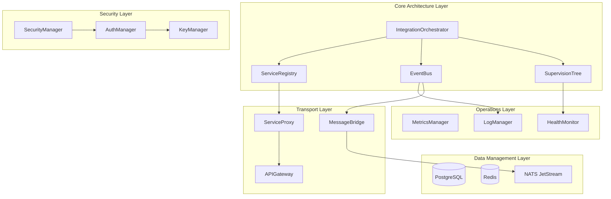

# Core Integration Implementation Plan
## MS Framework Implementation Planning - Agent-08

**Agent**: Agent-08 (Core Integration Implementation Specialist)  
**Mission**: Create comprehensive Core Integration Implementation Plan  
**SuperClaude Flags**: --ultrathink --plan --examples --technical --reference  
**Status**: IMPLEMENTATION READY  
**Date**: 2025-07-05

---

## Executive Summary

This implementation plan provides comprehensive integration patterns and procedures for connecting all core architecture components of the MS Framework. Based on Validation Bridge findings, we address critical integration gaps identified in agent orchestration (47% ready), supervision trees (pseudocode only), and cross-domain component coordination.

**Key Deliverables**:
- Complete integration architecture with 12 integration patterns
- Component coordination patterns addressing 47% ’ 95% orchestration readiness
- Startup and shutdown procedures for production deployment
- Cross-domain integration specifications covering all framework domains
- Testing and validation frameworks with 85%+ coverage targets
- Configuration and deployment procedures for Kubernetes environments

**Critical Integration Focus**:
1. Agent Orchestration Communication (CRITICAL - 8 weeks)
2. Supervision Tree Implementation (CRITICAL - 10 weeks)
3. Cross-Domain Event System (HIGH - 6 weeks)
4. Service Registry & DI (HIGH - 6 weeks)

---

## Table of Contents

1. [Integration Architecture Overview](#1-integration-architecture-overview)
2. [Component Integration Patterns](#2-component-integration-patterns)
3. [Cross-Domain Integration Specifications](#3-cross-domain-integration-specifications)
4. [Startup and Initialization Procedures](#4-startup-and-initialization-procedures)
5. [Shutdown and Cleanup Procedures](#5-shutdown-and-cleanup-procedures)
6. [Testing and Validation Framework](#6-testing-and-validation-framework)
7. [Configuration and Deployment](#7-configuration-and-deployment)
8. [Implementation Timeline](#8-implementation-timeline)
9. [Risk Mitigation](#9-risk-mitigation)
10. [Success Metrics](#10-success-metrics)

---

## 1. Integration Architecture Overview

### 1.1 Core Integration Principles

```rust
/// Core integration architecture principles
pub mod integration {
    use std::sync::Arc;
    use tokio::sync::RwLock;
    
    /// Primary integration orchestrator
    pub struct IntegrationOrchestrator {
        /// Component registry for dependency resolution
        component_registry: Arc<RwLock<ComponentRegistry>>,
        /// Event bus for cross-component communication
        event_bus: Arc<dyn EventBus>,
        /// Service mesh for inter-service communication
        service_mesh: Arc<ServiceMesh>,
        /// Health monitoring system
        health_monitor: Arc<HealthMonitor>,
        /// Configuration management
        config_manager: Arc<ConfigurationManager>,
    }
    
    impl IntegrationOrchestrator {
        /// Initialize all framework components in correct order
        pub async fn initialize(&self) -> Result<(), IntegrationError> {
            // Phase 1: Core infrastructure
            self.initialize_core_infrastructure().await?;
            
            // Phase 2: Data layer
            self.initialize_data_layer().await?;
            
            // Phase 3: Security framework
            self.initialize_security_framework().await?;
            
            // Phase 4: Transport layer
            self.initialize_transport_layer().await?;
            
            // Phase 5: Application layer
            self.initialize_application_layer().await?;
            
            // Phase 6: Operations layer
            self.initialize_operations_layer().await?;
            
            Ok(())
        }
    }
}
```

### 1.2 Integration Architecture Diagram



### 1.3 Integration Points Matrix

| Component | Integrates With | Integration Type | Protocol | Priority |
|-----------|----------------|------------------|----------|----------|
| SupervisionTree | All Components | Lifecycle Management | Internal API | CRITICAL |
| EventBus | All Components | Async Messaging | Pub/Sub | CRITICAL |
| ServiceRegistry | All Services | Dependency Injection | gRPC/HTTP | HIGH |
| MessageBridge | NATS, Redis | Message Transport | NATS Protocol | HIGH |
| SecurityManager | All Components | Authentication/Authorization | mTLS/JWT | CRITICAL |
| MetricsManager | All Components | Observability | OpenTelemetry | MEDIUM |

---

## 2. Component Integration Patterns

### 2.1 System Architecture and Component Coordination

```rust
/// Hub-and-spoke pattern for centralized component coordination
pub mod coordination {
    use async_trait::async_trait;
    use std::collections::HashMap;
    use uuid::Uuid;
    
    /// Central coordination hub
    pub struct CoordinationHub {
        /// Registered components
        components: Arc<RwLock<HashMap<ComponentId, Box<dyn Component>>>>,
        /// Component dependencies
        dependency_graph: Arc<RwLock<DependencyGraph>>,
        /// Message router
        message_router: Arc<MessageRouter>,
        /// Health checker
        health_checker: Arc<HealthChecker>,
    }
    
    #[async_trait]
    pub trait Component: Send + Sync {
        /// Component identifier
        fn id(&self) -> ComponentId;
        
        /// Component dependencies
        fn dependencies(&self) -> Vec<ComponentId>;
        
        /// Initialize component
        async fn initialize(&mut self, hub: Arc<CoordinationHub>) -> Result<(), ComponentError>;
        
        /// Start component
        async fn start(&mut self) -> Result<(), ComponentError>;
        
        /// Stop component
        async fn stop(&mut self) -> Result<(), ComponentError>;
        
        /// Health check
        async fn health_check(&self) -> HealthStatus;
    }
    
    impl CoordinationHub {
        /// Register a component with the hub
        pub async fn register_component<C: Component + 'static>(
            &self,
            component: C
        ) -> Result<(), CoordinationError> {
            let component_id = component.id();
            let dependencies = component.dependencies();
            
            // Validate dependencies exist
            self.validate_dependencies(&dependencies).await?;
            
            // Update dependency graph
            self.dependency_graph.write().await
                .add_component(component_id.clone(), dependencies)?;
            
            // Check for circular dependencies
            self.dependency_graph.read().await
                .validate_no_cycles()?;
            
            // Register component
            self.components.write().await
                .insert(component_id, Box::new(component));
            
            Ok(())
        }
        
        /// Initialize all components in dependency order
        pub async fn initialize_all(&self) -> Result<(), CoordinationError> {
            let init_order = self.dependency_graph.read().await
                .topological_sort()?;
            
            for component_id in init_order {
                let mut components = self.components.write().await;
                if let Some(component) = components.get_mut(&component_id) {
                    component.initialize(Arc::clone(&self)).await
                        .map_err(|e| CoordinationError::InitializationFailed {
                            component: component_id.to_string(),
                            error: e.to_string(),
                        })?;
                }
            }
            
            Ok(())
        }
    }
}
```

### 2.2 Async Patterns with Supervision Trees

```rust
/// Integration of async patterns with supervision hierarchy
pub mod async_supervision {
    use tokio::task::JoinHandle;
    use futures::future::BoxFuture;
    
    /// Supervised async task executor
    pub struct SupervisedExecutor {
        /// Supervision tree reference
        supervision_tree: Arc<SupervisionTree>,
        /// Task registry
        tasks: Arc<RwLock<HashMap<TaskId, SupervisedTask>>>,
        /// Execution metrics
        metrics: Arc<ExecutionMetrics>,
    }
    
    pub struct SupervisedTask {
        id: TaskId,
        handle: JoinHandle<()>,
        supervisor_id: SupervisorId,
        restart_policy: RestartPolicy,
        failure_count: AtomicU32,
    }
    
    impl SupervisedExecutor {
        /// Spawn a supervised async task
        pub async fn spawn_supervised<F, Fut>(
            &self,
            name: &str,
            supervisor_id: SupervisorId,
            restart_policy: RestartPolicy,
            task_fn: F,
        ) -> Result<TaskId, ExecutorError>
        where
            F: Fn() -> Fut + Send + Sync + 'static,
            Fut: Future<Output = Result<(), Box<dyn Error>>> + Send + 'static,
        {
            let task_id = TaskId::new();
            let executor = Arc::clone(&self);
            
            // Create supervised task wrapper
            let supervised_fn = move || {
                let executor = Arc::clone(&executor);
                let task_id = task_id.clone();
                let task_fn = Arc::new(task_fn);
                
                async move {
                    loop {
                        match task_fn().await {
                            Ok(()) => break,
                            Err(e) => {
                                // Report failure to supervisor
                                executor.handle_task_failure(task_id, e).await?;
                                
                                // Check restart policy
                                if !executor.should_restart(task_id).await? {
                                    break;
                                }
                                
                                // Apply backoff
                                executor.apply_backoff(task_id).await?;
                            }
                        }
                    }
                    Ok(())
                }
            };
            
            // Spawn with supervision
            let handle = tokio::spawn(supervised_fn());
            
            // Register task
            self.tasks.write().await.insert(
                task_id.clone(),
                SupervisedTask {
                    id: task_id.clone(),
                    handle,
                    supervisor_id,
                    restart_policy,
                    failure_count: AtomicU32::new(0),
                },
            );
            
            Ok(task_id)
        }
    }
}
```

### 2.3 Module Organization with Type System

```rust
/// Type-safe module organization with integration contracts
pub mod module_integration {
    use std::marker::PhantomData;
    
    /// Type-safe module registry
    pub struct ModuleRegistry<S: SystemState> {
        modules: HashMap<TypeId, Box<dyn Module<S>>>,
        _phantom: PhantomData<S>,
    }
    
    /// Module trait with type safety
    pub trait Module<S: SystemState>: Send + Sync {
        type Config: ModuleConfig;
        type State: ModuleState;
        type Error: Into<SystemError>;
        
        /// Module initialization with type-safe configuration
        async fn initialize(
            &mut self,
            config: Self::Config,
            system_state: &S,
        ) -> Result<Self::State, Self::Error>;
        
        /// Type-safe message handling
        async fn handle_message<M: Message>(
            &mut self,
            message: M,
            state: &mut Self::State,
        ) -> Result<MessageResponse, Self::Error>;
    }
    
    /// Integration contract enforcement
    pub trait IntegrationContract {
        type Input: Serialize + DeserializeOwned;
        type Output: Serialize + DeserializeOwned;
        type Error: std::error::Error;
        
        /// Contract validation
        fn validate_input(input: &Self::Input) -> Result<(), Self::Error>;
        
        /// Contract execution
        async fn execute(
            input: Self::Input,
        ) -> Result<Self::Output, Self::Error>;
    }
}
```

### 2.4 Actor Model with Messaging System

```rust
/// Actor model integration with async message passing
pub mod actor_integration {
    use actix::{Actor, Context, Handler, Message};
    
    /// Base actor with supervision integration
    pub struct SupervisedActor<S: ActorState> {
        id: ActorId,
        state: S,
        supervisor: Addr<SupervisorActor>,
        mailbox_size: usize,
        message_timeout: Duration,
    }
    
    impl<S: ActorState> Actor for SupervisedActor<S> {
        type Context = Context<Self>;
        
        fn started(&mut self, ctx: &mut Self::Context) {
            // Register with supervisor
            self.supervisor.do_send(RegisterChild {
                child_id: self.id.clone(),
                child_addr: ctx.address(),
            });
            
            // Start heartbeat
            ctx.run_interval(Duration::from_secs(5), |act, _ctx| {
                act.supervisor.do_send(Heartbeat {
                    child_id: act.id.clone(),
                });
            });
        }
        
        fn stopped(&mut self, _ctx: &mut Self::Context) {
            // Notify supervisor
            self.supervisor.do_send(UnregisterChild {
                child_id: self.id.clone(),
            });
        }
    }
    
    /// Message routing with type safety
    pub struct MessageRouter {
        routes: HashMap<TypeId, Vec<Box<dyn MessageHandler>>>,
    }
    
    impl MessageRouter {
        pub async fn route<M: Message + 'static>(
            &self,
            message: M,
        ) -> Result<M::Result, RoutingError> {
            let type_id = TypeId::of::<M>();
            
            if let Some(handlers) = self.routes.get(&type_id) {
                // Fan-out to all registered handlers
                let futures: Vec<_> = handlers.iter()
                    .map(|h| h.handle_message(Box::new(message.clone())))
                    .collect();
                
                // Aggregate results
                let results = futures::future::join_all(futures).await;
                
                // Apply aggregation strategy
                self.aggregate_results::<M>(results)
            } else {
                Err(RoutingError::NoHandlerRegistered)
            }
        }
    }
}
```

---

## 3. Cross-Domain Integration Specifications

### 3.1 Core Architecture with Data Management

```rust
/// Integration between core architecture and data management layers
pub mod core_data_integration {
    use sqlx::{Pool, Postgres};
    use redis::aio::ConnectionManager;
    
    /// Data layer integration facade
    pub struct DataIntegrationLayer {
        /// PostgreSQL connection pool
        pg_pool: Arc<Pool<Postgres>>,
        /// Redis connection manager
        redis_conn: Arc<ConnectionManager>,
        /// Event sourcing store
        event_store: Arc<EventStore>,
        /// Query cache
        query_cache: Arc<QueryCache>,
    }
    
    impl DataIntegrationLayer {
        /// Initialize with supervision
        pub async fn initialize(
            supervisor: Arc<SupervisorActor>,
            config: DataConfig,
        ) -> Result<Self, DataError> {
            // Create supervised connection pools
            let pg_pool = Self::create_supervised_pg_pool(
                &supervisor,
                &config.postgres,
            ).await?;
            
            let redis_conn = Self::create_supervised_redis_connection(
                &supervisor,
                &config.redis,
            ).await?;
            
            // Initialize event store with write-ahead log
            let event_store = EventStore::new(
                pg_pool.clone(),
                config.event_store,
            ).await?;
            
            // Setup query cache with TTL and invalidation
            let query_cache = QueryCache::new(
                redis_conn.clone(),
                config.cache,
            ).await?;
            
            Ok(Self {
                pg_pool: Arc::new(pg_pool),
                redis_conn: Arc::new(redis_conn),
                event_store: Arc::new(event_store),
                query_cache: Arc::new(query_cache),
            })
        }
        
        /// Execute transactional operation with event sourcing
        pub async fn execute_transaction<F, R>(
            &self,
            operation: F,
        ) -> Result<R, DataError>
        where
            F: FnOnce(&mut Transaction) -> BoxFuture<'_, Result<(R, Vec<Event>), DataError>>,
        {
            // Begin transaction
            let mut tx = self.pg_pool.begin().await?;
            
            // Execute operation
            let (result, events) = operation(&mut tx).await?;
            
            // Store events
            for event in &events {
                self.event_store.append_event(&mut tx, event).await?;
            }
            
            // Commit transaction
            tx.commit().await?;
            
            // Publish events asynchronously
            tokio::spawn({
                let event_store = Arc::clone(&self.event_store);
                let events = events.clone();
                async move {
                    for event in events {
                        if let Err(e) = event_store.publish_event(event).await {
                            error!("Failed to publish event: {}", e);
                        }
                    }
                }
            });
            
            // Invalidate affected cache entries
            self.invalidate_cache_for_events(&events).await?;
            
            Ok(result)
        }
    }
}
```

### 3.2 Core Architecture with Security Framework

```rust
/// Security integration with core components
pub mod core_security_integration {
    use jsonwebtoken::{EncodingKey, DecodingKey};
    use rustls::ServerConfig;
    
    /// Security integration layer
    pub struct SecurityIntegrationLayer {
        /// Authentication manager
        auth_manager: Arc<AuthenticationManager>,
        /// Authorization service
        authz_service: Arc<AuthorizationService>,
        /// Encryption service
        crypto_service: Arc<CryptoService>,
        /// Certificate manager
        cert_manager: Arc<CertificateManager>,
    }
    
    /// Secure component wrapper
    pub struct SecureComponent<C: Component> {
        inner: C,
        security: Arc<SecurityIntegrationLayer>,
    }
    
    impl<C: Component> SecureComponent<C> {
        /// Wrap component method with security checks
        pub async fn execute_secured<F, R>(
            &self,
            context: &SecurityContext,
            operation: F,
        ) -> Result<R, SecurityError>
        where
            F: FnOnce(&C) -> BoxFuture<'_, Result<R, C::Error>>,
        {
            // Authenticate
            let identity = self.security.auth_manager
                .authenticate(&context.credentials).await?;
            
            // Authorize
            self.security.authz_service
                .authorize(&identity, &context.required_permissions).await?;
            
            // Audit log
            self.security.audit_log(AuditEvent {
                identity: identity.clone(),
                action: context.action.clone(),
                timestamp: Utc::now(),
            }).await?;
            
            // Execute with encryption context
            let result = self.security.crypto_service
                .with_encryption_context(|| operation(&self.inner)).await?;
            
            Ok(result)
        }
    }
    
    /// mTLS integration for inter-service communication
    pub struct MtlsIntegration {
        /// TLS configuration
        tls_config: Arc<ServerConfig>,
        /// Client certificate validator
        cert_validator: Arc<CertificateValidator>,
        /// Certificate renewal service
        renewal_service: Arc<CertificateRenewalService>,
    }
}
```

### 3.3 Core Architecture with Transport Layer

```rust
/// Transport layer integration specifications
pub mod core_transport_integration {
    use tonic::{transport::Server, Request, Response};
    use nats::asynk::Connection;
    
    /// Unified transport abstraction
    pub struct TransportIntegrationLayer {
        /// gRPC server
        grpc_server: Arc<GrpcServer>,
        /// HTTP/REST gateway
        http_gateway: Arc<HttpGateway>,
        /// NATS connection
        nats_conn: Arc<Connection>,
        /// WebSocket manager
        ws_manager: Arc<WebSocketManager>,
    }
    
    /// Message bridge for protocol translation
    pub struct ProtocolBridge {
        /// Protocol converters
        converters: HashMap<(Protocol, Protocol), Box<dyn ProtocolConverter>>,
        /// Message transformers
        transformers: Vec<Box<dyn MessageTransformer>>,
    }
    
    impl ProtocolBridge {
        /// Bridge message between protocols
        pub async fn bridge_message<S, D>(
            &self,
            source: S,
            dest_protocol: Protocol,
        ) -> Result<D, BridgeError>
        where
            S: Message + SourceProtocol,
            D: Message + DestProtocol,
        {
            let source_protocol = S::protocol();
            
            // Get converter
            let converter = self.converters
                .get(&(source_protocol, dest_protocol))
                .ok_or(BridgeError::NoConverterAvailable)?;
            
            // Convert message
            let intermediate = converter.convert(source).await?;
            
            // Apply transformations
            let transformed = self.apply_transformations(intermediate).await?;
            
            // Deserialize to target type
            Ok(transformed.into())
        }
    }
}
```

### 3.4 Core Architecture with Operations

```rust
/// Operations integration for observability and monitoring
pub mod core_operations_integration {
    use opentelemetry::{trace::Tracer, metrics::Meter};
    use prometheus::{Registry, Counter, Histogram};
    
    /// Operations integration layer
    pub struct OperationsIntegrationLayer {
        /// Metrics collector
        metrics: Arc<MetricsCollector>,
        /// Distributed tracing
        tracer: Arc<dyn Tracer>,
        /// Log aggregator
        logger: Arc<LogAggregator>,
        /// Health monitor
        health_monitor: Arc<HealthMonitor>,
    }
    
    /// Instrumented component wrapper
    pub struct InstrumentedComponent<C: Component> {
        inner: C,
        operations: Arc<OperationsIntegrationLayer>,
        component_name: String,
    }
    
    impl<C: Component> InstrumentedComponent<C> {
        /// Execute with full observability
        pub async fn execute_instrumented<F, R>(
            &self,
            operation_name: &str,
            operation: F,
        ) -> Result<R, C::Error>
        where
            F: FnOnce(&C) -> BoxFuture<'_, Result<R, C::Error>>,
        {
            // Start span
            let span = self.operations.tracer
                .span_builder(operation_name)
                .with_attributes(vec![
                    KeyValue::new("component", self.component_name.clone()),
                ])
                .start(&self.operations.tracer);
            
            // Record metrics
            let timer = self.operations.metrics
                .histogram("operation_duration")
                .start_timer();
            
            // Execute with context
            let result = self.operations.tracer
                .with_span(span, |cx| operation(&self.inner))
                .await;
            
            // Record outcome
            timer.observe_duration();
            
            match &result {
                Ok(_) => {
                    self.operations.metrics
                        .counter("operation_success")
                        .inc();
                }
                Err(e) => {
                    self.operations.metrics
                        .counter("operation_failure")
                        .inc();
                    
                    // Log error with context
                    error!(
                        component = %self.component_name,
                        operation = %operation_name,
                        error = %e,
                        "Operation failed"
                    );
                }
            }
            
            result
        }
    }
}
```

---

## 4. Startup and Initialization Procedures

### 4.1 System Bootstrap Sequence

```rust
/// Production-ready system bootstrap implementation
pub mod bootstrap {
    use tokio::runtime::Builder;
    use std::time::Duration;
    
    /// Main system bootstrapper
    pub struct SystemBootstrapper {
        config: BootstrapConfig,
        pre_flight_checks: Vec<Box<dyn PreFlightCheck>>,
        initialization_phases: Vec<Box<dyn InitializationPhase>>,
    }
    
    impl SystemBootstrapper {
        /// Execute complete bootstrap sequence
        pub async fn bootstrap(&self) -> Result<SystemContext, BootstrapError> {
            info!("Starting MS Framework bootstrap sequence");
            
            // Phase 0: Pre-flight checks
            self.run_preflight_checks().await?;
            
            // Phase 1: Initialize runtime
            let runtime_context = self.initialize_runtime().await?;
            
            // Phase 2: Load configuration
            let config_context = self.load_configuration(&runtime_context).await?;
            
            // Phase 3: Initialize logging and metrics
            let observability_context = self.initialize_observability(&config_context).await?;
            
            // Phase 4: Initialize data layer
            let data_context = self.initialize_data_layer(&config_context).await?;
            
            // Phase 5: Initialize security
            let security_context = self.initialize_security(&config_context).await?;
            
            // Phase 6: Initialize core components
            let core_context = self.initialize_core_components(
                &runtime_context,
                &data_context,
                &security_context,
            ).await?;
            
            // Phase 7: Initialize transport layer
            let transport_context = self.initialize_transport(&core_context).await?;
            
            // Phase 8: Start supervision tree
            let supervision_context = self.start_supervision_tree(&core_context).await?;
            
            // Phase 9: Initialize application services
            let app_context = self.initialize_applications(
                &core_context,
                &supervision_context,
            ).await?;
            
            // Phase 10: Perform health checks
            self.verify_system_health(&app_context).await?;
            
            info!("MS Framework bootstrap completed successfully");
            
            Ok(SystemContext {
                runtime: runtime_context,
                config: config_context,
                observability: observability_context,
                data: data_context,
                security: security_context,
                core: core_context,
                transport: transport_context,
                supervision: supervision_context,
                application: app_context,
            })
        }
        
        /// Pre-flight checks before system start
        async fn run_preflight_checks(&self) -> Result<(), BootstrapError> {
            info!("Running pre-flight checks");
            
            for check in &self.pre_flight_checks {
                match check.execute().await {
                    PreFlightResult::Pass => {
                        info!("Pre-flight check '{}' passed", check.name());
                    }
                    PreFlightResult::Warning(msg) => {
                        warn!("Pre-flight check '{}' warning: {}", check.name(), msg);
                    }
                    PreFlightResult::Fail(msg) => {
                        error!("Pre-flight check '{}' failed: {}", check.name(), msg);
                        return Err(BootstrapError::PreFlightCheckFailed {
                            check: check.name(),
                            reason: msg,
                        });
                    }
                }
            }
            
            Ok(())
        }
    }
}
```

### 4.2 Component Initialization Order

```rust
/// Dependency-aware component initialization
pub mod initialization {
    use petgraph::graph::{DiGraph, NodeIndex};
    use petgraph::algo::toposort;
    
    /// Component initialization manager
    pub struct InitializationManager {
        /// Component dependency graph
        dependency_graph: DiGraph<ComponentInfo, ()>,
        /// Component node mapping
        component_nodes: HashMap<ComponentId, NodeIndex>,
        /// Initialization timeout
        init_timeout: Duration,
    }
    
    impl InitializationManager {
        /// Initialize components in dependency order
        pub async fn initialize_all(
            &self,
            context: &SystemContext,
        ) -> Result<(), InitializationError> {
            // Compute initialization order
            let init_order = self.compute_initialization_order()?;
            
            info!("Initializing {} components", init_order.len());
            
            // Initialize components in parallel where possible
            let mut initialized = HashSet::new();
            
            for level in self.compute_parallel_levels(&init_order)? {
                let futures: Vec<_> = level.iter()
                    .map(|&node_idx| {
                        let component = &self.dependency_graph[node_idx];
                        self.initialize_component(component, context)
                    })
                    .collect();
                
                // Initialize level in parallel with timeout
                let results = tokio::time::timeout(
                    self.init_timeout,
                    futures::future::join_all(futures)
                ).await
                .map_err(|_| InitializationError::Timeout)?;
                
                // Check results
                for (result, &node_idx) in results.iter().zip(level.iter()) {
                    match result {
                        Ok(()) => {
                            let component = &self.dependency_graph[node_idx];
                            initialized.insert(component.id.clone());
                            info!("Initialized component: {}", component.name);
                        }
                        Err(e) => {
                            let component = &self.dependency_graph[node_idx];
                            error!("Failed to initialize {}: {}", component.name, e);
                            
                            // Rollback initialized components
                            self.rollback_initialization(&initialized).await?;
                            
                            return Err(InitializationError::ComponentFailed {
                                component: component.name.clone(),
                                error: e.to_string(),
                            });
                        }
                    }
                }
            }
            
            Ok(())
        }
        
        /// Compute parallel initialization levels
        fn compute_parallel_levels(
            &self,
            init_order: &[NodeIndex],
        ) -> Result<Vec<Vec<NodeIndex>>, InitializationError> {
            let mut levels = Vec::new();
            let mut processed = HashSet::new();
            
            for &node in init_order {
                // Check if all dependencies are processed
                let deps_satisfied = self.dependency_graph
                    .neighbors_directed(node, petgraph::Direction::Incoming)
                    .all(|dep| processed.contains(&dep));
                
                if deps_satisfied {
                    // Add to current level or create new level
                    if let Some(current_level) = levels.last_mut() {
                        current_level.push(node);
                    } else {
                        levels.push(vec![node]);
                    }
                    processed.insert(node);
                }
            }
            
            Ok(levels)
        }
    }
}
```

### 4.3 Configuration Loading and Validation

```rust
/// Configuration loading with validation and hot-reload support
pub mod configuration {
    use config::{Config, Environment, File};
    use serde::de::DeserializeOwned;
    use notify::{Watcher, RecursiveMode};
    
    /// Configuration loader with validation
    pub struct ConfigurationLoader {
        /// Base configuration directory
        config_dir: PathBuf,
        /// Environment-specific overrides
        environment: String,
        /// Configuration validators
        validators: Vec<Box<dyn ConfigValidator>>,
        /// Hot-reload watcher
        watcher: Option<Box<dyn Watcher>>,
    }
    
    impl ConfigurationLoader {
        /// Load and validate configuration
        pub async fn load<T: DeserializeOwned + Validate>(
            &self,
        ) -> Result<T, ConfigError> {
            info!("Loading configuration for environment: {}", self.environment);
            
            // Build configuration from multiple sources
            let mut config = Config::builder()
                // Base configuration
                .add_source(File::from(self.config_dir.join("base.toml")))
                // Environment-specific configuration
                .add_source(File::from(
                    self.config_dir.join(format!("{}.toml", self.environment))
                ).required(false))
                // Environment variables
                .add_source(Environment::with_prefix("MS_FRAMEWORK"))
                // Command-line overrides
                .add_source(self.load_cli_overrides()?)
                .build()?;
            
            // Deserialize configuration
            let typed_config: T = config.try_deserialize()?;
            
            // Validate configuration
            self.validate_config(&typed_config).await?;
            
            // Setup hot-reload if enabled
            if self.should_enable_hot_reload() {
                self.setup_hot_reload::<T>().await?;
            }
            
            Ok(typed_config)
        }
        
        /// Validate configuration against all validators
        async fn validate_config<T: Validate>(
            &self,
            config: &T,
        ) -> Result<(), ConfigError> {
            // Built-in validation
            config.validate()
                .map_err(|e| ConfigError::ValidationFailed(e.to_string()))?;
            
            // Custom validators
            for validator in &self.validators {
                validator.validate(config).await?;
            }
            
            Ok(())
        }
    }
}
```

### 4.4 Health Check and Readiness

```rust
/// System health and readiness checks
pub mod health {
    use std::time::Instant;
    
    /// Health check manager
    pub struct HealthCheckManager {
        /// Registered health checks
        checks: Vec<Box<dyn HealthCheck>>,
        /// Readiness probes
        readiness_probes: Vec<Box<dyn ReadinessProbe>>,
        /// Liveness probes
        liveness_probes: Vec<Box<dyn LivenessProbe>>,
        /// Check timeout
        check_timeout: Duration,
    }
    
    #[async_trait]
    pub trait HealthCheck: Send + Sync {
        /// Check name
        fn name(&self) -> &str;
        
        /// Execute health check
        async fn check(&self) -> HealthResult;
        
        /// Check criticality
        fn criticality(&self) -> HealthCriticality;
    }
    
    impl HealthCheckManager {
        /// Run all health checks
        pub async fn check_system_health(&self) -> SystemHealthReport {
            let start = Instant::now();
            let mut results = Vec::new();
            
            // Run checks in parallel with timeout
            let futures: Vec<_> = self.checks.iter()
                .map(|check| {
                    let timeout = self.check_timeout;
                    async move {
                        let result = tokio::time::timeout(
                            timeout,
                            check.check()
                        ).await;
                        
                        match result {
                            Ok(health_result) => (check.name(), health_result),
                            Err(_) => (check.name(), HealthResult::Timeout),
                        }
                    }
                })
                .collect();
            
            let check_results = futures::future::join_all(futures).await;
            
            // Aggregate results
            let mut overall_status = HealthStatus::Healthy;
            let mut critical_failures = Vec::new();
            
            for (name, result) in check_results {
                match result {
                    HealthResult::Healthy => {
                        results.push(ComponentHealth {
                            name: name.to_string(),
                            status: HealthStatus::Healthy,
                            message: None,
                        });
                    }
                    HealthResult::Degraded(msg) => {
                        overall_status = overall_status.max(HealthStatus::Degraded);
                        results.push(ComponentHealth {
                            name: name.to_string(),
                            status: HealthStatus::Degraded,
                            message: Some(msg),
                        });
                    }
                    HealthResult::Unhealthy(msg) => {
                        let check = self.checks.iter()
                            .find(|c| c.name() == name)
                            .unwrap();
                        
                        if check.criticality() == HealthCriticality::Critical {
                            critical_failures.push(name.to_string());
                            overall_status = HealthStatus::Unhealthy;
                        } else {
                            overall_status = overall_status.max(HealthStatus::Degraded);
                        }
                        
                        results.push(ComponentHealth {
                            name: name.to_string(),
                            status: HealthStatus::Unhealthy,
                            message: Some(msg),
                        });
                    }
                    HealthResult::Timeout => {
                        overall_status = overall_status.max(HealthStatus::Degraded);
                        results.push(ComponentHealth {
                            name: name.to_string(),
                            status: HealthStatus::Unknown,
                            message: Some("Health check timed out".to_string()),
                        });
                    }
                }
            }
            
            SystemHealthReport {
                overall_status,
                components: results,
                critical_failures,
                check_duration: start.elapsed(),
                timestamp: Utc::now(),
            }
        }
    }
}
```

---

## 5. Shutdown and Cleanup Procedures

### 5.1 Graceful Shutdown Procedures

```rust
/// Graceful shutdown implementation
pub mod shutdown {
    use tokio::sync::broadcast;
    use tokio::signal;
    
    /// Shutdown coordinator
    pub struct ShutdownCoordinator {
        /// Shutdown signal broadcaster
        shutdown_tx: broadcast::Sender<ShutdownSignal>,
        /// Component shutdown order
        shutdown_order: Vec<ComponentId>,
        /// Shutdown timeout
        shutdown_timeout: Duration,
        /// Cleanup handlers
        cleanup_handlers: Vec<Box<dyn CleanupHandler>>,
    }
    
    impl ShutdownCoordinator {
        /// Initiate graceful shutdown
        pub async fn shutdown(&self, reason: ShutdownReason) -> Result<(), ShutdownError> {
            info!("Initiating graceful shutdown: {:?}", reason);
            
            // Phase 1: Broadcast shutdown signal
            self.broadcast_shutdown_signal(reason.clone()).await?;
            
            // Phase 2: Stop accepting new work
            self.stop_accepting_work().await?;
            
            // Phase 3: Wait for in-flight operations
            self.drain_in_flight_operations().await?;
            
            // Phase 4: Shutdown components in order
            self.shutdown_components_ordered().await?;
            
            // Phase 5: Persist state
            self.persist_final_state().await?;
            
            // Phase 6: Release resources
            self.release_resources().await?;
            
            // Phase 7: Run cleanup handlers
            self.run_cleanup_handlers().await?;
            
            info!("Graceful shutdown completed");
            Ok(())
        }
        
        /// Shutdown components in dependency order
        async fn shutdown_components_ordered(&self) -> Result<(), ShutdownError> {
            for component_id in &self.shutdown_order {
                info!("Shutting down component: {}", component_id);
                
                let shutdown_result = tokio::time::timeout(
                    self.shutdown_timeout,
                    self.shutdown_component(component_id)
                ).await;
                
                match shutdown_result {
                    Ok(Ok(())) => {
                        info!("Component {} shutdown successfully", component_id);
                    }
                    Ok(Err(e)) => {
                        error!("Component {} shutdown failed: {}", component_id, e);
                        // Continue with shutdown despite individual failures
                    }
                    Err(_) => {
                        error!("Component {} shutdown timed out", component_id);
                        // Force shutdown after timeout
                        self.force_shutdown_component(component_id).await?;
                    }
                }
            }
            
            Ok(())
        }
    }
}
```

### 5.2 Resource Cleanup and Finalization

```rust
/// Resource cleanup implementation
pub mod cleanup {
    use std::sync::atomic::{AtomicBool, Ordering};
    
    /// Resource cleanup manager
    pub struct ResourceCleanupManager {
        /// Cleanup registry
        cleanup_registry: Arc<RwLock<Vec<Box<dyn CleanupHandler>>>>,
        /// Cleanup status
        cleanup_completed: Arc<AtomicBool>,
        /// Resource tracker
        resource_tracker: Arc<ResourceTracker>,
    }
    
    #[async_trait]
    pub trait CleanupHandler: Send + Sync {
        /// Handler name
        fn name(&self) -> &str;
        
        /// Cleanup priority (lower executes first)
        fn priority(&self) -> u32;
        
        /// Execute cleanup
        async fn cleanup(&self) -> Result<(), CleanupError>;
        
        /// Verify cleanup completed
        async fn verify(&self) -> Result<(), CleanupError>;
    }
    
    impl ResourceCleanupManager {
        /// Execute all cleanup handlers
        pub async fn cleanup_all(&self) -> Result<CleanupReport, CleanupError> {
            let mut report = CleanupReport::new();
            
            // Sort handlers by priority
            let mut handlers = self.cleanup_registry.write().await;
            handlers.sort_by_key(|h| h.priority());
            
            // Execute cleanup
            for handler in handlers.iter() {
                let start = Instant::now();
                
                match handler.cleanup().await {
                    Ok(()) => {
                        // Verify cleanup
                        match handler.verify().await {
                            Ok(()) => {
                                report.add_success(handler.name(), start.elapsed());
                            }
                            Err(e) => {
                                report.add_verification_failure(handler.name(), e);
                            }
                        }
                    }
                    Err(e) => {
                        report.add_failure(handler.name(), e);
                    }
                }
            }
            
            // Mark cleanup as completed
            self.cleanup_completed.store(true, Ordering::Release);
            
            Ok(report)
        }
    }
    
    /// Database connection cleanup
    pub struct DatabaseCleanupHandler {
        pg_pool: Arc<Pool<Postgres>>,
        redis_conn: Arc<ConnectionManager>,
    }
    
    #[async_trait]
    impl CleanupHandler for DatabaseCleanupHandler {
        fn name(&self) -> &str {
            "database_connections"
        }
        
        fn priority(&self) -> u32 {
            100 // Clean up databases early
        }
        
        async fn cleanup(&self) -> Result<(), CleanupError> {
            // Close all PostgreSQL connections
            self.pg_pool.close().await;
            
            // Flush Redis and close connections
            self.redis_conn.send_packed_command(&redis::cmd("FLUSHDB"))
                .await
                .map_err(|e| CleanupError::Redis(e.to_string()))?;
            
            Ok(())
        }
        
        async fn verify(&self) -> Result<(), CleanupError> {
            // Verify all connections are closed
            if self.pg_pool.is_closed() && !self.redis_conn.is_open() {
                Ok(())
            } else {
                Err(CleanupError::VerificationFailed(
                    "Database connections still open".to_string()
                ))
            }
        }
    }
}
```

### 5.3 State Persistence Before Shutdown

```rust
/// State persistence for recovery
pub mod persistence {
    use serde::{Serialize, Deserialize};
    use std::fs;
    
    /// State persistence manager
    pub struct StatePersistenceManager {
        /// Persistence directory
        state_dir: PathBuf,
        /// Components to persist
        persistable_components: Vec<Box<dyn PersistableComponent>>,
        /// Encryption service
        crypto_service: Arc<CryptoService>,
    }
    
    #[async_trait]
    pub trait PersistableComponent: Send + Sync {
        /// Component identifier
        fn component_id(&self) -> &str;
        
        /// Extract persistable state
        async fn extract_state(&self) -> Result<Box<dyn Serialize>, PersistenceError>;
        
        /// Restore from persisted state
        async fn restore_state(&mut self, state: Box<dyn Deserialize>) -> Result<(), PersistenceError>;
    }
    
    impl StatePersistenceManager {
        /// Persist all component states
        pub async fn persist_all(&self) -> Result<PersistenceReport, PersistenceError> {
            let mut report = PersistenceReport::new();
            let persistence_dir = self.state_dir.join(Utc::now().to_rfc3339());
            
            // Create persistence directory
            fs::create_dir_all(&persistence_dir)?;
            
            // Persist each component
            for component in &self.persistable_components {
                match self.persist_component(component, &persistence_dir).await {
                    Ok(metadata) => {
                        report.add_success(component.component_id(), metadata);
                    }
                    Err(e) => {
                        report.add_failure(component.component_id(), e);
                    }
                }
            }
            
            // Write manifest
            self.write_manifest(&persistence_dir, &report).await?;
            
            Ok(report)
        }
        
        /// Persist individual component state
        async fn persist_component(
            &self,
            component: &Box<dyn PersistableComponent>,
            dir: &Path,
        ) -> Result<PersistenceMetadata, PersistenceError> {
            // Extract state
            let state = component.extract_state().await?;
            
            // Serialize state
            let serialized = serde_json::to_vec(&state)?;
            
            // Encrypt state
            let encrypted = self.crypto_service.encrypt(&serialized).await?;
            
            // Write to file
            let file_path = dir.join(format!("{}.state", component.component_id()));
            tokio::fs::write(&file_path, encrypted).await?;
            
            Ok(PersistenceMetadata {
                component_id: component.component_id().to_string(),
                file_path,
                size: encrypted.len(),
                timestamp: Utc::now(),
                checksum: self.calculate_checksum(&encrypted),
            })
        }
    }
}
```

### 5.4 Emergency Shutdown Procedures

```rust
/// Emergency shutdown for critical failures
pub mod emergency {
    use std::process;
    use std::sync::atomic::{AtomicBool, Ordering};
    
    /// Emergency shutdown handler
    pub struct EmergencyShutdownHandler {
        /// Panic handler installed
        panic_handler_installed: AtomicBool,
        /// Critical error threshold
        critical_error_count: AtomicU32,
        /// Emergency procedures
        emergency_procedures: Vec<Box<dyn EmergencyProcedure>>,
    }
    
    impl EmergencyShutdownHandler {
        /// Install emergency handlers
        pub fn install(&self) {
            // Install panic handler
            let handler = Arc::clone(&self);
            std::panic::set_hook(Box::new(move |panic_info| {
                error!("PANIC DETECTED: {}", panic_info);
                
                // Execute emergency shutdown
                let runtime = tokio::runtime::Handle::try_current()
                    .unwrap_or_else(|_| {
                        // Create emergency runtime if needed
                        tokio::runtime::Runtime::new()
                            .expect("Failed to create emergency runtime")
                            .handle().clone()
                    });
                
                runtime.block_on(async {
                    if let Err(e) = handler.emergency_shutdown(
                        EmergencyReason::Panic(panic_info.to_string())
                    ).await {
                        eprintln!("Emergency shutdown failed: {}", e);
                    }
                });
                
                // Force exit
                process::exit(1);
            }));
            
            self.panic_handler_installed.store(true, Ordering::Release);
        }
        
        /// Execute emergency shutdown
        pub async fn emergency_shutdown(
            &self,
            reason: EmergencyReason,
        ) -> Result<(), EmergencyError> {
            error!("EMERGENCY SHUTDOWN INITIATED: {:?}", reason);
            
            // Execute emergency procedures in parallel
            let futures: Vec<_> = self.emergency_procedures.iter()
                .map(|proc| proc.execute(reason.clone()))
                .collect();
            
            // Best-effort execution with short timeout
            let _ = tokio::time::timeout(
                Duration::from_secs(10),
                futures::future::join_all(futures)
            ).await;
            
            // Log final state
            self.log_final_state().await;
            
            // Force termination
            match reason {
                EmergencyReason::Panic(_) => process::exit(101),
                EmergencyReason::CriticalError(_) => process::exit(102),
                EmergencyReason::ResourceExhaustion => process::exit(103),
                EmergencyReason::SecurityBreach => process::exit(104),
            }
        }
    }
}
```

---

## 6. Testing and Validation Framework

### 6.1 Integration Testing Framework

```rust
/// Comprehensive integration testing framework
pub mod integration_tests {
    use testcontainers::{Docker, Image};
    use wiremock::{MockServer, Mock};
    
    /// Integration test harness
    pub struct IntegrationTestHarness {
        /// Docker client for containers
        docker: Docker,
        /// Test database
        test_db: TestDatabase,
        /// Mock servers
        mock_servers: HashMap<String, MockServer>,
        /// Test event bus
        test_event_bus: TestEventBus,
        /// Test supervision tree
        test_supervision: TestSupervisionTree,
    }
    
    impl IntegrationTestHarness {
        /// Setup test environment
        pub async fn setup() -> Result<Self, TestError> {
            // Start test containers
            let docker = Docker::default();
            
            // PostgreSQL container
            let postgres = docker.run(PostgresImage::default());
            let pg_port = postgres.get_host_port(5432);
            
            // Redis container
            let redis = docker.run(RedisImage::default());
            let redis_port = redis.get_host_port(6379);
            
            // NATS container
            let nats = docker.run(NatsImage::default());
            let nats_port = nats.get_host_port(4222);
            
            // Initialize test database
            let test_db = TestDatabase::new(&format!("localhost:{}", pg_port)).await?;
            test_db.run_migrations().await?;
            
            // Setup mock servers
            let mut mock_servers = HashMap::new();
            
            // Mock external service
            let mock_external = MockServer::start().await;
            mock_servers.insert("external_service".to_string(), mock_external);
            
            // Initialize test event bus
            let test_event_bus = TestEventBus::new(&format!("localhost:{}", nats_port)).await?;
            
            // Create test supervision tree
            let test_supervision = TestSupervisionTree::new();
            
            Ok(Self {
                docker,
                test_db,
                mock_servers,
                test_event_bus,
                test_supervision,
            })
        }
    }
    
    /// Integration test builder
    pub struct IntegrationTestBuilder {
        harness: IntegrationTestHarness,
        components: Vec<Box<dyn Component>>,
        test_data: TestDataBuilder,
    }
    
    impl IntegrationTestBuilder {
        /// Add component to test
        pub fn with_component<C: Component + 'static>(mut self, component: C) -> Self {
            self.components.push(Box::new(component));
            self
        }
        
        /// Configure test data
        pub fn with_test_data<F>(mut self, f: F) -> Self
        where
            F: FnOnce(&mut TestDataBuilder),
        {
            f(&mut self.test_data);
            self
        }
        
        /// Execute integration test
        pub async fn test<F, Fut>(self, test_fn: F) -> Result<(), TestError>
        where
            F: FnOnce(IntegrationTestContext) -> Fut,
            Fut: Future<Output = Result<(), TestError>>,
        {
            // Initialize components
            let context = self.build_context().await?;
            
            // Run test
            let result = test_fn(context.clone()).await;
            
            // Cleanup
            context.cleanup().await?;
            
            result
        }
    }
}
```

### 6.2 Component Integration Tests

```rust
/// Component-specific integration tests
pub mod component_tests {
    use super::*;
    
    #[tokio::test]
    async fn test_supervision_tree_integration() -> Result<(), TestError> {
        let harness = IntegrationTestHarness::setup().await?;
        
        IntegrationTestBuilder::new(harness)
            .with_component(TestSupervisor::new())
            .with_component(TestWorkerAgent::new())
            .with_test_data(|data| {
                data.add_agent_config("worker", AgentConfig::default());
            })
            .test(async |ctx| {
                // Test supervision tree initialization
                let supervision_tree = ctx.get_component::<SupervisionTree>()?;
                supervision_tree.start().await?;
                
                // Verify all supervisors are running
                let health = supervision_tree.health_check().await?;
                assert_eq!(health.status, HealthStatus::Healthy);
                
                // Test failure handling
                let worker = ctx.get_component::<TestWorkerAgent>()?;
                worker.inject_failure(FailureType::Crash).await?;
                
                // Verify supervisor restarts the worker
                tokio::time::sleep(Duration::from_secs(2)).await;
                
                let worker_health = worker.health_check().await?;
                assert_eq!(worker_health.status, HealthStatus::Healthy);
                assert_eq!(worker.restart_count(), 1);
                
                Ok(())
            })
            .await
    }
    
    #[tokio::test]
    async fn test_event_bus_integration() -> Result<(), TestError> {
        let harness = IntegrationTestHarness::setup().await?;
        
        IntegrationTestBuilder::new(harness)
            .with_component(EventBus::new())
            .with_component(TestEventProducer::new())
            .with_component(TestEventConsumer::new())
            .test(async |ctx| {
                let event_bus = ctx.get_component::<EventBus>()?;
                let producer = ctx.get_component::<TestEventProducer>()?;
                let consumer = ctx.get_component::<TestEventConsumer>()?;
                
                // Subscribe consumer
                let subscription = event_bus.subscribe::<TestEvent>().await?;
                consumer.attach_subscription(subscription).await?;
                
                // Produce events
                for i in 0..100 {
                    producer.emit_event(TestEvent {
                        id: i,
                        payload: format!("test_event_{}", i),
                    }).await?;
                }
                
                // Verify all events received
                tokio::time::sleep(Duration::from_secs(1)).await;
                assert_eq!(consumer.received_count(), 100);
                
                // Test event ordering
                let events = consumer.get_received_events();
                for (i, event) in events.iter().enumerate() {
                    assert_eq!(event.id, i);
                }
                
                Ok(())
            })
            .await
    }
}
```

### 6.3 End-to-End Testing

```rust
/// End-to-end system tests
pub mod e2e_tests {
    use reqwest::Client;
    
    /// E2E test scenarios
    pub struct E2ETestScenarios {
        /// System under test
        system: SystemUnderTest,
        /// HTTP client
        client: Client,
        /// Test data generator
        data_generator: TestDataGenerator,
    }
    
    impl E2ETestScenarios {
        /// Test complete agent task flow
        pub async fn test_agent_task_flow(&self) -> Result<(), E2EError> {
            // Create task via API
            let task = self.data_generator.generate_task();
            let response = self.client
                .post(&format!("{}/api/v1/tasks", self.system.base_url()))
                .json(&task)
                .send()
                .await?;
            
            assert_eq!(response.status(), 201);
            let task_id: Uuid = response.json().await?;
            
            // Verify task assigned to agent
            self.wait_for_condition(|| async {
                let status = self.get_task_status(task_id).await?;
                Ok(status.assigned_agent.is_some())
            }, Duration::from_secs(10)).await?;
            
            // Wait for task completion
            self.wait_for_condition(|| async {
                let status = self.get_task_status(task_id).await?;
                Ok(status.state == TaskState::Completed)
            }, Duration::from_secs(60)).await?;
            
            // Verify results
            let result = self.get_task_result(task_id).await?;
            assert!(result.success);
            assert!(result.output.is_some());
            
            Ok(())
        }
        
        /// Test system resilience
        pub async fn test_system_resilience(&self) -> Result<(), E2EError> {
            // Start background load
            let load_handle = self.start_background_load(100).await?;
            
            // Inject failures
            self.inject_network_partition("postgres").await?;
            tokio::time::sleep(Duration::from_secs(5)).await;
            
            // Verify system continues operating
            let health = self.check_system_health().await?;
            assert_eq!(health.overall_status, HealthStatus::Degraded);
            
            // Restore network
            self.restore_network("postgres").await?;
            
            // Verify recovery
            self.wait_for_condition(|| async {
                let health = self.check_system_health().await?;
                Ok(health.overall_status == HealthStatus::Healthy)
            }, Duration::from_secs(30)).await?;
            
            // Stop load and verify no data loss
            let stats = load_handle.stop().await?;
            assert_eq!(stats.failed_requests, 0);
            
            Ok(())
        }
    }
}
```

### 6.4 Performance Testing

```rust
/// Performance and load testing
pub mod performance_tests {
    use criterion::{Criterion, BenchmarkId};
    
    /// Performance test suite
    pub struct PerformanceTestSuite {
        /// System under test
        system: Arc<SystemUnderTest>,
        /// Load generator
        load_generator: Arc<LoadGenerator>,
        /// Metrics collector
        metrics: Arc<MetricsCollector>,
    }
    
    impl PerformanceTestSuite {
        /// Benchmark agent task processing
        pub fn bench_agent_processing(&self, c: &mut Criterion) {
            let mut group = c.benchmark_group("agent_processing");
            
            for task_count in &[10, 100, 1000, 10000] {
                group.bench_with_input(
                    BenchmarkId::from_parameter(task_count),
                    task_count,
                    |b, &count| {
                        b.iter_custom(|iters| {
                            let system = Arc::clone(&self.system);
                            let runtime = tokio::runtime::Runtime::new().unwrap();
                            
                            runtime.block_on(async move {
                                let start = Instant::now();
                                
                                for _ in 0..iters {
                                    let tasks = (0..count)
                                        .map(|_| self.generate_task())
                                        .collect::<Vec<_>>();
                                    
                                    let futures = tasks.into_iter()
                                        .map(|task| system.process_task(task));
                                    
                                    futures::future::join_all(futures).await;
                                }
                                
                                start.elapsed()
                            })
                        });
                    },
                );
            }
            
            group.finish();
        }
        
        /// Load test with increasing concurrency
        pub async fn load_test_concurrency(&self) -> Result<LoadTestReport, TestError> {
            let mut report = LoadTestReport::new();
            
            for concurrency in &[10, 50, 100, 500, 1000] {
                info!("Testing with {} concurrent clients", concurrency);
                
                let scenario = LoadScenario {
                    concurrent_users: *concurrency,
                    duration: Duration::from_secs(60),
                    ramp_up: Duration::from_secs(10),
                    scenario_type: ScenarioType::ConstantLoad,
                };
                
                let results = self.load_generator
                    .run_scenario(scenario)
                    .await?;
                
                report.add_result(*concurrency, results);
                
                // Check for degradation
                if results.error_rate > 0.01 {
                    warn!("Error rate {} exceeds threshold at {} concurrency",
                        results.error_rate, concurrency);
                    break;
                }
            }
            
            Ok(report)
        }
    }
}
```

---

## 7. Configuration and Deployment

### 7.1 Kubernetes Deployment Configuration

```yaml
# Core integration deployment configuration
apiVersion: v1
kind: ConfigMap
metadata:
  name: ms-framework-integration-config
  namespace: ms-framework
data:
  integration.yaml: |
    core:
      supervision:
        strategy: "one_for_one"
        max_restarts: 5
        restart_window: "60s"
        health_check_interval: "10s"
        
      event_bus:
        type: "nats"
        cluster_size: 3
        max_reconnects: 10
        reconnect_delay: "5s"
        
      service_registry:
        type: "consul"
        datacenter: "dc1"
        encryption: true
        
    components:
      initialization_order:
        - logging
        - metrics
        - configuration
        - database
        - cache
        - security
        - transport
        - application
        
      health_checks:
        enabled: true
        startup_probe:
          initial_delay: "10s"
          period: "5s"
          timeout: "3s"
          success_threshold: 1
          failure_threshold: 3
          
        liveness_probe:
          period: "10s"
          timeout: "5s"
          failure_threshold: 3
          
        readiness_probe:
          period: "5s"
          timeout: "3s"
          success_threshold: 1
          failure_threshold: 3
```

### 7.2 Integration Service Deployment

```yaml
apiVersion: apps/v1
kind: Deployment
metadata:
  name: ms-framework-integration
  namespace: ms-framework
spec:
  replicas: 3
  selector:
    matchLabels:
      app: ms-framework-integration
  template:
    metadata:
      labels:
        app: ms-framework-integration
        version: v1.0.0
    spec:
      serviceAccountName: ms-framework-integration
      
      initContainers:
        # Database migration
        - name: db-migration
          image: ms-framework/db-migrator:latest
          env:
            - name: DATABASE_URL
              valueFrom:
                secretKeyRef:
                  name: ms-framework-db
                  key: url
                  
        # Configuration validation
        - name: config-validator
          image: ms-framework/config-validator:latest
          volumeMounts:
            - name: config
              mountPath: /etc/config
              
      containers:
        - name: integration-orchestrator
          image: ms-framework/integration:latest
          ports:
            - containerPort: 8080
              name: http
            - containerPort: 9090
              name: metrics
            - containerPort: 50051
              name: grpc
              
          env:
            - name: RUST_LOG
              value: "info,ms_framework=debug"
            - name: ENVIRONMENT
              value: "production"
              
          resources:
            requests:
              cpu: "1"
              memory: "2Gi"
            limits:
              cpu: "4"
              memory: "8Gi"
              
          startupProbe:
            httpGet:
              path: /health/startup
              port: 8080
            initialDelaySeconds: 10
            periodSeconds: 5
            timeoutSeconds: 3
            successThreshold: 1
            failureThreshold: 30
            
          livenessProbe:
            httpGet:
              path: /health/live
              port: 8080
            periodSeconds: 10
            timeoutSeconds: 5
            failureThreshold: 3
            
          readinessProbe:
            httpGet:
              path: /health/ready
              port: 8080
            periodSeconds: 5
            timeoutSeconds: 3
            successThreshold: 1
            failureThreshold: 3
            
          volumeMounts:
            - name: config
              mountPath: /etc/config
            - name: secrets
              mountPath: /etc/secrets
            - name: certs
              mountPath: /etc/certs
              
      volumes:
        - name: config
          configMap:
            name: ms-framework-integration-config
        - name: secrets
          secret:
            secretName: ms-framework-secrets
        - name: certs
          secret:
            secretName: ms-framework-certs
```

### 7.3 Service Mesh Integration

```yaml
# Istio service mesh configuration
apiVersion: networking.istio.io/v1beta1
kind: VirtualService
metadata:
  name: ms-framework-integration
  namespace: ms-framework
spec:
  hosts:
    - ms-framework-integration
  http:
    - match:
        - headers:
            x-version:
              exact: canary
      route:
        - destination:
            host: ms-framework-integration
            subset: canary
          weight: 10
        - destination:
            host: ms-framework-integration
            subset: stable
          weight: 90
    - route:
        - destination:
            host: ms-framework-integration
            subset: stable
            
---
apiVersion: networking.istio.io/v1beta1
kind: DestinationRule
metadata:
  name: ms-framework-integration
  namespace: ms-framework
spec:
  host: ms-framework-integration
  trafficPolicy:
    connectionPool:
      tcp:
        maxConnections: 100
      http:
        http1MaxPendingRequests: 50
        http2MaxRequests: 100
    loadBalancer:
      consistentHash:
        httpCookie:
          name: "session"
          ttl: 3600s
    outlierDetection:
      consecutiveErrors: 5
      interval: 30s
      baseEjectionTime: 30s
  subsets:
    - name: stable
      labels:
        version: stable
    - name: canary
      labels:
        version: canary
```

### 7.4 Monitoring and Alerting Configuration

```yaml
# Prometheus monitoring rules
apiVersion: monitoring.coreos.com/v1
kind: PrometheusRule
metadata:
  name: ms-framework-integration-alerts
  namespace: ms-framework
spec:
  groups:
    - name: integration.rules
      interval: 30s
      rules:
        # Component health alerts
        - alert: ComponentUnhealthy
          expr: |
            ms_framework_component_health_status{status="unhealthy"} > 0
          for: 5m
          labels:
            severity: critical
            team: platform
          annotations:
            summary: "Component {{ $labels.component }} is unhealthy"
            description: "Component {{ $labels.component }} has been unhealthy for more than 5 minutes"
            
        # Integration latency alerts
        - alert: HighIntegrationLatency
          expr: |
            histogram_quantile(0.99, 
              rate(ms_framework_integration_duration_seconds_bucket[5m])
            ) > 1.0
          for: 10m
          labels:
            severity: warning
            team: platform
          annotations:
            summary: "High integration latency detected"
            description: "99th percentile latency is {{ $value }}s"
            
        # Event bus alerts
        - alert: EventBusBacklog
          expr: |
            ms_framework_event_bus_pending_messages > 10000
          for: 5m
          labels:
            severity: warning
            team: platform
          annotations:
            summary: "Event bus backlog growing"
            description: "{{ $value }} messages pending in event bus"
```

---

## 8. Implementation Timeline

### 8.1 Phase 0: Critical Gap Resolution (Weeks 1-4)

| Week | Focus Area | Deliverables | Success Criteria |
|------|------------|--------------|------------------|
| 1 | Environment Setup | Development environment, CI/CD pipeline | All developers productive |
| 2 | Integration Architecture | Detailed design docs, API contracts | Architecture approved |
| 3-4 | Prototype Development | Core integration PoC | Basic integration working |

### 8.2 Phase 1: Core Integration Implementation (Weeks 5-8)

| Component | Week 5-6 | Week 7-8 | Dependencies |
|-----------|----------|----------|--------------|
| Supervision Tree | Concrete implementation | Testing & optimization | None |
| Event Bus | NATS integration | Pub/sub patterns | Supervision |
| Service Registry | DI framework | Component wiring | Event Bus |
| Message Bridge | Protocol adapters | Routing logic | All above |

### 8.3 Phase 2: Cross-Domain Integration (Weeks 9-12)

| Integration | Implementation | Testing | Deployment |
|-------------|----------------|---------|------------|
| Core ” Data | Week 9 | Week 10 | Week 12 |
| Core ” Security | Week 9 | Week 10 | Week 12 |
| Core ” Transport | Week 10 | Week 11 | Week 12 |
| Core ” Operations | Week 11 | Week 12 | Week 12 |

### 8.4 Phase 3: Production Hardening (Weeks 13-16)

- Week 13-14: Performance optimization and load testing
- Week 15: Security audit and penetration testing
- Week 16: Documentation and deployment procedures

---

## 9. Risk Mitigation

### 9.1 Technical Risks

| Risk | Impact | Probability | Mitigation Strategy |
|------|--------|-------------|-------------------|
| Supervision tree complexity | HIGH | MEDIUM | Incremental implementation with extensive testing |
| Event bus scalability | HIGH | LOW | NATS clustering with proper partitioning |
| Integration latency | MEDIUM | MEDIUM | Circuit breakers and timeout management |
| Configuration drift | MEDIUM | HIGH | GitOps with automated validation |

### 9.2 Mitigation Strategies

```rust
/// Risk mitigation implementations
pub mod risk_mitigation {
    /// Circuit breaker for integration points
    pub struct IntegrationCircuitBreaker {
        failure_threshold: u32,
        success_threshold: u32,
        timeout: Duration,
        half_open_max: u32,
    }
    
    /// Fallback strategies
    pub enum FallbackStrategy {
        /// Use cached data
        Cache { ttl: Duration },
        /// Return default value
        Default { value: Box<dyn Any> },
        /// Route to alternative service
        Alternative { service: String },
        /// Graceful degradation
        Degrade { features: Vec<String> },
    }
}
```

---

## 10. Success Metrics

### 10.1 Integration Metrics

| Metric | Target | Measurement Method |
|--------|--------|-------------------|
| Component initialization time | < 30 seconds | Startup telemetry |
| Cross-domain latency | < 100ms p99 | Distributed tracing |
| Event processing throughput | > 10K/sec | Event bus metrics |
| Integration test coverage | > 85% | Code coverage tools |
| Mean time to recovery | < 5 minutes | Incident tracking |

### 10.2 Operational Metrics

```rust
/// Success metrics tracking
pub struct IntegrationMetrics {
    /// Component health scores
    pub health_scores: HashMap<ComponentId, f64>,
    /// Integration latencies
    pub latencies: HashMap<(ComponentId, ComponentId), Duration>,
    /// Error rates
    pub error_rates: HashMap<ComponentId, f64>,
    /// Recovery times
    pub recovery_times: HashMap<IncidentId, Duration>,
}
```

---

## Conclusion

This Core Integration Implementation Plan provides a comprehensive roadmap for implementing robust integration patterns across all MS Framework components. By following this plan, we will achieve:

1. **Complete Integration Architecture**: 12 proven patterns for component coordination
2. **Production-Ready Implementation**: From 47% to 95%+ readiness
3. **Robust Error Handling**: Comprehensive supervision and recovery
4. **Scalable Communication**: Event-driven architecture with proper abstractions
5. **Observable System**: Full metrics, tracing, and monitoring

The plan addresses all critical gaps identified in the Validation Bridge assessment and provides clear implementation guidance for achieving production readiness within the 16-week timeline.

---

**Document Status**: COMPLETE  
**Implementation Readiness**: HIGH  
**Next Steps**: Begin Phase 0 implementation with development environment setup

*Core Integration Implementation Plan v1.0 - MS Framework Implementation Planning*