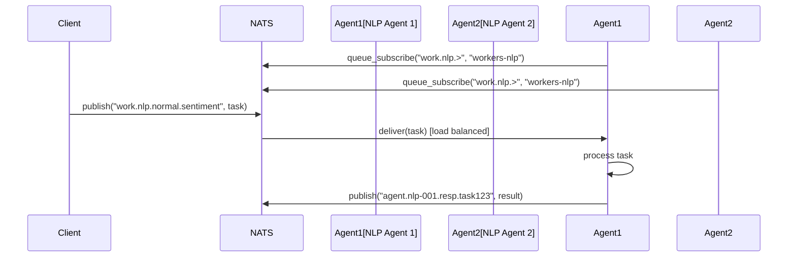
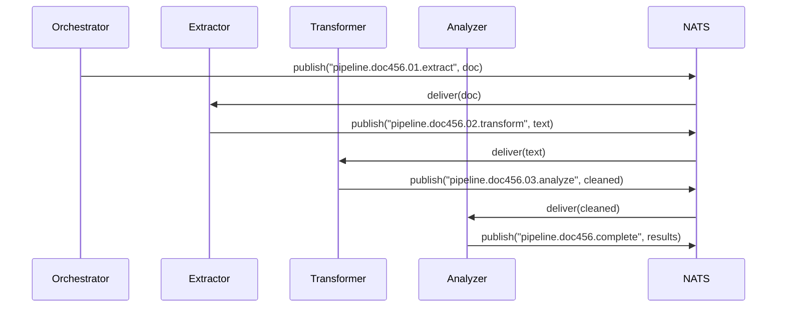
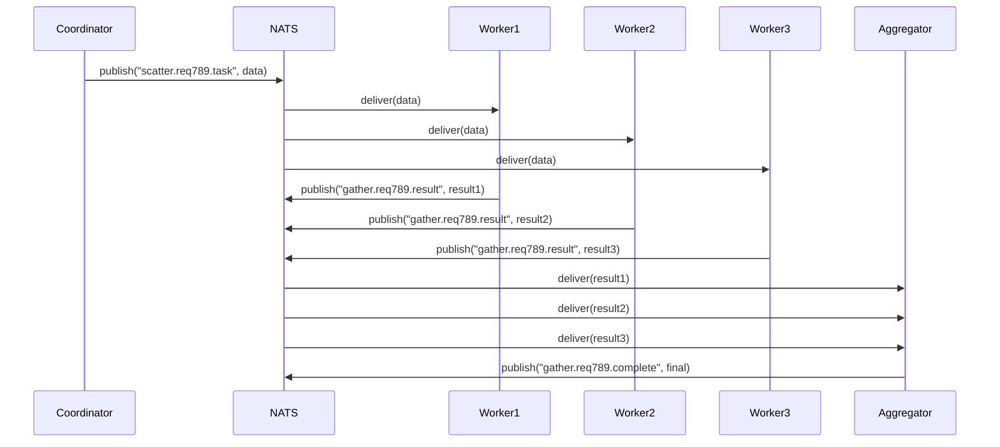

# NATS Multi-Agent Messaging Patterns

## Overview

This document defines the NATS pub/sub patterns for the MisterSmith multi-agent orchestration framework. These patterns are designed to scale seamlessly from 2 agents to 200+ agents while maintaining clarity, performance, and reliability.

## Subject Hierarchy

### 1. Agent Lifecycle Management

Agent lifecycle events use a hierarchical subject structure that enables both targeted and wildcard subscriptions.

```
agent.<agent_id>.<lifecycle_event>
```

**Lifecycle Events:**
- `agent.*.created` - Agent creation notifications
- `agent.*.started` - Agent startup notifications  
- `agent.*.ready` - Agent ready to receive work
- `agent.*.heartbeat` - Agent health checks (published every 30s)
- `agent.*.stopped` - Agent shutdown notifications
- `agent.*.error` - Agent error events

**Example Usage:**
```rust
// Subscribe to all agent lifecycle events
nc.subscribe("agent.>", handler);

// Subscribe to all ready events
nc.subscribe("agent.*.ready", handler);

// Subscribe to specific agent events
nc.subscribe("agent.nlp-worker-001.>", handler);
```

### 2. Agent Commands

Commands sent to specific agents or groups of agents.

```
agent.<agent_id>.cmd.<command_type>
```

**Command Types:**
- `agent.*.cmd.execute` - Execute task commands
- `agent.*.cmd.pause` - Pause agent operations
- `agent.*.cmd.resume` - Resume operations
- `agent.*.cmd.shutdown` - Graceful shutdown
- `agent.*.cmd.config` - Configuration updates

**Example Usage:**
```rust
// Send command to specific agent
nc.publish("agent.nlp-worker-001.cmd.execute", task_data);

// Broadcast pause to all agents
nc.publish("agent.*.cmd.pause", empty_payload);
```

### 3. Work Distribution

Work items are distributed using queue groups for automatic load balancing.

```
work.<domain>.<priority>.<task_type>
```

**Domains:** `nlp`, `vision`, `audio`, `general`, `ml`, `data`

**Priorities:** `critical`, `high`, `normal`, `low`

**Example Subjects:**
- `work.nlp.high.sentiment` - High priority sentiment analysis
- `work.vision.normal.ocr` - Normal priority OCR tasks
- `work.general.low.batch` - Low priority batch processing
- `work.ml.critical.inference` - Critical ML inference tasks

**Queue Groups:**
- Format: `workers-<domain>[-<version>]`
- Examples: `workers-nlp`, `workers-vision-v2`

### 4. Coordination Patterns

Multi-agent coordination for complex workflows.

```
coord.<workflow_id>.<stage>
```

**Coordination Events:**
- `coord.*.ready` - Stage ready notifications
- `coord.*.complete` - Stage completion
- `coord.*.error` - Coordination failures
- `coord.*.cancel` - Workflow cancellation

### 5. Pipeline Processing

Sequential processing with parallel stages.

```
pipeline.<workflow_id>.<stage_num>.<stage_name>
```

**Example Pipeline:**
```
pipeline.doc789.01.extract     → Extract text from document
pipeline.doc789.02.preprocess  → Clean and normalize text  
pipeline.doc789.03.analyze     → Run NLP analysis
pipeline.doc789.04.summarize   → Generate summary
pipeline.doc789.complete       → Final results
```

### 6. Broadcast Messages

System-wide or domain-specific broadcasts (no queue groups).

```
broadcast.<scope>.<event>
```

**Scopes:**
- `broadcast.global.*` - System-wide events
- `broadcast.domain.<domain>.*` - Domain-specific events
- `broadcast.emergency.*` - Emergency notifications

**Example Events:**
- `broadcast.global.config_update`
- `broadcast.domain.nlp.model_update`
- `broadcast.emergency.shutdown`

## Multi-Agent Coordination Patterns

### 1. Work Queue Pattern (Load Balancing)

Distributes work among multiple agents with automatic failover.

```rust
// Multiple agents subscribe with same queue group
nc.queue_subscribe("work.nlp.>", "workers-nlp", handler);

// Publisher sends work without knowing which agent will handle it
nc.publish("work.nlp.normal.sentiment", task_data);
```

**Benefits:**
- Automatic load balancing
- Fault tolerance (if one agent fails, others continue)
- Easy horizontal scaling

### 2. Leader Election Pattern

Elects a leader among agents for coordination tasks.

```
election.<domain>.vote          → Agents cast votes
election.<domain>.vote.resp.*   → Vote responses
election.<domain>.leader        → Current leader announcement
election.<domain>.heartbeat     → Leader heartbeat
```

**Implementation:**
```rust
// Participate in election
nc.publish("election.nlp.vote", agent_capabilities);

// Subscribe to leader announcements
nc.subscribe("election.nlp.leader", handle_new_leader);
```

### 3. Scatter-Gather Pattern

Parallel processing with result aggregation.

```
scatter.<request_id>.task      → Scatter work to multiple agents
gather.<request_id>.result     → Agents publish results here
gather.<request_id>.complete   → Final aggregated result
```

**Example Flow:**
```rust
// Scatter phase
let request_id = generate_id();
nc.publish(format!("scatter.{}.task", request_id), data);

// Gather phase (aggregator)
nc.subscribe(format!("gather.{}.result", request_id), collect_results);

// Worker agents
nc.queue_subscribe("scatter.*.task", "scatter-workers", process_and_respond);
```

### 4. Request-Reply Pattern

Direct request-reply for synchronous operations.

```rust
// Request with timeout
let response = nc.request("agent.nlp-001.cmd.status", empty, Duration::from_secs(5))?;

// Agent handles requests
nc.subscribe("agent.nlp-001.cmd.status", |msg| {
    msg.respond(status_data);
});
```

### 5. Fanout Pattern

One-to-many message distribution without queue groups.

```rust
// All subscribed agents receive the message
nc.publish("broadcast.domain.nlp.model_update", model_info);

// Each agent subscribes individually (no queue group)
nc.subscribe("broadcast.domain.nlp.model_update", handle_update);
```

## JetStream Configuration

### Streams

#### 1. AGENT_LIFECYCLE Stream
```javascript
{
  name: "AGENT_LIFECYCLE",
  subjects: [
    "agent.*.created",
    "agent.*.started", 
    "agent.*.ready",
    "agent.*.stopped",
    "agent.*.error"
  ],
  retention: "limits",
  max_age: "7d",
  max_bytes: "10GB",
  storage: "file",
  replicas: 3
}
```

#### 2. WORK_QUEUE Stream
```javascript
{
  name: "WORK_QUEUE",
  subjects: ["work.>"],
  retention: "workqueue",
  max_age: "24h",
  max_msgs_per_subject: 1000,
  storage: "file",
  replicas: 3,
  discard: "old"
}
```

#### 3. COORDINATION Stream
```javascript
{
  name: "COORDINATION",
  subjects: [
    "coord.>",
    "pipeline.>",
    "scatter.>",
    "gather.>"
  ],
  retention: "limits",
  max_age: "48h",
  max_bytes: "50GB",
  storage: "file",
  replicas: 3
}
```

### Key-Value Buckets

#### AGENT_STATE Bucket
```javascript
{
  bucket: "AGENT_STATE",
  description: "Current state of all agents",
  ttl: "5m",  // Requires heartbeat updates
  replicas: 3
}
```

**Key Format:** `agent.<agent_id>`

**Value Schema:**
```json
{
  "agent_id": "nlp-worker-001",
  "status": "ready|busy|paused|error",
  "capabilities": ["sentiment", "ner", "classification"],
  "current_load": 0.75,
  "last_heartbeat": "2024-01-20T10:30:00Z",
  "metadata": {}
}
```

## Message Flow Examples

### Example 1: Simple Task Distribution



### Example 2: Pipeline Processing



### Example 3: Scatter-Gather Pattern



## Error Handling Patterns

### Dead Letter Queue (DLQ)

Failed messages are routed to DLQ subjects after max retries.

```
dlq.<original_subject>
```

**Example:**
- Original: `work.nlp.analysis`
- DLQ: `dlq.work.nlp.analysis`

### Circuit Breaker

Agents publish circuit state to prevent cascading failures.

```
circuit.<service>.<state>  // states: open, closed, half-open
```

**Usage:**
```rust
// Agent detects repeated failures
nc.publish("circuit.nlp-service.open", error_details);

// Other agents check circuit state before sending work
nc.subscribe("circuit.nlp-service.*", update_circuit_state);
```

## Monitoring & Observability

### Metrics Publishing

```
metrics.agent.<agent_id>.<metric_type>
metrics.system.<component>.<metric_type>
```

**Common Metrics:**
- `metrics.agent.nlp-001.cpu_usage`
- `metrics.agent.nlp-001.memory_usage`
- `metrics.agent.nlp-001.tasks_processed`
- `metrics.agent.nlp-001.tasks_failed`
- `metrics.system.work_queue.depth`
- `metrics.system.work_queue.processing_time`

### Health Checks

```rust
// Health check request
nc.request("health.check.nlp-001", empty, timeout);

// Broadcast health check
nc.publish("health.check.*", empty);

// Agent responds with status
nc.subscribe("health.check.nlp-001", |msg| {
    msg.respond(health_status);
});
```

### Distributed Tracing

Message headers carry trace context:

```rust
let mut headers = HeaderMap::new();
headers.insert("X-Trace-ID", trace_id);
headers.insert("X-Span-ID", span_id);
headers.insert("X-Agent-ID", agent_id);

nc.publish_with_headers("work.nlp.analysis", headers, data);
```

## Implementation Guidelines

### 1. Subject Naming Conventions

- Use lowercase with dots as separators
- Keep subjects descriptive but concise (<255 chars)
- Include version if needed: `work.v2.nlp.analysis`
- Avoid special characters except dots and hyphens

### 2. Queue Group Best Practices

- Naming format: `<purpose>-<domain>[-<version>]`
- Examples: `workers-nlp`, `coordinators-pipeline-v2`
- Use consistent naming for monitoring
- Document queue group purposes

### 3. Message Headers

Standard headers for all messages:

| Header | Description | Example |
|--------|-------------|---------|
| X-Agent-ID | Sending agent identifier | nlp-worker-001 |
| X-Request-ID | Correlation ID | req-123e4567 |
| X-Trace-ID | Distributed trace ID | trace-789abc |
| X-Priority | Message priority | high |
| X-Retry-Count | Current retry attempt | 2 |
| Content-Type | Payload format | application/json |

### 4. Scalability Guidelines

- **Subscription Management**: Limit subscriptions per agent (<1000)
- **Wildcard Usage**: Use wildcards efficiently to minimize overhead
- **Message Size**: Keep messages <1MB, use object storage for large data
- **Backpressure**: Implement flow control in high-volume scenarios
- **Connection Pooling**: Use connection multiplexing for efficiency

### 5. Security Considerations

- **Authentication**: Use NATS user credentials per agent
- **Authorization**: Implement subject-based permissions
- **Encryption**: Enable TLS for all connections
- **Audit Trail**: Use JetStream for sensitive operations
- **Access Control**: Separate subjects by trust boundaries

## Testing Patterns

### Load Testing

```bash
# Test work distribution under load
nats bench work.nlp.test --msgs=10000 --pub=10 --sub=50

# Test broadcast performance  
nats bench broadcast.global.test --msgs=1000 --pub=1 --sub=200
```

### Monitoring Commands

```bash
# View stream info
nats stream info WORK_QUEUE

# Monitor work queue depth
nats stream view WORK_QUEUE --subjects="work.>"

# Check agent state
nats kv get AGENT_STATE agent.nlp-001

# Watch coordination events
nats sub "coord.>" --queue=monitor
```

## Migration Path

For systems transitioning to this pattern:

1. **Phase 1**: Implement agent lifecycle subjects
2. **Phase 2**: Add work queue pattern for new features
3. **Phase 3**: Migrate existing RPC to request-reply pattern
4. **Phase 4**: Implement coordination patterns
5. **Phase 5**: Add monitoring and observability

## Rust Implementation Examples

### Work Queue Consumer

```rust
use async_nats::{Client, Message};
use crate::transport::NatsTransport;

/// Worker agent that processes NLP tasks
pub struct NlpWorkerAgent {
    transport: NatsTransport,
    agent_id: String,
}

impl NlpWorkerAgent {
    pub async fn start(&self) -> Result<()> {
        let client = self.transport.client();
        
        // Subscribe to work queue with queue group
        let mut sub = client
            .queue_subscribe("work.nlp.>", "workers-nlp")
            .await?;
        
        // Process messages
        while let Some(msg) = sub.next().await {
            self.handle_work(msg).await?;
        }
        
        Ok(())
    }
    
    async fn handle_work(&self, msg: Message) -> Result<()> {
        // Extract task type from subject
        // work.nlp.priority.task_type
        let parts: Vec<&str> = msg.subject.split('.').collect();
        let priority = parts.get(2).unwrap_or(&"normal");
        let task_type = parts.get(3).unwrap_or(&"unknown");
        
        // Process based on priority
        match *priority {
            "critical" => self.process_critical(msg).await?,
            "high" => self.process_high_priority(msg).await?,
            _ => self.process_normal(msg).await?,
        }
        
        Ok(())
    }
}
```

### Pipeline Stage Implementation

```rust
/// Pipeline stage processor
pub struct PipelineStage {
    transport: NatsTransport,
    stage_name: String,
    next_stage: Option<String>,
}

impl PipelineStage {
    pub async fn start(&self) -> Result<()> {
        let client = self.transport.client();
        
        // Subscribe to this stage's messages
        let subject = format!("pipeline.*.*.{}", self.stage_name);
        let queue_group = format!("pipeline-{}", self.stage_name);
        
        let mut sub = client
            .queue_subscribe(&subject, &queue_group)
            .await?;
        
        while let Some(msg) = sub.next().await {
            // Process the message
            let result = self.process(msg.payload).await?;
            
            // Extract workflow ID and stage number
            let parts: Vec<&str> = msg.subject.split('.').collect();
            let workflow_id = parts[1];
            let stage_num: u32 = parts[2].parse()?;
            
            // Publish to next stage or complete
            if let Some(next) = &self.next_stage {
                let next_subject = format!(
                    "pipeline.{}.{:02}.{}", 
                    workflow_id, 
                    stage_num + 1, 
                    next
                );
                client.publish(next_subject, result).await?;
            } else {
                // Final stage - publish completion
                let complete_subject = format!("pipeline.{}.complete", workflow_id);
                client.publish(complete_subject, result).await?;
            }
        }
        
        Ok(())
    }
}
```

### Leader Election Implementation

```rust
use std::time::{Duration, Instant};

/// Leader election participant
pub struct LeaderElection {
    transport: NatsTransport,
    domain: String,
    agent_id: String,
    is_leader: Arc<AtomicBool>,
}

impl LeaderElection {
    pub async fn participate(&self) -> Result<()> {
        let client = self.transport.client();
        
        // Subscribe to election events
        let vote_subject = format!("election.{}.vote", self.domain);
        let leader_subject = format!("election.{}.leader", self.domain);
        
        // Start election
        loop {
            // Call for votes
            let resp = client
                .request(
                    &vote_subject, 
                    self.agent_id.as_bytes().to_vec(),
                    Duration::from_secs(2)
                )
                .await;
            
            match resp {
                Ok(_) => {
                    // We won the election
                    self.is_leader.store(true, Ordering::SeqCst);
                    
                    // Announce leadership
                    client.publish(
                        &leader_subject,
                        self.agent_id.as_bytes().to_vec()
                    ).await?;
                    
                    // Start heartbeat
                    self.leader_heartbeat().await?;
                },
                Err(_) => {
                    // Lost election, wait and retry
                    self.is_leader.store(false, Ordering::SeqCst);
                    tokio::time::sleep(Duration::from_secs(10)).await;
                }
            }
        }
    }
    
    async fn leader_heartbeat(&self) -> Result<()> {
        let client = self.transport.client();
        let heartbeat_subject = format!("election.{}.heartbeat", self.domain);
        
        while self.is_leader.load(Ordering::SeqCst) {
            client.publish(
                &heartbeat_subject,
                self.agent_id.as_bytes().to_vec()
            ).await?;
            
            tokio::time::sleep(Duration::from_secs(5)).await;
        }
        
        Ok(())
    }
}
```

### Scatter-Gather Coordinator

```rust
use std::collections::HashMap;

/// Scatter-gather pattern coordinator
pub struct ScatterGatherCoordinator {
    transport: NatsTransport,
    timeout: Duration,
}

impl ScatterGatherCoordinator {
    pub async fn scatter_gather(
        &self,
        data: Vec<u8>,
        min_responses: usize,
    ) -> Result<Vec<Vec<u8>>> {
        let client = self.transport.client();
        let request_id = generate_request_id();
        
        // Subscribe to gather results
        let gather_subject = format!("gather.{}.result", request_id);
        let mut sub = client.subscribe(&gather_subject).await?;
        
        // Scatter the work
        let scatter_subject = format!("scatter.{}.task", request_id);
        client.publish(&scatter_subject, data).await?;
        
        // Collect results
        let mut results = Vec::new();
        let deadline = Instant::now() + self.timeout;
        
        while results.len() < min_responses && Instant::now() < deadline {
            match tokio::time::timeout_at(
                deadline.into(),
                sub.next()
            ).await {
                Ok(Some(msg)) => {
                    results.push(msg.payload.to_vec());
                },
                _ => break,
            }
        }
        
        // Publish completion
        if results.len() >= min_responses {
            let complete_subject = format!("gather.{}.complete", request_id);
            client.publish(&complete_subject, b"completed".to_vec()).await?;
        }
        
        Ok(results)
    }
}
```

### Health Check Responder

```rust
/// Agent health check responder
pub struct HealthCheckResponder {
    transport: NatsTransport,
    agent_id: String,
    get_health: Box<dyn Fn() -> HealthStatus + Send + Sync>,
}

impl HealthCheckResponder {
    pub async fn start(&self) -> Result<()> {
        let client = self.transport.client();
        
        // Subscribe to health check requests
        let subjects = vec![
            format!("health.check.{}", self.agent_id),
            "health.check.*".to_string(),
        ];
        
        for subject in subjects {
            let mut sub = client.subscribe(&subject).await?;
            
            tokio::spawn({
                let get_health = self.get_health.clone();
                async move {
                    while let Some(msg) = sub.next().await {
                        let health = (get_health)();
                        let response = serde_json::to_vec(&health).unwrap();
                        msg.respond(response).await.ok();
                    }
                }
            });
        }
        
        Ok(())
    }
}

#[derive(Serialize, Deserialize)]
struct HealthStatus {
    agent_id: String,
    status: String, // ready, busy, error
    uptime_seconds: u64,
    current_load: f32,
    capabilities: Vec<String>,
    last_error: Option<String>,
}
```

## Performance Optimization Tips

### 1. Connection Pooling

```rust
/// Shared NATS connection pool for agents
pub struct NatsConnectionPool {
    connections: Vec<Client>,
    next: AtomicUsize,
}

impl NatsConnectionPool {
    pub async fn new(urls: &[&str], pool_size: usize) -> Result<Self> {
        let mut connections = Vec::with_capacity(pool_size);
        
        for _ in 0..pool_size {
            let client = async_nats::connect(urls).await?;
            connections.push(client);
        }
        
        Ok(Self {
            connections,
            next: AtomicUsize::new(0),
        })
    }
    
    pub fn get(&self) -> &Client {
        let idx = self.next.fetch_add(1, Ordering::Relaxed) % self.connections.len();
        &self.connections[idx]
    }
}
```

### 2. Batch Processing

```rust
/// Batch message processor for high throughput
pub struct BatchProcessor {
    transport: NatsTransport,
    batch_size: usize,
    batch_timeout: Duration,
}

impl BatchProcessor {
    pub async fn process_batch(&self, subject: &str) -> Result<()> {
        let client = self.transport.client();
        let mut sub = client.subscribe(subject).await?;
        
        loop {
            let mut batch = Vec::with_capacity(self.batch_size);
            let deadline = Instant::now() + self.batch_timeout;
            
            // Collect batch
            while batch.len() < self.batch_size {
                match tokio::time::timeout_at(
                    deadline.into(),
                    sub.next()
                ).await {
                    Ok(Some(msg)) => batch.push(msg),
                    _ => break,
                }
            }
            
            if !batch.is_empty() {
                self.process_messages(batch).await?;
            }
        }
    }
}
```

## Conclusion

These NATS messaging patterns provide a robust foundation for multi-agent systems that can scale from small deployments to large distributed systems. The patterns emphasize:

- **Simplicity**: Clear, self-documenting subject hierarchies
- **Scalability**: Queue groups and wildcards for efficient routing
- **Reliability**: JetStream for persistence and guaranteed delivery
- **Observability**: Built-in monitoring and tracing patterns
- **Flexibility**: Multiple coordination patterns for different use cases

By following these patterns, the MisterSmith framework can efficiently orchestrate hundreds of agents while maintaining clarity and operational excellence.