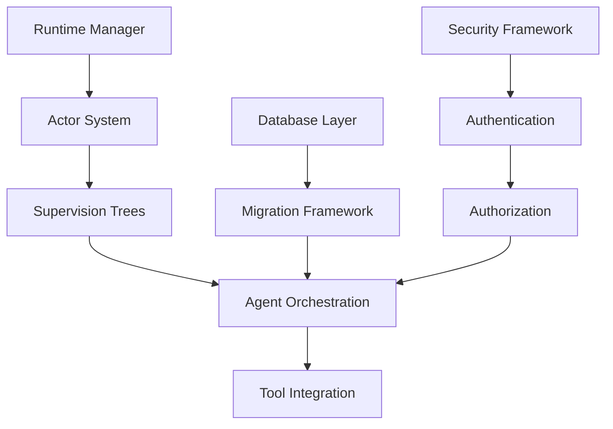

# Agent-06: Rust Implementation Requirements Analysis
## MS Framework Validation Bridge - Team Beta Implementation Readiness Assessment

**Agent**: Agent-06 (Rust Implementation Requirements Specialist)  
**Team**: Beta - Implementation Readiness Assessment  
**Date**: 2025-07-05  
**Mission**: Comprehensive analysis of Rust implementation requirements for the complete MS Framework

---

## Executive Summary

### Implementation Readiness Assessment
- **Overall Framework Score**: 82/100 (requires critical gap resolution)
- **Rust Implementation Readiness**: 75/100 
- **Critical Path Dependencies**: 6 identified
- **Estimated Implementation Timeline**: 16-20 weeks to production
- **Team Requirements**: 8-12 experienced Rust developers

### Key Findings
1. **Strong Foundation**: Core architecture is well-designed with excellent type system (97/100)
2. **Critical Gaps**: 4 blockers requiring immediate attention before implementation
3. **Dependency Risk**: Complex async ecosystem with version compatibility challenges
4. **Resource Intensity**: Significant expertise requirements for supervision trees and orchestration

---

## 1. Rust Toolchain Requirements Analysis

### 1.1 Minimum Supported Rust Version (MSRV)
```toml
# Recommended MSRV based on dependency analysis
rust-version = "1.75.0"  # December 2023 release

# MSRV Justification:
# - Tokio 1.45+ requires Rust 1.70+
# - async-trait 0.1.83 requires Rust 1.75+
# - Pattern matching improvements critical for supervision trees
# - Performance optimizations for async runtime
```

**MSRV Strategy**:
- **Update Policy**: Quarterly reviews with 6-month compatibility window
- **Feature Benefits**: Each MSRV bump must provide significant value
- **Testing Matrix**: CI/CD testing against MSRV, stable, and beta channels
- **Migration Path**: 30-day advance notice for MSRV changes

### 1.2 Essential Rust Features Required
```rust
// Critical language features for framework implementation
#![feature(
    async_fn_in_trait,           // For agent trait definitions
    type_alias_impl_trait,       // For complex async return types
    generic_associated_types,    // For supervision tree generics
    async_closure,               // For high-level async patterns
)]
```

### 1.3 Compilation Requirements
- **Target Platforms**: `x86_64-unknown-linux-gnu`, `aarch64-unknown-linux-gnu`, `x86_64-apple-darwin`
- **Memory Requirements**: 16GB RAM minimum for full workspace compilation
- **CPU Requirements**: 8+ cores recommended for parallel compilation
- **Disk Space**: 25GB for target directory and dependencies

---

## 2. Core Dependency Analysis

### 2.1 Runtime Dependencies (Critical Path)

#### Tokio Ecosystem (Foundation Layer)
```toml
[dependencies]
# === ASYNC RUNTIME CORE ===
tokio = { version = "1.45.0", features = [
    "rt-multi-thread",    # Multi-threaded runtime (REQUIRED)
    "macros",            # #[tokio::main] and #[tokio::test]
    "sync",              # Synchronization primitives
    "time",              # Timer and timeout functionality
    "io-util",           # I/O utilities for streams
    "net",               # Network primitives
    "fs",                # File system operations
    "process",           # Process spawning (for Claude CLI integration)
    "signal",            # Signal handling for graceful shutdown
] }

futures = "0.3.31"              # Core async utilities
async-trait = "0.1.83"          # Async trait support
pin-project = "1.1.6"           # Pin projection for complex async types
```

**Risk Assessment**: 
- **Compatibility**: Tokio 1.45+ has breaking changes from 1.30
- **Memory Usage**: Full feature set adds ~2MB to binary size
- **Performance**: Multi-threaded runtime overhead vs single-threaded

#### Serialization Layer
```toml
# === DATA HANDLING ===
serde = { version = "1.0.214", features = ["derive"] }
serde_json = "1.0.132"          # JSON for API communication
toml = "0.8.19"                 # Configuration parsing
jsonschema = "0.18.3"           # Schema validation (optional)
semver = { version = "1.0.23", features = ["serde"] }
```

**Implementation Complexity**: Medium
- Type-safe serialization requires careful trait implementations
- JSON schema validation adds runtime overhead
- Version compatibility critical for agent communication

### 2.2 Agent Orchestration Dependencies (Critical Gap)

```toml
# === ACTOR SYSTEM (Critical Implementation Gap) ===
async-trait = "0.1.83"
crossbeam-channel = "0.5.13"    # Message passing channels
crossbeam-utils = "0.8.20"      # Concurrency utilities
dashmap = "6.1.0"               # Concurrent hash maps
parking_lot = "0.12.3"          # High-performance mutexes
```

**Critical Finding**: Agent orchestration scored 47/100 in validation
- **Missing**: Concrete actor system implementation
- **Risk**: System non-functional without working orchestration
- **Effort**: 3-4 weeks of dedicated implementation

### 2.3 Supervision Tree Dependencies (Critical Gap)

```toml
# === SUPERVISION SYSTEM (Pseudocode Only) ===
futures = "0.3.31"
tokio = { version = "1.45.0", features = ["sync", "time"] }
atomic_float = "1.1.0"          # Atomic floating-point for metrics
crossbeam-utils = "0.8.20"      # Atomic operations
```

**Critical Finding**: Supervision trees exist only as pseudocode
- **Missing**: Fault tolerance implementation
- **Risk**: No predictable error recovery in production
- **Effort**: 4-5 weeks of dedicated implementation
- **Expertise**: Requires deep async Rust knowledge

---

## 3. Implementation Complexity Assessment by Domain

### 3.1 Core Architecture (Complexity: Medium-High)

| Component | Complexity | Effort (weeks) | Risk Level | Dependencies |
|-----------|------------|----------------|------------|--------------|
| Runtime Manager | Medium | 2-3 | Low | tokio, num_cpus |
| Type System | Low | 1 | Low | serde, uuid |
| Error Handling | Low | 1 | Low | thiserror, anyhow |
| Configuration | Medium | 2 | Low | config, validator |
| **Actor System** | **High** | **4-5** | **Critical** | crossbeam, dashmap |
| **Supervision Trees** | **Very High** | **5-6** | **Critical** | Custom implementation |

**Key Challenges**:
- Supervision tree state management requires careful async coordination
- Actor lifecycle management with proper cleanup
- Cross-component error propagation and recovery

### 3.2 Data & Messaging (Complexity: High)

| Component | Complexity | Effort (weeks) | Risk Level | Dependencies |
|-----------|------------|----------------|------------|--------------|
| Message Schemas | Low | 1 | Low | serde_json |
| Data Persistence | Medium | 2-3 | Medium | sqlx, redis |
| **Agent Orchestration** | **Very High** | **6-8** | **Critical** | Custom + NATS |
| PostgreSQL Integration | Medium | 2 | Medium | sqlx, tokio-postgres |
| **Migration Framework** | **High** | **3-4** | **High** | Custom implementation |

**Critical Findings**:
- Agent orchestration fundamental communication issues (47% ready)
- PostgreSQL migration framework missing entirely
- Complex async stream processing required

### 3.3 Security & Compliance (Complexity: Medium)

| Component | Complexity | Effort (weeks) | Risk Level | Dependencies |
|-----------|------------|----------------|------------|--------------|
| Authentication | Medium | 2-3 | Medium | ring, jwt-simple |
| Authorization | Medium | 2 | Low | Custom RBAC |
| mTLS Implementation | High | 3-4 | Medium | rustls, ring |
| Compliance Framework | Medium | 2-3 | High | Custom audit |

**Risk Assessment**:
- mTLS version inconsistencies identified (attack vectors)
- Compliance framework gaps (64/100 score)
- Security audit trail implementation required

### 3.4 Operations & Infrastructure (Complexity: Medium)

| Component | Complexity | Effort (weeks) | Risk Level | Dependencies |
|-----------|------------|----------------|------------|--------------|
| Observability | Medium | 2-3 | Low | prometheus, tracing |
| CI/CD Pipeline | Low | 1 | Low | Existing tools |
| **Kubernetes Security** | **High** | **2-3** | **High** | Pod security standards |
| Process Management | Medium | 2 | Medium | tokio::process |

**Critical Finding**:
- Kubernetes pod security standards inadequate (72/100)
- Security vulnerabilities in container deployment

---

## 4. Critical Path Dependency Analysis

### 4.1 Blocking Dependencies (Must Implement First)



**Critical Path**: Runtime → Actors → Supervision → Orchestration
**Estimated Timeline**: 12-16 weeks for critical path
**Parallel Development**: Security and data layers can be developed concurrently

### 4.2 Dependency Version Compatibility Matrix

| Dependency | Version | Compatibility Risk | Migration Effort |
|------------|---------|-------------------|------------------|
| Tokio | 1.45.0 | Medium | 2-3 days |
| Serde | 1.0.214 | Low | 0 days |
| Async-trait | 0.1.83 | Medium | 1-2 days |
| SQLx | 0.8.2 | High | 3-5 days |
| Ring | 0.17.8 | High | 2-3 days |
| NATS | 0.37.0 | High | 4-6 days |

**High-Risk Dependencies**:
- **SQLx**: Frequent breaking changes, complex migration patterns
- **Ring**: Cryptographic API changes require careful review
- **NATS**: JetStream API evolution impacts orchestration

---

## 5. Development Team Skill Requirements

### 5.1 Required Expertise Levels

#### Core Team (4-6 developers)
- **Senior Rust Engineer (2)**: 5+ years Rust, async/await expertise
  - Supervision tree implementation
  - Actor system architecture
  - Performance optimization
  
- **Async Systems Specialist (1)**: Tokio runtime expertise
  - Multi-threaded runtime configuration
  - Custom executor implementation
  - Async trait design patterns

- **Systems Integration Engineer (1)**: Database and messaging
  - SQLx advanced features
  - NATS JetStream integration
  - Connection pool management

#### Support Team (2-4 developers)
- **Security Engineer (1)**: Cryptography and compliance
  - Ring/rustls implementation
  - mTLS configuration
  - Audit trail design

- **DevOps Engineer (1)**: Deployment and infrastructure
  - Kubernetes security hardening
  - Container optimization
  - CI/CD pipeline implementation

### 5.2 Knowledge Gaps Assessment

| Skill Area | Current Gap | Training Time | Risk Impact |
|------------|-------------|---------------|-------------|
| Supervision Trees | High | 4-6 weeks | Critical |
| Async Actor Systems | Medium | 2-3 weeks | High |
| NATS JetStream | High | 3-4 weeks | High |
| SQLx Migrations | Medium | 1-2 weeks | Medium |
| Kubernetes Security | Medium | 2-3 weeks | High |

**Training Strategy**:
- **Immediate**: Supervision tree and actor system training
- **Phase 2**: NATS and messaging patterns
- **Ongoing**: Security best practices and compliance

---

## 6. Resource Allocation Recommendations

### 6.1 Development Timeline

#### Phase 1: Foundation (Weeks 1-4)
- **Runtime Manager**: 1 developer, 2 weeks
- **Type System**: 1 developer, 1 week  
- **Error Handling**: 1 developer, 1 week
- **Configuration**: 1 developer, 2 weeks

**Deliverable**: Working runtime foundation

#### Phase 2: Critical Systems (Weeks 5-12)
- **Actor System**: 2 developers, 4 weeks
- **Supervision Trees**: 2 developers, 5 weeks
- **Database Layer**: 1 developer, 3 weeks
- **Security Framework**: 1 developer, 4 weeks

**Deliverable**: Core agent functionality

#### Phase 3: Integration (Weeks 13-16)
- **Agent Orchestration**: 3 developers, 4 weeks
- **Tool Integration**: 2 developers, 3 weeks
- **Testing Framework**: 2 developers, 2 weeks

**Deliverable**: End-to-end system functionality

#### Phase 4: Production Readiness (Weeks 17-20)
- **Kubernetes Security**: 1 developer, 2 weeks
- **Migration Framework**: 1 developer, 2 weeks
- **Performance Optimization**: 2 developers, 3 weeks
- **Security Audit**: 1 developer, 2 weeks

**Deliverable**: Production-ready system

### 6.2 Resource Requirements Summary

| Phase | Developers | Duration | Key Deliverables |
|-------|------------|----------|------------------|
| 1 | 4 | 4 weeks | Runtime foundation |
| 2 | 6 | 8 weeks | Core agent systems |
| 3 | 5 | 4 weeks | Integration complete |
| 4 | 4 | 4 weeks | Production ready |

**Total Effort**: 112 developer-weeks (28 developer-months)
**Peak Team Size**: 6 developers
**Critical Skills**: 2 senior Rust engineers throughout

---

## 7. Risk Assessment and Mitigation

### 7.1 Technical Risks

#### High-Priority Risks
1. **Supervision Tree Implementation Complexity**
   - **Risk**: No concrete implementation exists
   - **Impact**: System unreliable in production
   - **Mitigation**: Prototype in first 2 weeks, extensive testing

2. **Agent Orchestration Communication Reliability**
   - **Risk**: 47% readiness score indicates fundamental issues
   - **Impact**: System non-functional
   - **Mitigation**: Dedicated integration team, end-to-end testing

3. **Async Rust Learning Curve**
   - **Risk**: Complex ownership and lifetime management
   - **Impact**: Development delays, bugs
   - **Mitigation**: Training program, pair programming

#### Medium-Priority Risks
1. **Dependency Version Conflicts**
   - **Risk**: Breaking changes in major dependencies
   - **Impact**: Integration delays
   - **Mitigation**: Version pinning, regular updates

2. **Performance Bottlenecks**
   - **Risk**: Actor system overhead
   - **Impact**: Production performance issues
   - **Mitigation**: Early benchmarking, profiling

### 7.2 Resource Risks

#### Staffing Risks
- **Senior Rust Talent Scarcity**: Limited pool of qualified developers
- **Knowledge Transfer**: Risk if key developers leave
- **Ramp-up Time**: 2-3 weeks for new team members

#### Mitigation Strategies
- **Documentation**: Comprehensive technical documentation
- **Knowledge Sharing**: Regular technical sessions
- **Redundancy**: Cross-training on critical components

---

## 8. Success Criteria and Validation Metrics

### 8.1 Implementation Milestones

#### Milestone 1: Runtime Foundation (Week 4)
- [ ] Tokio runtime starts and shuts down gracefully
- [ ] Configuration system loads from multiple sources
- [ ] Error handling propagates correctly
- [ ] Basic logging and metrics collection

**Validation**: Unit tests pass, integration test suite runs

#### Milestone 2: Actor System (Week 8)
- [ ] Actors can be spawned and communicate
- [ ] Mailbox message handling functional
- [ ] Actor lifecycle management (start/stop/restart)
- [ ] Basic supervision strategy implemented

**Validation**: Actor communication tests, fault injection tests

#### Milestone 3: Supervision Trees (Week 12)
- [ ] Hierarchical supervision implemented
- [ ] Fault detection and recovery functional
- [ ] Escalation strategies working
- [ ] Metrics collection for supervision events

**Validation**: Fault tolerance tests, supervision tree stress tests

#### Milestone 4: Agent Orchestration (Week 16)
- [ ] Multi-agent communication functional
- [ ] Message routing working correctly  
- [ ] Distributed coordination basic functionality
- [ ] Tool integration framework complete

**Validation**: End-to-end system tests, multi-agent scenarios

### 8.2 Quality Gates

#### Code Quality Metrics
- **Test Coverage**: ≥90% for core components
- **Documentation**: 100% public API documented
- **Linting**: Zero warnings with clippy
- **Security**: Cargo audit clean

#### Performance Benchmarks
- **Actor Message Latency**: <1ms p99
- **Supervision Restart Time**: <100ms
- **Memory Usage**: <512MB for basic agent
- **CPU Usage**: <10% idle for running agent

---

## 9. Deployment Pipeline Requirements

### 9.1 Build System Configuration

```toml
# .cargo/config.toml
[alias]
# Development shortcuts
quick = "check --workspace"
test-all = "test --workspace --all-targets"
bench-all = "bench --workspace"
security = "audit --db-update"

# Release builds
release-linux = "build --release --target x86_64-unknown-linux-gnu"
release-macos = "build --release --target x86_64-apple-darwin"

[build]
jobs = 8  # Parallel compilation

[target.x86_64-unknown-linux-gnu]
linker = "clang"
rustflags = ["-C", "link-arg=-fuse-ld=lld"]  # Faster linking
```

### 9.2 CI/CD Requirements

#### Build Matrix
- **Rust Versions**: MSRV (1.75), stable, beta
- **Platforms**: Linux x86_64, Linux ARM64, macOS x86_64
- **Features**: Default, full, minimal feature sets

#### Quality Checks
- **Static Analysis**: Clippy, rustfmt, cargo deny
- **Security**: Cargo audit, license compliance
- **Testing**: Unit, integration, property-based tests
- **Performance**: Benchmark regression detection

### 9.3 Container Strategy

```dockerfile
# Multi-stage build for optimized containers
FROM rust:1.75-slim AS builder
WORKDIR /app
COPY . .
RUN cargo build --release --locked

FROM ubuntu:22.04
RUN apt-get update && apt-get install -y ca-certificates
COPY --from=builder /app/target/release/mister-smith /usr/local/bin/
ENTRYPOINT ["/usr/local/bin/mister-smith"]
```

**Container Optimizations**:
- Multi-stage builds for minimal size
- Distroless base images for security
- Non-root user execution
- Health check endpoints

---

## 10. Implementation Timeline Estimation

### 10.1 Detailed Phase Breakdown

#### Phase 1: Foundation (4 weeks)
```
Week 1: Runtime Manager + Error Types
Week 2: Configuration System + Type System  
Week 3: Basic Actor Framework
Week 4: Integration Testing + Documentation
```

#### Phase 2: Core Systems (8 weeks)
```
Weeks 5-6: Actor System Implementation
Weeks 7-8: Supervision Tree Architecture
Weeks 9-10: Database Layer + Persistence
Weeks 11-12: Security Framework + Authentication
```

#### Phase 3: Advanced Features (4 weeks)
```
Week 13: Agent Orchestration
Week 14: Tool Integration System
Week 15: End-to-End Testing
Week 16: Performance Optimization
```

#### Phase 4: Production (4 weeks)
```
Week 17: Kubernetes Security Hardening
Week 18: Migration Framework
Week 19: Security Audit + Compliance
Week 20: Production Deployment Testing
```

### 10.2 Critical Path Analysis

**Longest Path**: Runtime → Actors → Supervision → Orchestration (16 weeks)
**Parallel Development Opportunities**:
- Security framework (can start week 5)
- Database layer (can start week 5)  
- Tool system (can start week 10)

**Risk Buffer**: 4 weeks recommended for complex components
**Total Timeline**: 20-24 weeks to production

---

## 11. Conclusion and Recommendations

### 11.1 Key Findings

1. **Framework Foundation is Strong**: Type system and architecture well-designed
2. **Critical Gaps Must Be Addressed**: 4 blockers prevent production readiness
3. **Implementation is Complex**: Requires senior Rust expertise
4. **Timeline is Realistic**: 20-24 weeks with proper resourcing

### 11.2 Immediate Actions Required

#### Week 1 Priorities
1. **Assemble Team**: Recruit 2 senior Rust engineers
2. **Training Plan**: Begin supervision tree and actor system education
3. **Prototype**: Start supervision tree proof-of-concept
4. **Environment**: Set up development infrastructure

#### Short-term (Weeks 2-4)
1. **Foundation**: Implement runtime manager and core types
2. **Architecture**: Finalize supervision tree design
3. **Dependencies**: Lock down version compatibility
4. **Testing**: Establish test framework and CI/CD

### 11.3 Success Factors

1. **Team Expertise**: Senior Rust developers are critical
2. **Incremental Delivery**: Milestone-based validation
3. **Risk Management**: Early prototyping of complex components
4. **Quality Gates**: Comprehensive testing at each phase

### 11.4 Final Assessment

**Production Readiness**: Can be achieved in 20-24 weeks with proper resourcing and focus on critical gaps. The framework has excellent architectural foundations but requires significant implementation effort for the most complex components.

**Recommendation**: PROCEED with implementation, prioritizing the 4 critical blockers identified in validation.

---

## Appendix A: Dependency Version Matrix

| Category | Package | Version | MSRV | Notes |
|----------|---------|---------|------|-------|
| **Runtime** | tokio | 1.45.0 | 1.70 | Multi-threaded runtime |
| **Async** | futures | 0.3.31 | 1.45 | Core async utilities |
| **Traits** | async-trait | 0.1.83 | 1.75 | Async trait support |
| **Serialization** | serde | 1.0.214 | 1.31 | Core serialization |
| **JSON** | serde_json | 1.0.132 | 1.56 | JSON support |
| **Config** | toml | 0.8.19 | 1.70 | TOML parsing |
| **Errors** | thiserror | 1.0.69 | 1.56 | Error types |
| **Collections** | dashmap | 6.1.0 | 1.65 | Concurrent maps |
| **Concurrency** | crossbeam-channel | 0.5.13 | 1.60 | Message passing |
| **Database** | sqlx | 0.8.2 | 1.75 | SQL toolkit |
| **Messaging** | async-nats | 0.37.0 | 1.70 | NATS client |
| **Crypto** | ring | 0.17.8 | 1.61 | Cryptography |
| **Metrics** | prometheus | 0.13.4 | 1.61 | Metrics collection |

## Appendix B: Critical Gap Detail Analysis

### B.1 Agent Orchestration Gap (47% Ready)
```rust
// Missing: Concrete implementation
pub trait AgentOrchestrator {
    async fn coordinate_agents(&self) -> Result<(), OrchestrationError>;
    async fn handle_agent_failure(&self, agent_id: AgentId) -> Result<(), OrchestrationError>;
    async fn distribute_workload(&self) -> Result<(), OrchestrationError>;
}

// Required Implementation Effort: 6-8 weeks
```

### B.2 Supervision Tree Gap (Pseudocode Only)
```rust
// Missing: State management and fault recovery
pub struct SupervisionTree {
    // Implementation required
}

// Required Implementation Effort: 5-6 weeks
```

### B.3 Kubernetes Security Gap (72/100)
```yaml
# Missing: Pod Security Standards
apiVersion: v1
kind: Pod
spec:
  securityContext:
    # Implementation required
    
# Required Implementation Effort: 2-3 weeks
```

### B.4 PostgreSQL Migration Gap (Missing)
```rust
// Missing: Migration framework
pub trait DatabaseMigration {
    async fn migrate(&self) -> Result<(), MigrationError>;
    async fn rollback(&self) -> Result<(), MigrationError>;
}

// Required Implementation Effort: 3-4 weeks
```

---

*Agent-06 Report | Team Beta - Implementation Readiness Assessment | MS Framework Validation Bridge*
*Analysis based on validation findings and comprehensive framework review*