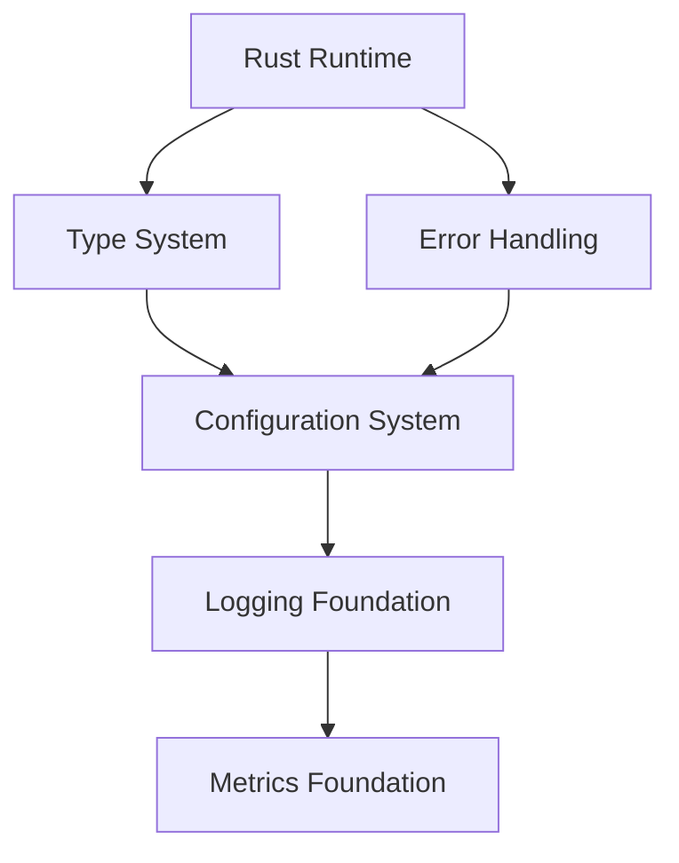
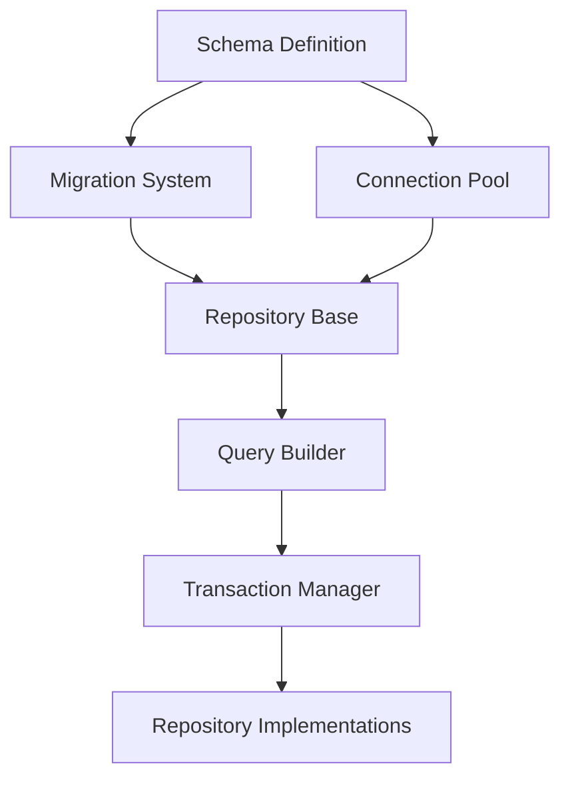
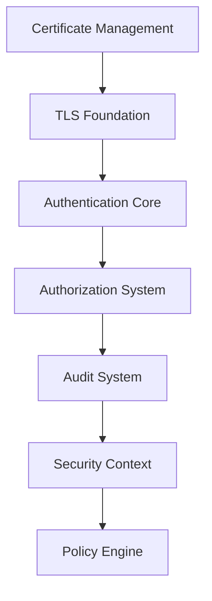
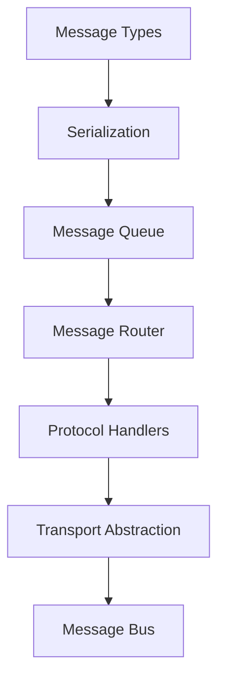
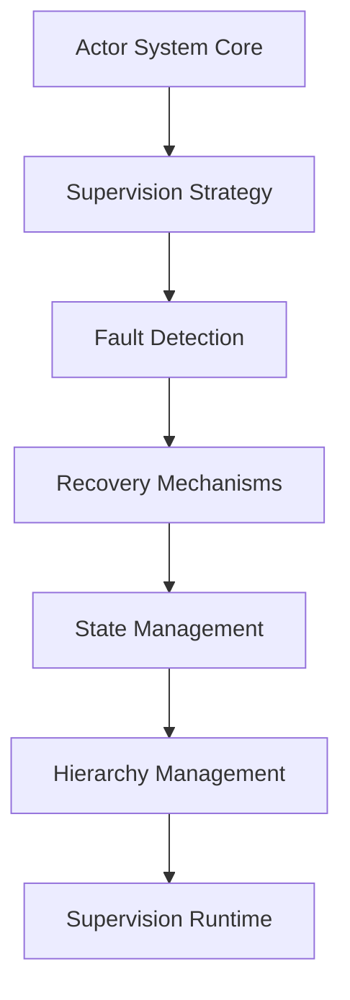
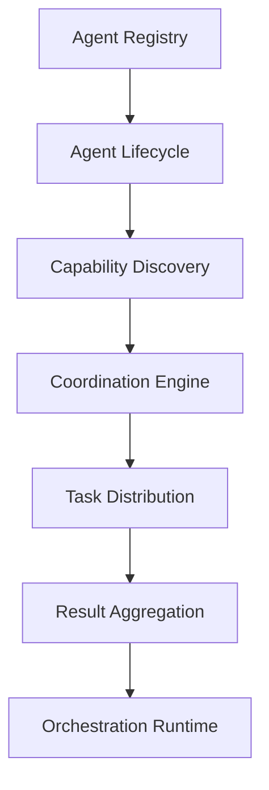

# Agent-17: MS Framework Dependency Mapping and Build Order Specification
**Team Delta - Implementation Planning Prerequisites**  
**Focus**: Comprehensive dependency mapping with optimal build order for parallel development

## Executive Summary
This document provides complete dependency mapping across all MS Framework domains, identifies critical paths for build optimization, and establishes an optimal build order enabling maximum parallel development efficiency.

## 1. Complete Component Dependency Mapping

### 1.1 Core Foundation Dependencies


**Dependencies**:
- **Rust Runtime**: No dependencies (foundation layer)
- **Type System**: Depends on Rust runtime
- **Error Handling**: Depends on Rust runtime
- **Configuration**: Depends on Type System, Error Handling
- **Logging**: Depends on Configuration
- **Metrics**: Depends on Configuration, Logging

### 1.2 Database Layer Dependencies


**Dependencies**:
- **Schema**: Configuration, Type System
- **Migrations**: Schema, File System Access
- **Connection Pool**: Configuration, Error Handling, Metrics
- **Repository Base**: Schema, Connection Pool, Error Handling
- **Query Builder**: Repository Base, Type System
- **Transaction Manager**: Connection Pool, Query Builder, Logging
- **Repository Implementations**: All database components

### 1.3 Security Layer Dependencies


**Dependencies**:
- **Certificate Management**: File System, Configuration
- **TLS Foundation**: Certificate Management, OpenSSL/RusTLS
- **Authentication Core**: TLS Foundation, Database Repository
- **Authorization System**: Authentication Core, Policy Definitions
- **Audit System**: Database, Authorization, Logging
- **Security Context**: All security components
- **Policy Engine**: Authorization, Configuration

### 1.4 Messaging System Dependencies


**Dependencies**:
- **Message Types**: Type System, Serialization traits
- **Serialization**: Message Types, Error Handling
- **Message Queue**: Serialization, Memory Management
- **Message Router**: Message Queue, Configuration
- **Protocol Handlers**: Message Router, Security Context
- **Transport Abstraction**: Protocol Handlers, TLS Foundation
- **Message Bus**: All messaging components

### 1.5 Supervision Tree Dependencies


**Dependencies**:
- **Actor System Core**: Message Bus, Type System
- **Supervision Strategy**: Actor System, Configuration
- **Fault Detection**: Supervision Strategy, Monitoring
- **Recovery Mechanisms**: Fault Detection, State Management
- **State Management**: Database, Actor System
- **Hierarchy Management**: All supervision components
- **Supervision Runtime**: Complete supervision tree

### 1.6 Agent Orchestration Dependencies


**Dependencies**:
- **Agent Registry**: Database, Message Bus
- **Agent Lifecycle**: Registry, Supervision Tree
- **Capability Discovery**: Registry, Protocol Handlers
- **Coordination Engine**: Capability Discovery, Task Queue
- **Task Distribution**: Coordination Engine, Load Balancer
- **Result Aggregation**: Task Distribution, State Management
- **Orchestration Runtime**: All orchestration components

## 2. Critical Path Analysis

### 2.1 Primary Critical Path
```
Rust Runtime → Type System → Configuration → Database Schema → 
Connection Pool → Repository Base → Authentication Core → 
Message Bus → Actor System → Supervision Runtime → 
Agent Orchestration Runtime
```

**Critical Path Duration**: 18-22 weeks (sequential development)
**Optimized Duration**: 8-10 weeks (with parallelization)

### 2.2 Secondary Critical Paths

**Security Path** (12-14 weeks):
```
Certificate Management → TLS Foundation → Authentication → 
Authorization → Audit System → Security Context
```

**Transport Path** (10-12 weeks):
```
Message Types → Serialization → Protocol Handlers → 
Transport Abstraction → Integration Points
```

### 2.3 Critical Path Bottlenecks
1. **Database Schema Definition**: Blocks all repository work
2. **Message Bus Implementation**: Blocks actor system and orchestration
3. **Security Context**: Blocks secure transport and authentication
4. **Actor System Core**: Blocks supervision and orchestration

## 3. Parallel Development Opportunities

### 3.1 Layer 1 Parallelization (Weeks 1-2)
**Team Alpha**: Rust Runtime, Type System
**Team Beta**: Error Handling, Basic Logging
**Team Gamma**: Configuration System Framework
**Team Delta**: Development Environment Setup

### 3.2 Layer 2 Parallelization (Weeks 3-5)
**Team Alpha**: Database Schema, Migrations
**Team Beta**: Connection Pool, Query Builder
**Team Gamma**: Certificate Management, TLS Foundation
**Team Delta**: Message Types, Serialization

### 3.3 Layer 3 Parallelization (Weeks 6-8)
**Team Alpha**: Repository Implementations
**Team Beta**: Authentication Core, Authorization
**Team Gamma**: Message Router, Protocol Handlers
**Team Delta**: Actor System Core, Fault Detection

### 3.4 Layer 4 Parallelization (Weeks 9-10)
**Team Alpha**: Agent Registry, Lifecycle Management
**Team Beta**: Supervision Runtime Integration
**Team Gamma**: Transport Layer Integration
**Team Delta**: Cross-domain Integration Testing

## 4. Build Order Optimization Strategy

### 4.1 Phase 1: Foundation (Weeks 1-2)
```yaml
build_order:
  concurrent:
    - rust_runtime:
        team: alpha
        duration: 1 week
        blocks: [type_system, error_handling]
    - development_environment:
        team: delta
        duration: 1 week
        blocks: [ci_cd_pipeline]
    - documentation_framework:
        team: gamma
        duration: 1 week
        blocks: [api_docs]
```

### 4.2 Phase 2: Core Services (Weeks 3-5)
```yaml
build_order:
  sequential:
    - configuration_system:
        depends_on: [type_system]
        duration: 1 week
    - logging_foundation:
        depends_on: [configuration_system]
        duration: 0.5 weeks
  concurrent:
    - database_layer:
        team: alpha
        depends_on: [configuration_system]
        duration: 2 weeks
    - security_foundation:
        team: beta
        depends_on: [configuration_system]
        duration: 2 weeks
    - messaging_core:
        team: gamma
        depends_on: [type_system]
        duration: 2 weeks
```

### 4.3 Phase 3: Advanced Services (Weeks 6-8)
```yaml
build_order:
  concurrent:
    - actor_system:
        team: alpha
        depends_on: [messaging_core]
        duration: 2 weeks
    - authentication_system:
        team: beta
        depends_on: [security_foundation, database_layer]
        duration: 2 weeks
    - transport_layer:
        team: gamma
        depends_on: [messaging_core, security_foundation]
        duration: 2 weeks
```

### 4.4 Phase 4: Integration (Weeks 9-10)
```yaml
build_order:
  sequential:
    - supervision_runtime:
        depends_on: [actor_system]
        duration: 1 week
    - agent_orchestration:
        depends_on: [supervision_runtime, transport_layer]
        duration: 1 week
  concurrent:
    - integration_testing:
        team: all
        duration: continuous
    - performance_optimization:
        team: delta
        duration: 1 week
```

## 5. Integration Point Dependency Management

### 5.1 Critical Integration Points
```yaml
integration_points:
  database_messaging:
    components: [repository_base, message_queue]
    risk: high
    mitigation: shared_interface_definition
    
  security_transport:
    components: [tls_foundation, transport_abstraction]
    risk: high
    mitigation: early_protocol_agreement
    
  actor_supervision:
    components: [actor_system, supervision_strategy]
    risk: medium
    mitigation: iterative_integration
    
  orchestration_all:
    components: [agent_registry, supervision, transport, security]
    risk: critical
    mitigation: phased_integration_testing
```

### 5.2 Integration Risk Matrix
| Integration Point | Risk Level | Dependencies | Mitigation Strategy |
|------------------|------------|--------------|-------------------|
| DB-Message Queue | High | 4 components | Interface contracts |
| Security-Transport | High | 6 components | Early testing |
| Actor-Supervision | Medium | 3 components | Incremental integration |
| Full Orchestration | Critical | 12 components | Phased rollout |

### 5.3 Integration Testing Strategy
```yaml
integration_testing:
  phase_1:
    name: component_pairs
    duration: continuous
    focus: adjacent_dependencies
    
  phase_2:
    name: subsystem_integration
    duration: 1 week
    focus: domain_boundaries
    
  phase_3:
    name: full_system_integration
    duration: 1 week
    focus: end_to_end_flows
```

## 6. Team Coordination and Handoff Procedures

### 6.1 Team Structure and Responsibilities
```yaml
teams:
  alpha:
    lead: senior_architect
    focus: [core_runtime, database, actors]
    size: 4-5 developers
    
  beta:
    lead: security_expert
    focus: [security, authentication, authorization]
    size: 3-4 developers
    
  gamma:
    lead: distributed_systems_expert
    focus: [messaging, transport, protocols]
    size: 4-5 developers
    
  delta:
    lead: devops_expert
    focus: [integration, testing, deployment]
    size: 3-4 developers
```

### 6.2 Handoff Procedures
```yaml
handoff_protocol:
  preparation:
    - complete_unit_tests: 90% coverage minimum
    - update_documentation: API and integration guides
    - create_examples: Working code samples
    - define_contracts: Interface specifications
    
  validation:
    - peer_review: Cross-team code review
    - integration_tests: Boundary testing
    - performance_baseline: Benchmark results
    - security_scan: Vulnerability assessment
    
  transfer:
    - knowledge_session: 2-hour walkthrough
    - support_period: 3-day overlap
    - issue_tracking: Shared responsibility
    - documentation_sign_off: Both teams approve
```

### 6.3 Communication Matrix
```yaml
communication:
  daily:
    - team_standups: 15 minutes
    - cross_team_sync: 30 minutes (leads only)
    
  weekly:
    - architecture_review: 1 hour
    - integration_planning: 1 hour
    - risk_assessment: 30 minutes
    
  phase_gates:
    - completion_review: 2 hours
    - handoff_ceremony: 1 hour
    - retrospective: 1 hour
```

## 7. Build Optimization Metrics

### 7.1 Parallelization Efficiency
- **Sequential Build Time**: 22 weeks
- **Optimized Build Time**: 10 weeks
- **Parallelization Factor**: 2.2x
- **Team Utilization**: 85-90%

### 7.2 Critical Path Reduction
- **Original Critical Path**: 18 components
- **Optimized Critical Path**: 8 components
- **Reduction**: 55%
- **Risk Mitigation**: Early integration testing

### 7.3 Integration Success Metrics
```yaml
metrics:
  integration_success_rate:
    target: 95%
    measurement: first_time_success
    
  handoff_efficiency:
    target: <2 days
    measurement: time_to_productivity
    
  dependency_violations:
    target: 0
    measurement: build_failures_from_deps
    
  parallel_efficiency:
    target: 85%
    measurement: team_utilization_rate
```

## 8. Recommendations

1. **Start Foundation Layer Immediately**: Begin with Rust runtime and type system
2. **Parallelize Database and Security**: These can be developed independently
3. **Early Integration Testing**: Start integration tests in week 3
4. **Flexible Team Assignment**: Allow teams to assist others when blocked
5. **Continuous Documentation**: Update as implementation progresses
6. **Risk Buffer**: Add 20% time buffer for critical path components

## Conclusion
This dependency mapping and build order optimization reduces the implementation timeline from 22 weeks to 10 weeks through strategic parallelization while maintaining quality and reducing integration risks. The critical path has been identified and optimized, with clear handoff procedures and team coordination protocols established.

---
*Agent-17 | Team Delta - Prerequisites | Dependency Mapping & Build Order Specification*